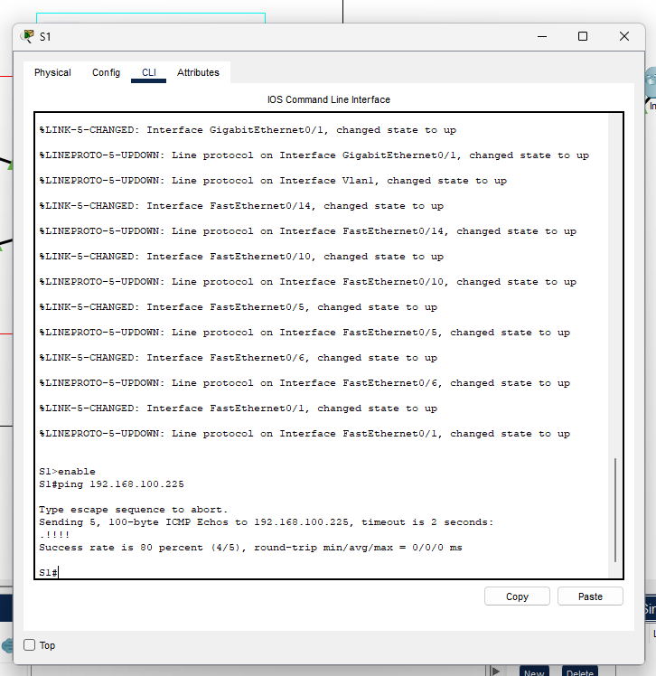
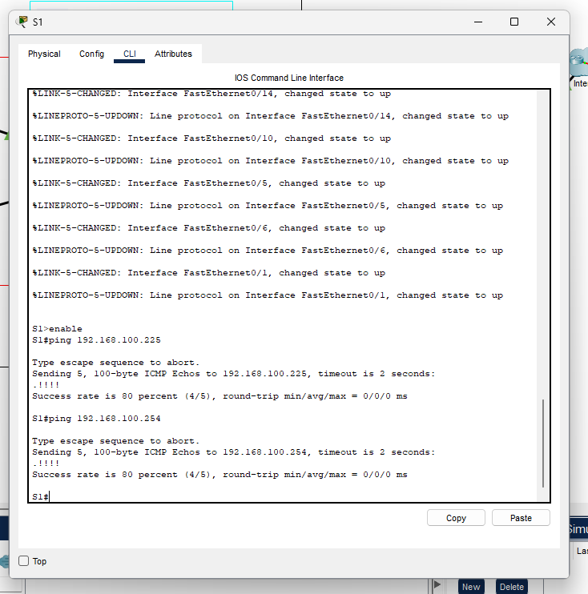
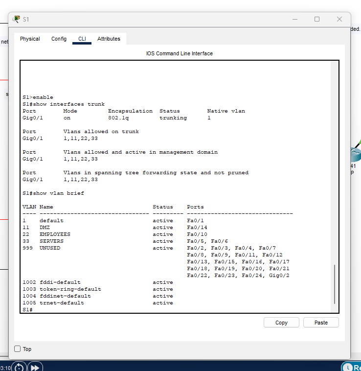
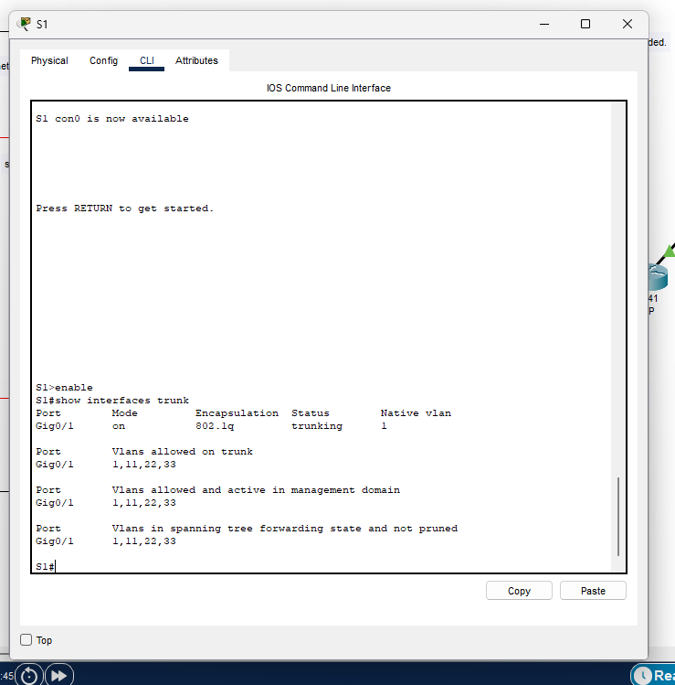
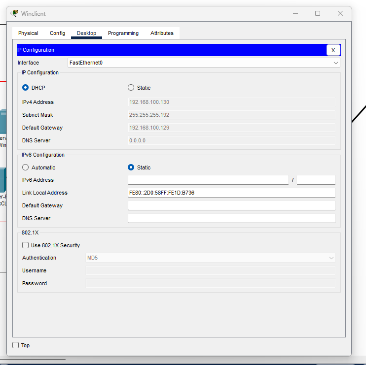
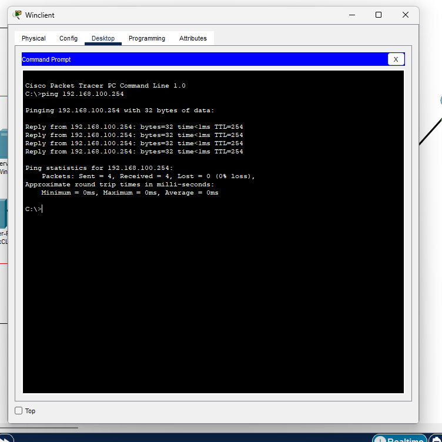
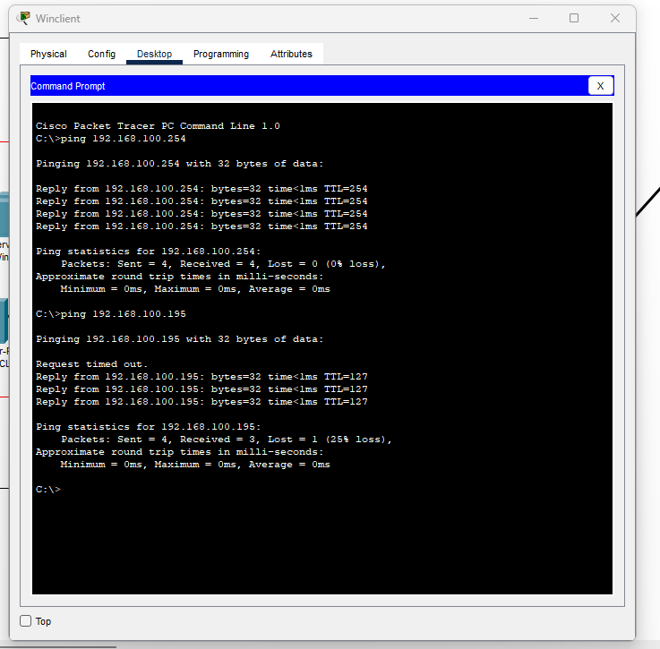
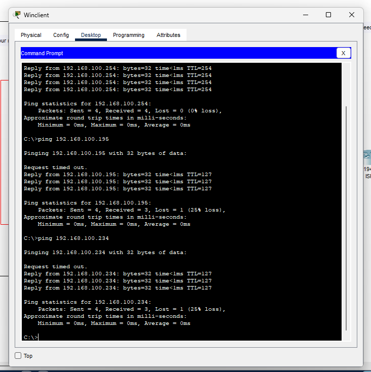
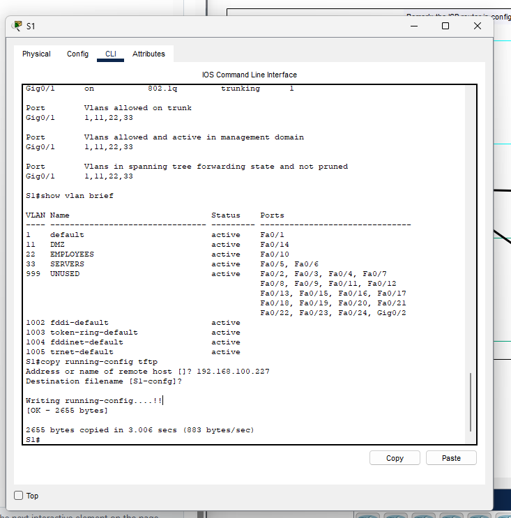

# Test plan

Author(s): G. Lescur - `guillaume.lescur@student.hogent.be`

## Before starting

- Open the Cisco Packet Tracer `PT-basis-simulatie - Testing.pkt`

## Test 1: Ping the router from the switch

Test procedure:

- Open the switch and run the command `enable`
- Run the command `ping 192.168.100.225`

Expected result:

- The pings are succesful.

## Test 2: Ping the ISP from the switch

Test procedure:

- Run the command `ping 192.168.100.254`

Expected result:

- The pings are succesful.

## Test 3: Check the VLANs on the switch

Test procedure:

- Run the command `show vlan brief`

Expected result:

- The result should show VLAN 1, 11, 22 and 23

## Test 4: Check the trunks on the switch

Test procedure:

- Run the command `show interfaces trunk`

Expected result:

- The result should show that the trunk port allows VLAN 1, 11, 22 and 23

## Test 5: Check if the Winclient gets an address through dhcp and ping the ISP from the Winclient

Test procedure:

- Open the Winclient and go to desktop and IP Configuration
- Check if DHCP is turned on and if it gets an IP address in the correct range
- Go to Desktop and Command prompt
- Run the command `ping 192.168.100.254`

Expected results:

- The Winclient gets a correct address through DHCP
- The pings are succesful

## Test 6: Ping the LinuxCLI from the WinClient

Test procedure:

- Run the command `ping 192.168.100.195`

Expected results:

- The pings are succesful

## Test 7: Ping the Proxy from the WinClient

Test procedure:

- Run the command `ping 192.168.100.234`

Expected results:

- The pings are succesful

## Test 8: TFTP configuration backup

Test procedure:

- Run the command `copy running-config tftp`
- Enter `192.168.100.227` as the address of the remote host
- Leave the name blank

Expected results:

- The running-config is written to the tftp server

