# Test Plan - Network iteration 2

_Author: J. Robyn - jelle.robyn@student.hogent.be_

This test plan validates the functionality and security of the network implemented in Iteration 2 within the Cisco Packet Tracer environment.
The objective is to verify that all core network services and design requirements are correctly implemented.

This test plan follows a **phased validation approach** to ensure reliable troubleshooting and correct implementation:

- **Phase 1:** Baseline network validation (NO ACLs applied)
- **Phase 2:** Incremental ACL implementation (per VLAN)
- **Phase 3:** End-to-end validation

> **IMORTANT:** Apply ONE ACL at a time -> test -> continue

This approach ensures that issues can be isolated quickly and accurately.

---

## Acceptance Criteria

Each test case is designed to confirm both expected functionality (allowed traffic) and security enforcement (blocked traffic),
ensuring that the network operates according to a default-deny, least-privilege model.

The tests are executed entirely within Packet Tracer using a combination of CLI commands and built-in device interfaces.

The network implementation is considered successful and compliant when all of the following criteria are met:

### 1. VLAN Segmentation

- VLANs 1, 11, 22, 33, 999 exist and are correctly configured
- Devices are assigned to correct VLANs
- Inter-VLAN routing is functional

### 2. IP Addressing & DHCP

- Clients receive valid IPs in `192.168.132.128/26`
- Default gateway is `192.168.132.129`
- DNS is assigned correctly

### 3. Routing & Connectivity

- Devices reach their gateway
- Inter-VLAN communication works (before ACLs)
- NAT/PAT provides external connectivity

### 4. ACL Enforcement

- Default-deny policy is enforced
- Only explicitly allowed traffic succeeds
- ACLs are validated per VLAN

### 5. Security Model

- Management VLAN is protected
- DMZ is isolated
- Internal lateral movement is restricted

---

## Preconditions

- Load `PT-iteration2.pkt`
- All devices powered on and connected
- Correct configs loaded
  - For the router: `PT-R1-config-no-acl.txt`
  - For the switch: `PT-S1-config`
- TFTP server enabled (Services -> TFTP -> ON)
- End devices connected to correct VLANs

---

# PHASE 1 - BASELINE TESTING (NO ACLs)

Apply:

```
hostname R1
!
no ip domain lookup
!
! =========================
! DHCP (Clients VLAN 22)
! =========================
!
ip dhcp excluded-address 192.168.132.129
!
ip dhcp pool EMPLOYEES
 network 192.168.132.128 255.255.255.192
 default-router 192.168.132.129
 dns-server 192.168.132.194
!
! =========================
! NAT CONFIG (PAT)
! =========================
!
access-list 1 permit 192.168.132.128 0.0.0.63
access-list 1 permit 192.168.132.192 0.0.0.31
access-list 1 permit 192.168.132.232 0.0.0.7
access-list 1 permit 192.168.132.224 0.0.0.7
!
ip nat inside source list 1 interface GigabitEthernet 0/1 overload
!
! =========================
! INTERFACES
! =========================
!
interface GigabitEthernet 0/1
 description UPLINK TO CLASS NETWORK
 ip address dhcp
 ip nat outside
 no shutdown
!
! Physical interface for VLAN 1 (Native/Management)
interface GigabitEthernet 0/0
 description LAN TRUNK - VLAN 1 UNTAGGED (MANAGEMENT)
 ip address 192.168.132.225 255.255.255.248
 ip nat inside
 no shutdown
!
interface GigabitEthernet 0/0.11
 encapsulation dot1Q 11
 ip address 192.168.132.233 255.255.255.248
 ip nat inside
!
interface GigabitEthernet 0/0.22
 encapsulation dot1Q 22
 ip address 192.168.132.129 255.255.255.192
 ip nat inside
!
interface GigabitEthernet 0/0.33
 encapsulation dot1Q 33
 ip address 192.168.132.193 255.255.255.224
 ip nat inside
!
! =========================
! ROUTING
! =========================
!
ip route 0.0.0.0 0.0.0.0 172.22.255.254
!
line vty 0 4
 login local
 transport input ssh
!
end
```

## Test 1: VLAN & Trunk Validation

**On S1:**

```
show vlan brief
show interfaces trunk
```

**Expected:**

- VLANs 1, 11, 22, 33, 999 exist
- G0/1 trunk is UP
- Allowed VLANs correct

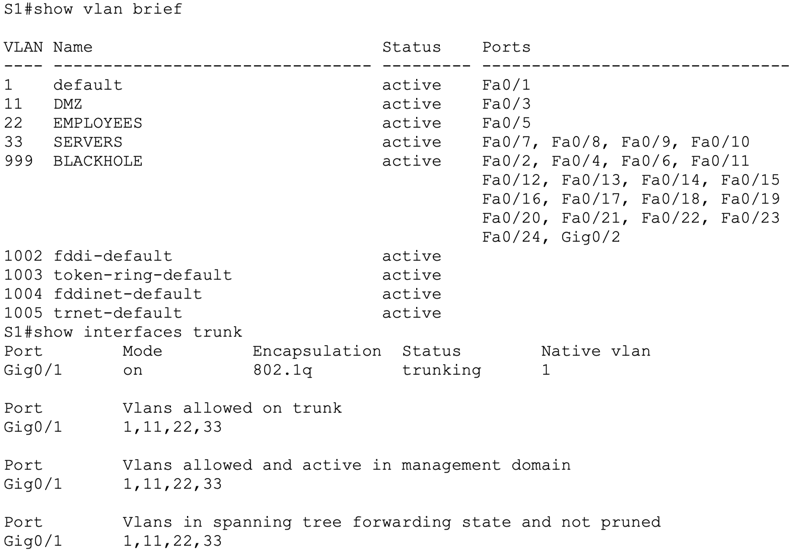

---

## Test 2: Inter-VLAN Routing

**On R2:**

```
ping 192.168.132.129
ping 192.168.132.193
ping 192.168.132.233
```

**Expected:**

- All succeed

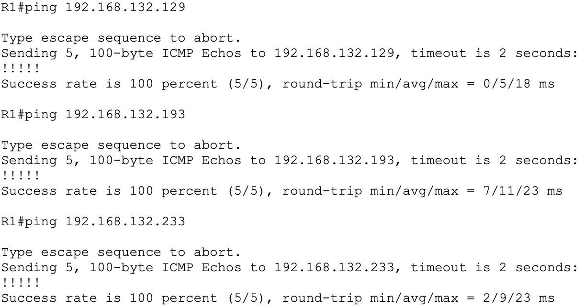

---

## Test 3: DHCP Functionality

**From client:**

Enable DHCP

Run:

```
ipconfig
```

**Expected:**

- IP: 192.168.132.130-190
- Gateway: 192.168.132.129
- DNS: 192.168.132.194

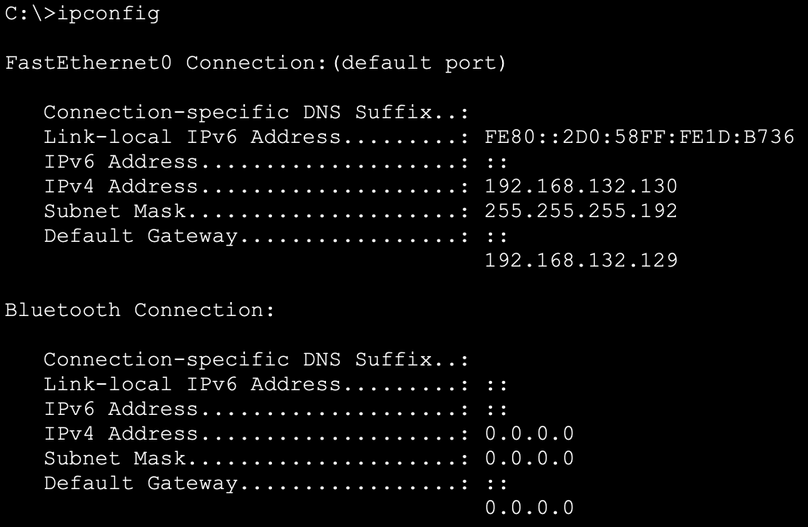

Notice that no DNS server is showed in the `ipconfig` output.
If this occurs, execute `ipconfig /release` `followed by ipconfig /renew`.
This will show correct configuration of the DNS server:

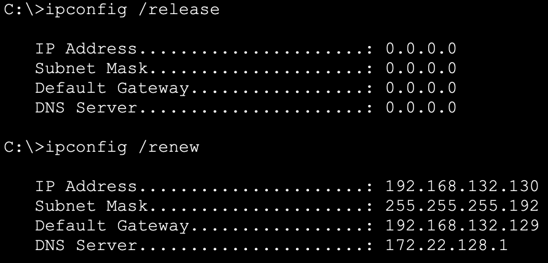

---

## Test 4: Default Gateway Reachability

**From client:**

```
ping 192.168.132.129
```

**Expected:**

- SUCCES

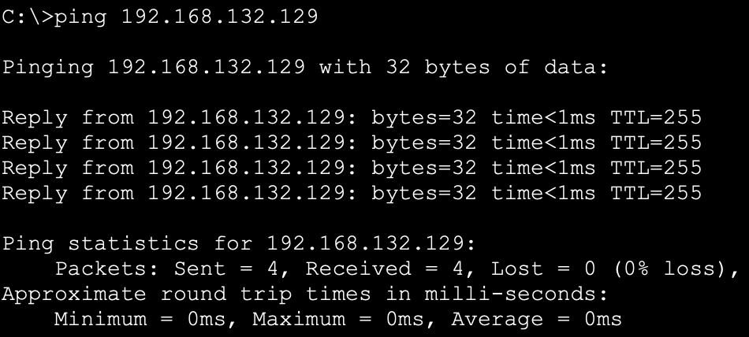

---

## Test 5: Internal Connectivity (NO ACLs yet)

**From client:**

```
ping 192.168.132.194   (Domain Controller)
ping 192.168.132.234   (Reverse Proxy)
```

**Expected:**

- SUCCES

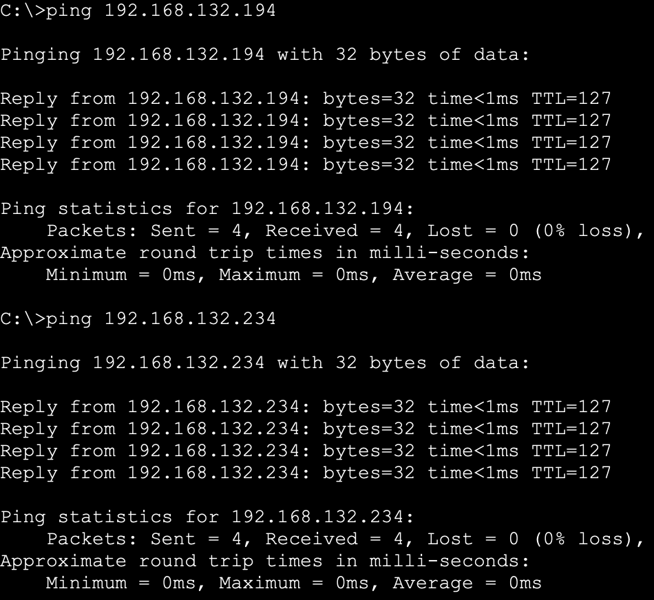

---

## Test 6: External Connectivity & NAT/PAT Functionality

**From client:**

```
ping 1.1.1.1
```

**On R1:**

```
show ip nat translations
```

**Expected:**

- Ping is successful
- NAT entries present
- Inside local -> inside global translation works

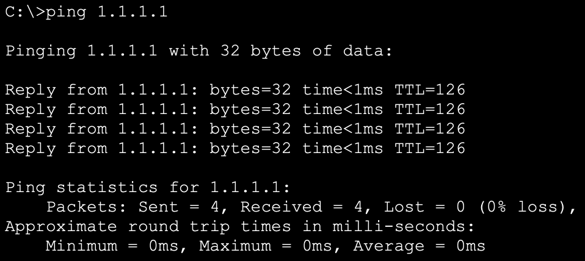

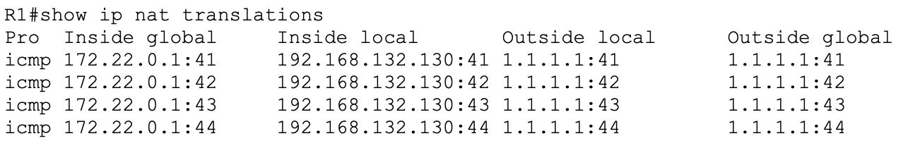

---

## Test 7 - DNS Resolution

**From client:**

```
nslookup t02-domain404.internal
```

Expected:

- Resolved by 192.168.132.194

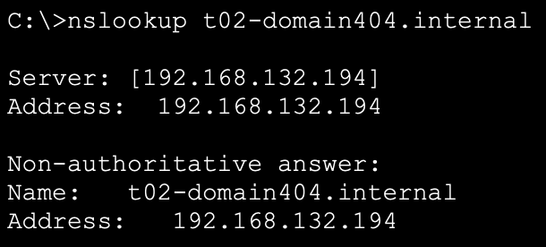

---

**Important**

The configured upstream DNS server (172.22.128.1) was not reachable in the Packet Tracer environment.
Therefore, an internal DNS server hosted on the Domain Controller was implemented to provide name resolution for internal clients.

# PHASE 2 - ACL IMPLEMENTATION (PER VLAN)

## Step 1: VLAN 22 - Clients

Apply:

```
ip access-list extended ACL_VLAN22

  remark === ALLOW ICMP (LIMITED) ===
  ! Clients -> VLAN 22
  permit icmp 192.168.132.128 0.0.0.63 host 192.168.132.129
  ! Clients -> DC
  permit icmp 192.168.132.128 0.0.0.63 host 192.168.132.194
  ! Clients -> Nextcloud
  permit icmp 192.168.132.128 0.0.0.63 host 192.168.132.197

  remark === DHCP (client -> router) ===
  ! DHCP client -> router (request)
  permit udp any eq 68 any eq 67
  ! DHCP router -> client (response)
  permit udp any eq 67 any eq 68

  remark === ALLOW DNS VIA DC ===
  ! Clients -> DNS server (DC)
  permit udp 192.168.132.128 0.0.0.63 host 192.168.132.194 eq 53
  ! DNS responses to clients
  permit tcp 192.168.132.128 0.0.0.63 host 192.168.132.194 eq 53

  ! remark === ALLOW DNS VIA INTERNET ===
  ! Clients -> internet
  ! permit udp 192.168.132.128 0.0.0.63 any eq 53
  ! permit tcp 192.168.132.128 0.0.0.63 any eq 53

  remark === ALLOW WEB ACCESS ===
  ! Clients -> internet (HTTP)
  permit tcp 192.168.132.128 0.0.0.63 any eq 80
  ! Clients -> internet (HTTPS)
  permit tcp 192.168.132.128 0.0.0.63 any eq 443
  ! Internet -> clients (return traffic)
  permit tcp any 192.168.132.128 0.0.0.63 established

  remark === CLIENTS TO REVERSE PROXY ===
  ! Clients -> reverse proxy
  permit tcp 192.168.132.128 0.0.0.63 host 192.168.132.234 eq 80
  permit tcp 192.168.132.128 0.0.0.63 host 192.168.132.234 eq 443

  remark === ALLOW CLIENTS TO DC (REQUIRED AD PORTS) ===
  ! Clients -> DC
  permit tcp 192.168.132.128 0.0.0.63 host 192.168.132.194 eq 88
  permit tcp 192.168.132.128 0.0.0.63 host 192.168.132.194 eq 389
  permit tcp 192.168.132.128 0.0.0.63 host 192.168.132.194 eq 445
  permit tcp 192.168.132.128 0.0.0.63 host 192.168.132.194 eq 636
  permit udp 192.168.132.128 0.0.0.63 host 192.168.132.194 eq 123
  permit tcp 192.168.132.128 0.0.0.63 host 192.168.132.194 range 49152 65535

  remark === CLIENTS TO STORAGE (SMB) ===
  permit tcp 192.168.132.128 0.0.0.63 host 192.168.132.199 eq 445

  remark === BLOCK ACCESS TO MANAGEMENT VLAN ===
  ! Clients -> block management VLAN
  deny ip 192.168.132.128 0.0.0.63 192.168.132.224 0.0.0.7

  remark === BLOCK CLIENT ACCESS TO SERVERS ===
  ! Clients -> block internal servers
  deny ip 192.168.132.128 0.0.0.63 192.168.132.192 0.0.0.31

  remark === DEFAULT DENY ===
  ! Block all other traffic
  deny ip any any log
  exit

interface g0/0.22
ip access-group ACL_VLAN22 in
exit
```

---

## Test 8 - Allowed Traffic (servers & web access)

**From client:**

```
ping 192.168.132.194   (DC)
ping 192.168.132.197   (Nextcloud)
```

On WinClient, open desktop -> Web Browser and go to:

```
http://1.1.1.1

https://1.1.1.1
```

**Expected:**

- SUCCESS for the pings

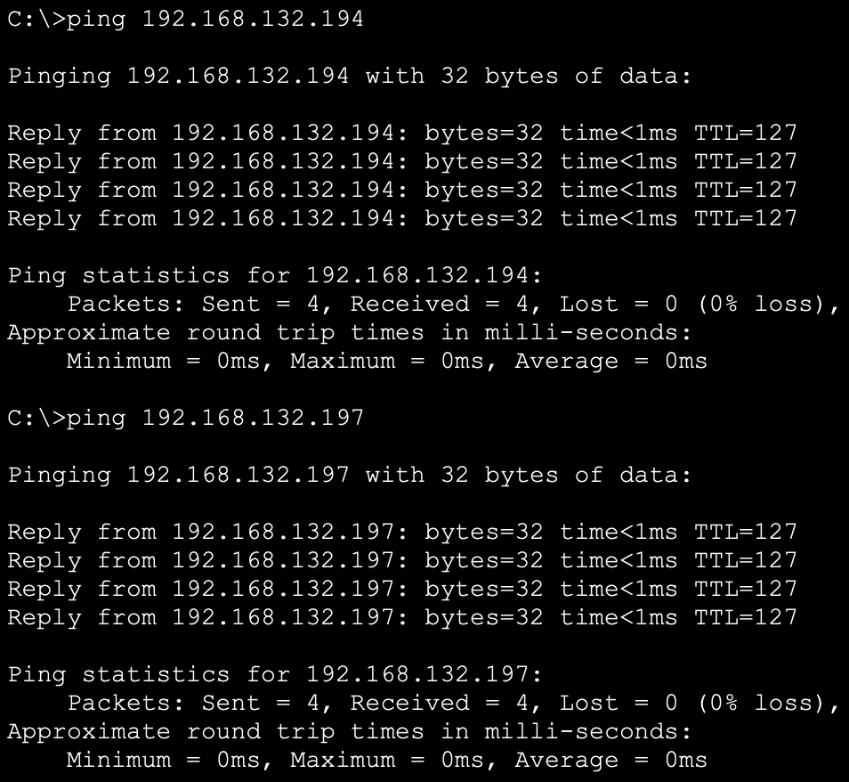

- Both HTTP & HTTPS requests are successful


---

## Test 9 - Block Management VLAN

```
ping 192.168.132.225
ping 192.168.132.226
ping 192.168.132.227
```

**Expected:**

- FAIL


---

## Test 10 - DNS Functionality (Clients)

**From client:**

```
nslookup t02-domain404.internal
```

**Expected:**

- SUCCESS

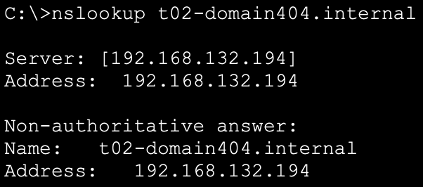

---

## Step 2: VLAN 11 - DMZ

Apply:

```
ip access-list extended ACL_VLAN11

  remark === ALLOW ICMP (LIMITED) ===
  ! From DMZ <-> gateway (router interface)
  permit icmp 192.168.132.232 0.0.0.7 host 192.168.132.233 echo
  ! From router -> DMZ (reply)
  permit icmp host 192.168.132.233 192.168.132.232 0.0.0.7 echo-reply

  remark === ALLOW REVERSE PROXY TO INTERNAL WEBSERVER ===
  ! Reverse proxy -> webserver (HTTP/HTTPS)
  permit tcp host 192.168.132.234 host 192.168.132.196 eq 80
  permit tcp host 192.168.132.234 host 192.168.132.196 eq 443
  ! Reverse proxy -> Nextcloud server (HTTP)
  permit tcp host 192.168.132.234 host 192.168.132.197 eq 80
  ! Webserver -> reverse proxy (responses)
  permit tcp host 192.168.132.196 host 192.168.132.234 established
  permit tcp host 192.168.132.197 host 192.168.132.234 established

  remark === ALLOW DNS (ONLY TO DC EXEPT FOR PROXY) ===
  permit udp 192.168.132.232 0.0.0.7 host 192.168.132.194 eq 53
  permit tcp 192.168.132.232 0.0.0.7 host 192.168.132.194 eq 53
  ! DC -> DMZ (responses)
  permit udp host 192.168.132.194 eq 53 192.168.132.232 0.0.0.7
  permit tcp host 192.168.132.194 eq 53 192.168.132.232 0.0.0.7
  ! Reverse proxy DNS -> internet
  permit tcp host 192.168.132.234 any eq 53
  permit udp host 192.168.132.234 any eq 53

  remark === ALLOW WEB ACCESS (UPDATES) ===
  ! DMZ -> internet (HTTP/HTTPS updates)
  permit tcp 192.168.132.232 0.0.0.7 any eq 80
  permit tcp 192.168.132.232 0.0.0.7 any eq 443
  ! Internet -> DMZ (return return traffic from internet)
  permit tcp any 192.168.132.232 0.0.0.7 established

  remark === BLOCK ACCESS FROM DMZ TO INTERNAL NETWORKS ===
  deny ip 192.168.132.232 0.0.0.7 192.168.132.128 0.0.0.127

  remark === BLOCK ACCESS FROM DMZ TO MANAGEMENT VLAN ===
  deny ip 192.168.132.232 0.0.0.7 192.168.132.224 0.0.0.7

  remark === DEFAULT DENY ===
  ! Block all other traffic
  deny ip any any log
  exit

interface g0/0.11
ip access-group ACL_VLAN11 in
exit
```

---

## Test 11 - DMZ to default gateway

**From DMZ (reverse proxy):**

```
ping 192.168.132.233
```

**Expected:**

- SUCCESS

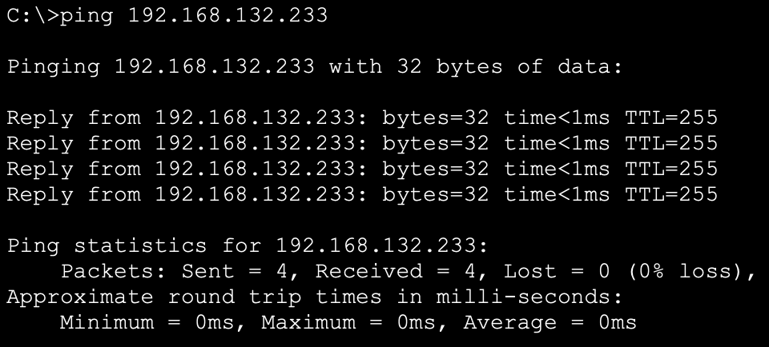

---

## Test 12 - DMZ to anywhere

**From DMZ (reverse proxy):**

```
ping 192.168.132.129   (VLAN 22 gateway)
ping 192.168.132.194   (domain controller)
ping 192.168.132.130   (client)
```

**Expected:**

- FAIL


---

## Test 13 - Outside DMZ to DMZ

**From client:**

```
ping 192.168.132.234
```

**Expected:**

- FAIL

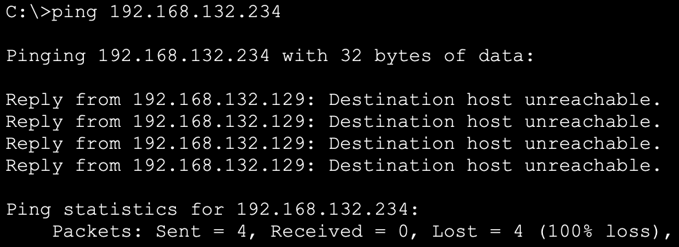

---

## Test 14 - Reverse proxy to webserver (HTTP/HTTPS)

**From DMZ (reverse proxy):**

```
ping 192.168.132.196
```

On WinClient, open desktop -> Web Browser and go to:

```
http://1.1.1.1

https://1.1.1.1
```

**Expected:**

- FAIL for the ping

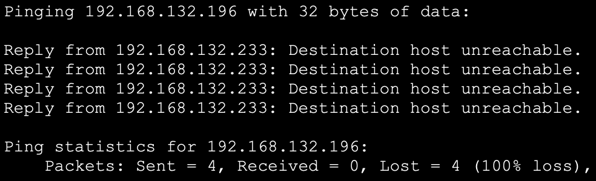

- Both HTTP (port 80) & HTTPS (port 443) requests are successful


---

## Test 15 - DMZ DNS resolution via Domain Controller

**From DMZ (reverse proxy):**

```
nslookup t02-domain404.internal
```

**Expected:**

- SUCCESS

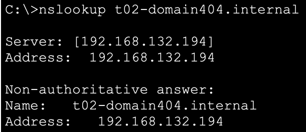

---

## Test 16 - DMZ web access to internet

**From DMZ (reverse proxy):**

```
ping 1.1.1.1
```

**Expected:**

- FAIL (ICMP not allowed)

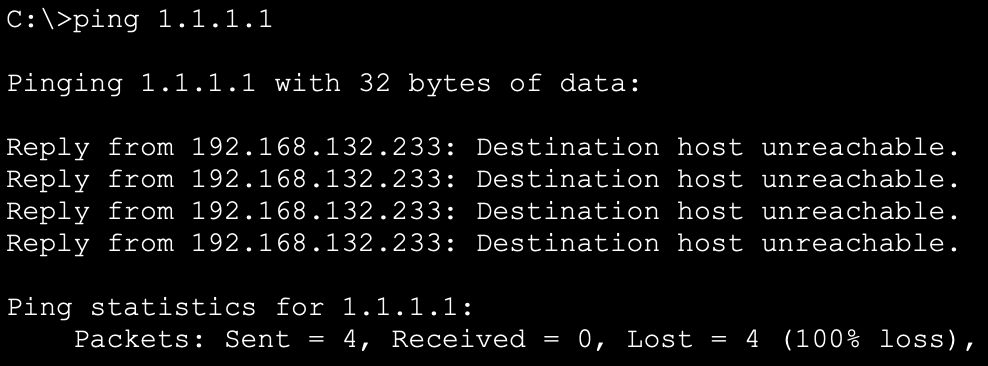

---

## Test 17 - DMZ to internal network (clients + servers)

**From DMZ (reverse proxy):**

```
ping 192.168.132.130   (client)
ping 192.168.132.194   (DC)
ping 192.168.132.196   (webserver, ICMP)
```

Expected:

- FAIL (only services such as DNS/web allowed)

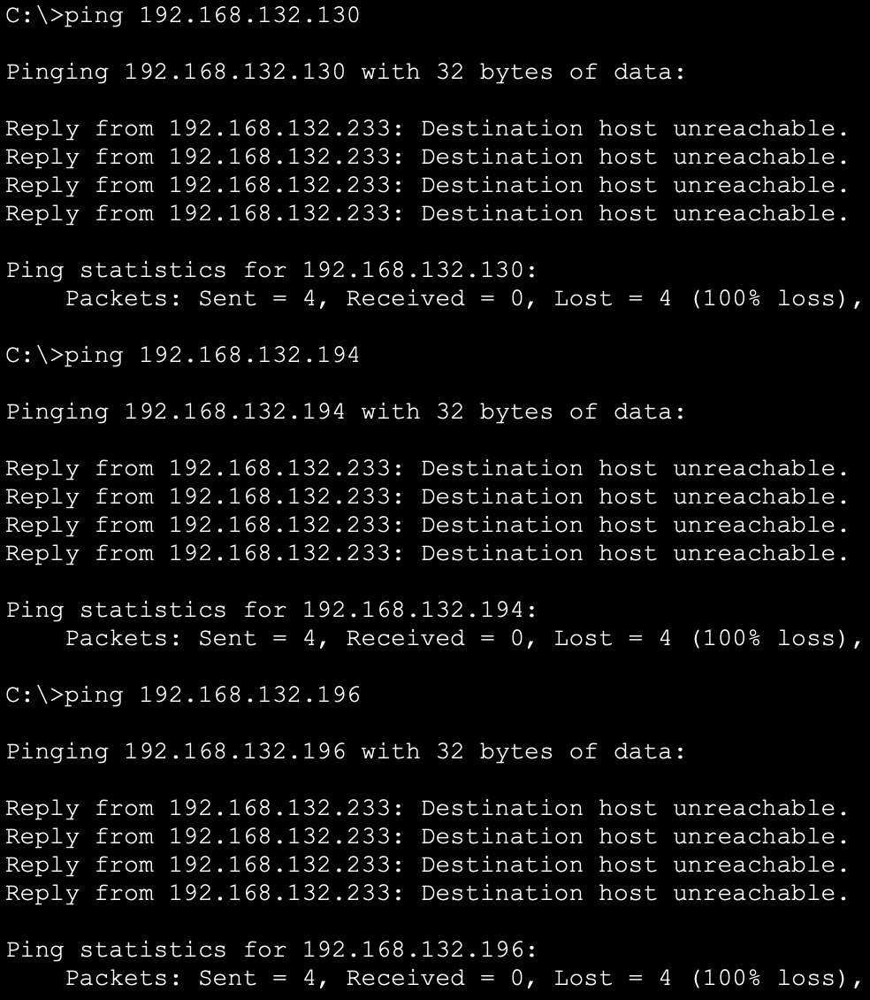

---

## Test 18 - DMZ to management VLAN

**From DMZ (reverse proxy):**

```
ping 192.168.132.225   (router)
ping 192.168.132.226   (switch)
ping 192.168.132.227   (TFTP)
```

**Expected:**

- FAIL (explicit deny to VLAN 1)

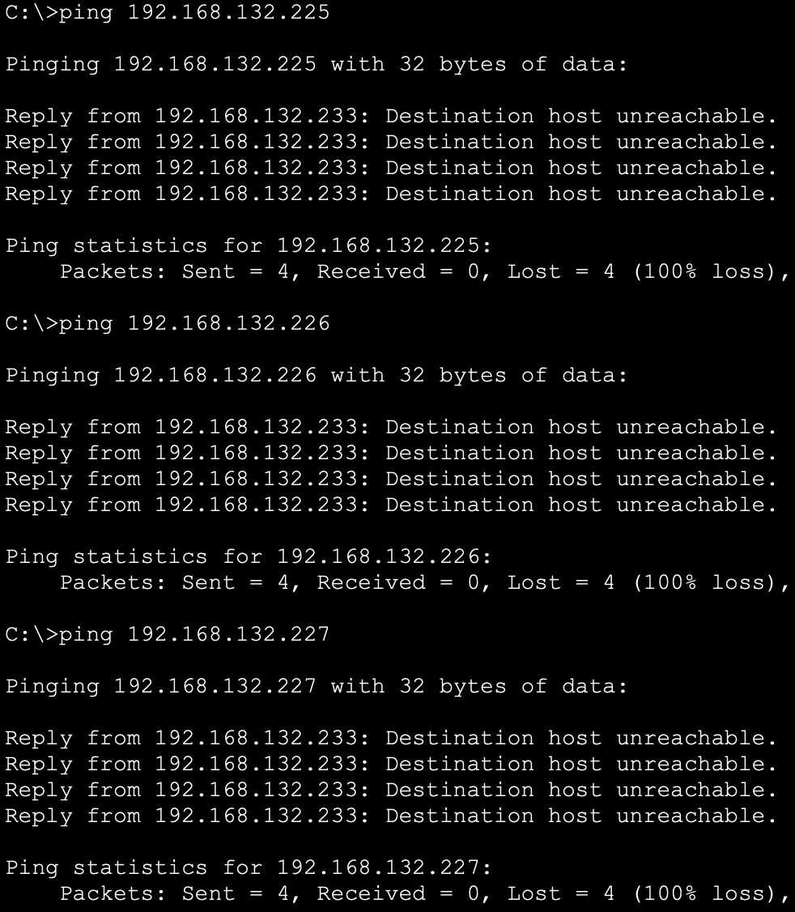

---

## Test 19 - ACL hit verification

**On R1:**

```
show access-lists ACL_VLAN11
```

**Expected:**

Expected:

- Counters raise for:
  - DNS rules
  - HTTP/HTTPS rules
  - deny statements

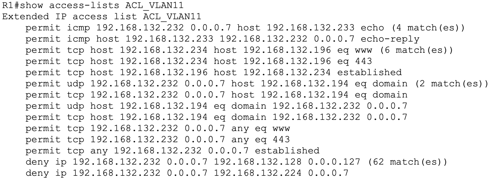

---

# Step 3: VLAN 33 - Servers

Apply:

```
ip access-list extended ACL_VLAN33

  remark === ALLOW ICMP (LIMITED) ===
  ! From servers -> gateway
  permit icmp 192.168.132.192 0.0.0.31 host 192.168.132.193 echo
  ! From gateway -> servers (reply)
  permit icmp host 192.168.132.193 192.168.132.192 0.0.0.31 echo-reply

  remark === ALLOW DC SSH TO REVERSE PROXY ===
  ! From DC to reverse proxy
  permit tcp host 192.168.132.194 host 192.168.132.234 eq 22
  ! From reverse proxy to DC (SSH response)
  permit tcp host 192.168.132.234 host 192.168.132.194 established

  remark === ALLOW SERVERS TO DMZ (WEB BACKEND) ===
  permit tcp 192.168.132.192 0.0.0.31 192.168.132.232 0.0.0.7 eq 80
  permit tcp 192.168.132.192 0.0.0.31 192.168.132.232 0.0.0.7 eq 443
  permit tcp 192.168.132.232 0.0.0.7 192.168.132.192 0.0.0.31 established

  remark === ALLOW DC RESPONSES TO CLIENTS (VLAN 22) ===
  ! Let DC / servers answer to client requists
  permit tcp 192.168.132.192 0.0.0.31 192.168.132.128 0.0.0.63 established
  ! Explicit permit rule for DNS (UDP 53)
  permit udp host 192.168.132.194 eq 53 192.168.132.128 0.0.0.63

  remark === ALLOW INTERNET ACCESS (UPDATES) ===
  ! Servers -> internet
  permit tcp 192.168.132.192 0.0.0.31 any eq 80
  permit tcp 192.168.132.192 0.0.0.31 any eq 443
  ! Return traffic
  permit tcp any 192.168.132.192 0.0.0.31 established

  remark === BLOCK ACCESS FROM SERVERS TO MANAGEMENT VLAN ===
  deny ip 192.168.132.192 0.0.0.31 192.168.132.224 0.0.0.7

  remark === BLOCK ACCESS FROM SERVERS TO CLIENT VLAN ===
  deny ip 192.168.132.192 0.0.0.31 192.168.132.128 0.0.0.63

  remark === DEFAULT DENY ===
  ! Block all other traffic
  deny ip any any log
  exit

interface g0/0.33
ip access-group ACL_VLAN33 in
exit
```

---

## Test 20 - Server to default gateway

**From any server in VLAN 33:**

```
ping 192.168.132.193
```

**Expected:**

- SUCCESS

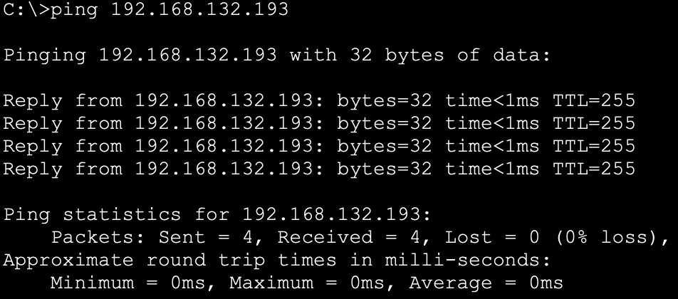

---

## Test 21 - Server to client VLAN

**From any server in VLAN 33:**

```
ping 192.168.132.130
```

**Expected:**

- FAIL

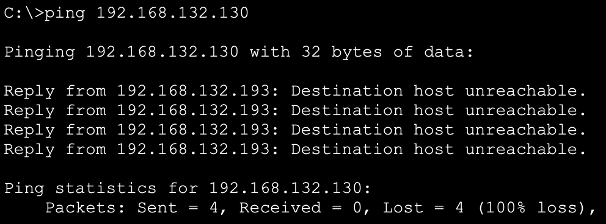

---

## Test 22 - Server to management VLAN

**From any server in VLAN 33:**

```
ping 192.168.132.225
```

**Expected:**

- FAIL

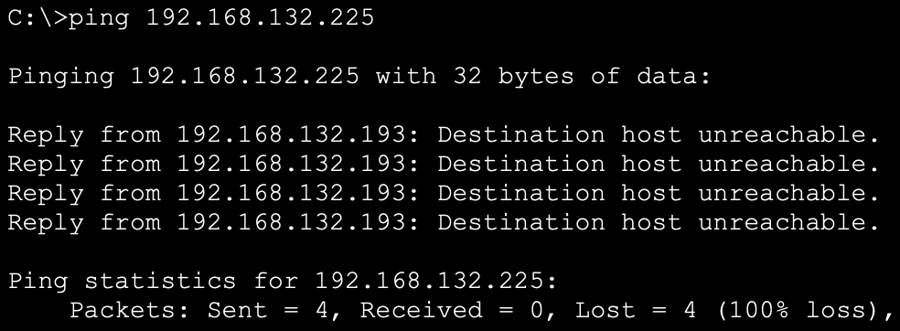

---

## Test 23 - Server DNS resolution (internal)

**From any server:**

```
nslookup t02-domain404.internal
```

**Expected:**

- SUCCESS (via 192.168.132.194)

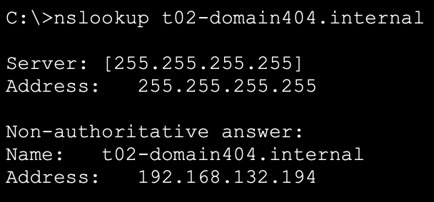

---

## Test 24 - ICMP restriction

**From any server:**

```
ping 192.168.132.130
```

**Expected:**

- FAIL

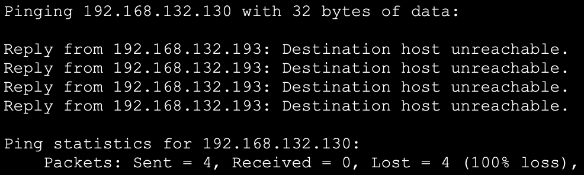

---

## Test 25 - ACL hit verification

**On R1:**

```
show access-lists ACL_VLAN33
```

**Expected:**

- Counters raise for:
  - DNS rules
  - DB rules
  - deny rules

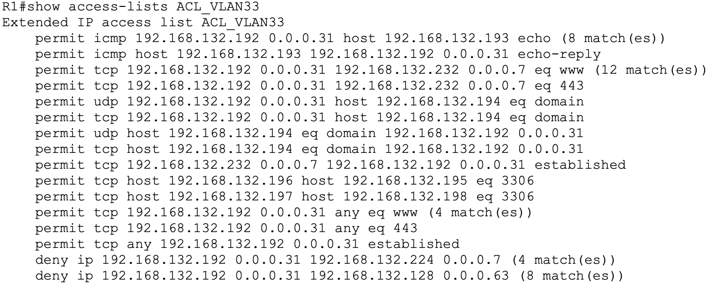

---

## Step 4: VLAN 1 - Management

Apply:

```
ip access-list extended ACL_VLAN1

  remark === ALLOW ICMP (LIMITED) ===
  ! From TFTP server <-> management devices
  permit icmp host 192.168.132.227 192.168.132.224 0.0.0.7 echo
  permit icmp 192.168.132.224 0.0.0.7 host 192.168.132.227 echo-reply

  remark === ALLOW TFTP SERVER ACCESS TO INTERNET ===
  permit udp host 192.168.132.227 any eq 53
  permit tcp host 192.168.132.227 any eq 53
  permit tcp host 192.168.132.227 any eq 80
  permit tcp host 192.168.132.227 any eq 443

  remark === ALLOW TFTP SERVER ACCESS TO NETWORK DEVICES ===
  permit udp host 192.168.132.225 host 192.168.132.227 eq 69
  permit udp host 192.168.132.226 host 192.168.132.227 eq 69
  permit udp host 192.168.132.227 host 192.168.132.225 eq 69
  permit udp host 192.168.132.227 host 192.168.132.226 eq 69

  remark === ALLOW DNS FROM MANAGEMENT TO DC ===
  ! Management devices -> DNS server (DC)
  permit udp 192.168.132.224 0.0.0.7 host 192.168.132.194 eq 53
  permit tcp 192.168.132.224 0.0.0.7 host 192.168.132.194 eq 53
  ! Return traffic
  permit tcp any 192.168.132.224 0.0.0.7 established

  remark === DEFAULT DENY ===
  ! Block all other traffic
  deny ip any any log
  exit

interface g0/0
ip access-group ACL_VLAN1 in
exit
```

---

## Test 26 - Management ICMP (Allowed)

**From TFTP server:**

```
ping 192.168.132.225   (router)
ping 192.168.132.226   (switch)
```

**Expected:**

- SUCCESS

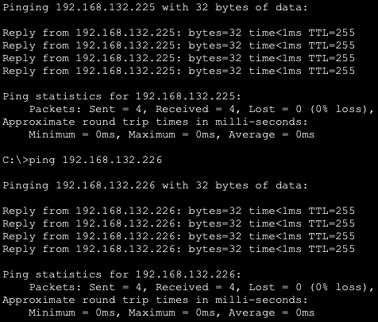

## Test 27 - Management ICMP (Blocked external)

**From client:**

```
ping 192.168.132.225
ping 192.168.132.226
ping 192.168.132.226
```

**Expected:**

- FAIL

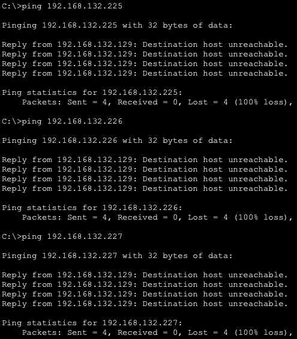

---

## Test 28 - Server VLAN to Management

**From any server:**

```
ping 192.168.132.225
```

**Expected:**

- FAIL

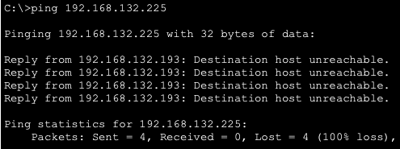

---

## Test 29 - DMZ to Management

**From DMZ (reverse proxy):**

```
ping 192.168.132.225
```

**Expected:**

- FAIL

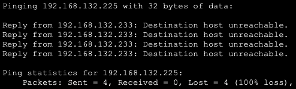

---

## Test 30 - TFTP functionality (router)

**From R1:**

```
copy running-config tftp
```

**Server**

```
192.168.132.227
```

**Expected:**

- SUCCESS

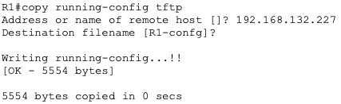

- File is visible on TFTP server


---

## Test 31 - TFTP functionality (switch)

**From S1:**

```
copy running-config tftp
```

**Server**

```
192.168.132.227
```

**Expected:**

- SUCCESS

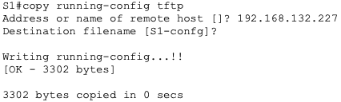

- File is visible on TFTP server

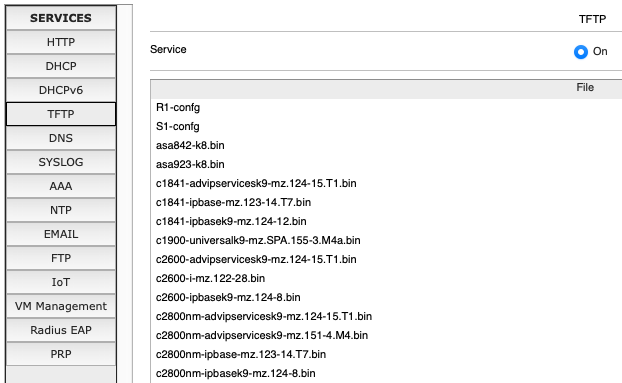

## Test 32 - Management to DNS

Verify that the router itself cannot ping internal servers due to ACL_VLAN1 restrictions.

**From R1:**

```
ping 192.168.132.194
```

**Expected:**

- FAIL

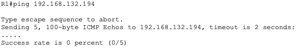

---

## Test 33 - ACL hit verification

**On R1:**

```
show access-lists ACL_VLAN33
```

**Expected:**

- Counters raise:
  - deny rules (client attempts)
  - permit rules (TFTP / ICMP)

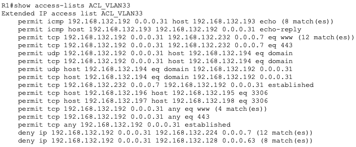

---

## Step 5: Outside ACL

Apply:

```
ip access-list extended ACL_OUTSIDE

 remark === ALLOW CLASS NETWORK ===
 permit ip 172.22.0.0 0.0.255.255 any

 remark === ALLOW ICMP (LIMITED) ===
 permit icmp any any

 remark === ANTI-SPOOFING ===
 ! Block private IP spoofing (internet -> internal)
 deny ip 10.0.0.0 0.255.255.255 any
 deny ip 172.16.0.0 0.15.255.255 any
 deny ip 192.168.0.0 0.0.255.255 any
 deny ip 127.0.0.0 0.0.0.255 any

 remark === ALLOW INTERNET (NEEDED FOR NAT TRAFFIC) ===
 permit ip any any
exit

interface g0/1
ip access-group ACL_OUTSIDE in
exit
```

---

## Test 34 - Valid internet traffic

**From ISP router / outside network:**

```
ping 172.22.0.1
```

**Expected:**

- SUCCESS
- NAT works as intented

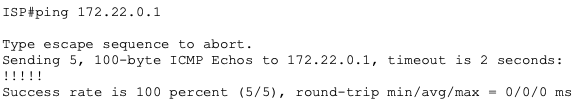

---

## Test 35 - Internet to internal scan attempt

**From ISP router:**

```
ping 192.168.132.129
ping 192.168.132.225
ping 192.168.132.194
```

**Expected:**

- ALL FAIL

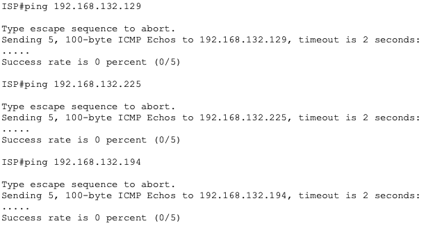

---

## Test 36 - NAT Table Validation

```
show ip nat translations
```

**Expected:**

- Only inside networks appear
- No invalid translations

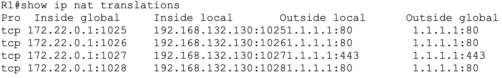
