# Test Report – Network iteration 2

- Test Executor: D. Cooreman - `dean.cooreman@student.hogent.be`
- Executed on: 18/05/2026

---

# PHASE 1 - BASELINE TESTING (NO ACLs)

## Test 1: VLAN & Trunk Validation

**Test procedure:**

- On S1, run:

```
show vlan brief
show interfaces trunk
```

Obtained result:

- VLANs and trunks are set up correctly.

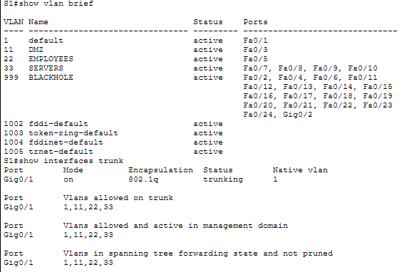

Test passed:

- [x] Yes
- [ ] No

---

## Test 2: Inter-VLAN Routing

**Test procedure:**

- On R1, run:

```
ping 192.168.132.129
ping 192.168.132.193
ping 192.168.132.233
```

Obtained result:

- All pings are successful.

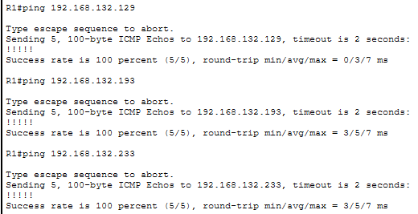

Test passed:

- [x] Yes
- [ ] No

---

## Test 3: DHCP Functionality

**Test procedure:**

- From client, enable DHCP and run `ipconfig`.

Obtained result:

- The client successfully received an IP-address.

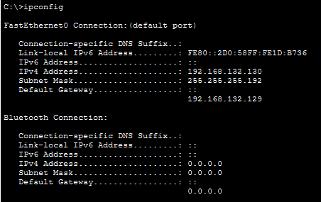

Test passed:

- [x] Yes
- [ ] No

---

## Test 4: Default Gateway Reachability

**Test procedure:**

- From client, run:

```
ping 192.168.132.129
```

Obtained result:

- Default gateway is reachable.

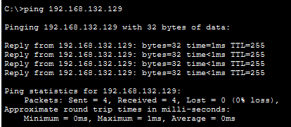

Test passed:

- [x] Yes
- [ ] No

---

## Test 5: Internal Connectivity (NO ACLs yet)

**Test procedure:**

- From client, run:

```
ping 192.168.132.194
ping 192.168.132.234
```

Obtained result:

- All pings successful. 

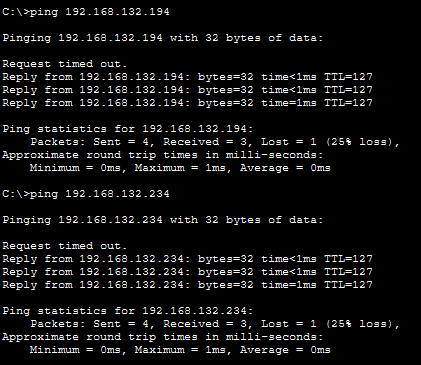

Test passed:

- [x] Yes
- [ ] No

---

## Test 6: External Connectivity & NAT/PAT Functionality

**Test procedure:**

- From client, run `ping 1.1.1.1`.
- On R1, run `show ip nat translations`.

Obtained result:

- Ping from client successful.
- Nat translations successful.

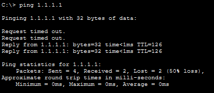

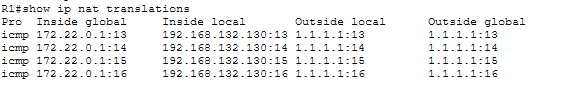

Test passed:

- [x] Yes
- [ ] No

---

## Test 7: DNS Resolution

**Test procedure:**

- From client, run:

```
nslookup t02-domain404.internal
```

Obtained result:

- `nslookup` successful

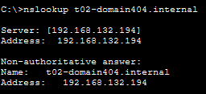

Test passed:

- [x] Yes
- [ ] No

---

# PHASE 2 - ACL IMPLEMENTATION (PER VLAN)

## Test 8: Allowed Traffic (servers & web access)

**Test procedure:**

- From client, run:

```
ping 192.168.132.194
ping 192.168.132.197
```

- From WinClient web browser, open `http://1.1.1.1` and `https://1.1.1.1`.

Obtained result:

- Pings successful.
- Websites reachable.

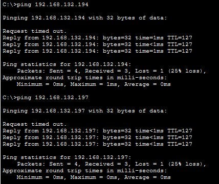


Test passed:

- [x] Yes
- [ ] No

---

## Test 9: Block Management VLAN

**Test procedure:**

- From client, run:

```
ping 192.168.132.225
ping 192.168.132.226
ping 192.168.132.227
```

Obtained result:

- All pings give: Destination host unreachable.

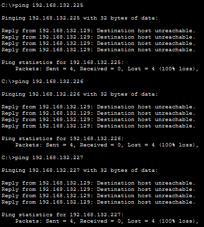

Test passed:

- [x] Yes
- [ ] No

---

## Test 10: DNS Functionality (Clients)

**Test procedure:**

- From client, run:

```
nslookup t02-domain404.internal
```

Obtained result:

- Address successfully resolved.

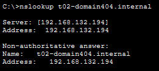

Test passed:

- [x] Yes
- [ ] No

---

## Test 11: DMZ to default gateway

**Test procedure:**

- From DMZ (reverse proxy), run:

```
ping 192.168.132.233
```

Obtained result:

- Ping successful.

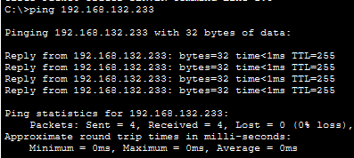

Test passed:

- [x] Yes
- [ ] No

---

## Test 12: DMZ to anywhere

**Test procedure:**

- From DMZ (reverse proxy), run:

```
ping 192.168.132.129
ping 192.168.132.194
ping 192.168.132.130
```

Obtained result:

- All pings: Destination host unreachable.

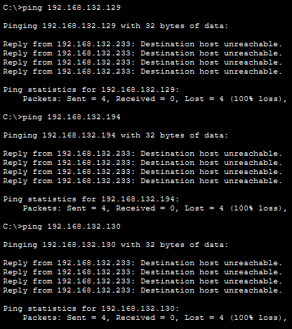

Test passed:

- [x] Yes
- [ ] No

---

## Test 13: Outside DMZ to DMZ

**Test procedure:**

- From client, run:

```
ping 192.168.132.234
```

Obtained result:

- Pings says: Destination host unreachable.

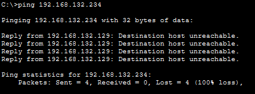

Test passed:

- [x] Yes
- [ ] No

---

## Test 14: Reverse proxy to webserver (HTTP/HTTPS)

**Test procedure:**

- From DMZ (reverse proxy), run `ping 192.168.132.196`.
- From WinClient web browser, open `http://1.1.1.1` and `https://1.1.1.1`.

Obtained result:

- Pings says: Destination host unreachable.
- Both websites reachable.

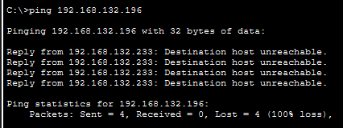


Test passed:

- [x] Yes
- [ ] No

---

## Test 15: DMZ DNS resolution via Domain Controller

**Test procedure:**

- From DMZ (reverse proxy), run:

```
nslookup t02-domain404.internal
```

Obtained result:

- Successfully resolved.

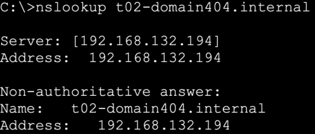

Test passed:

- [x] Yes
- [ ] No

---

## Test 16: DMZ web access to internet

**Test procedure:**

- From DMZ (reverse proxy), run:

```
ping 1.1.1.1
```

Obtained result:

- Ping says: Destination host unreachable.

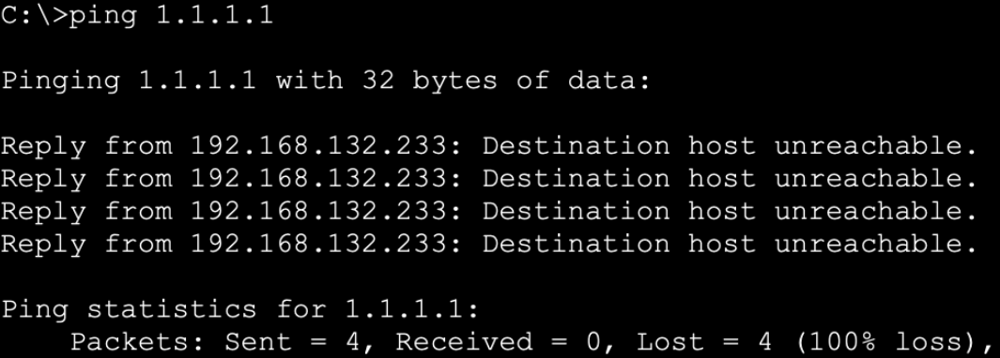

Test passed:

- [x] Yes
- [ ] No

---

## Test 17: DMZ to internal network (clients + servers)

**Test procedure:**

- From DMZ (reverse proxy), run:

```
ping 192.168.132.130
ping 192.168.132.194
ping 192.168.132.196
```

Obtained result:

- All pings say: Destination host unreachable.

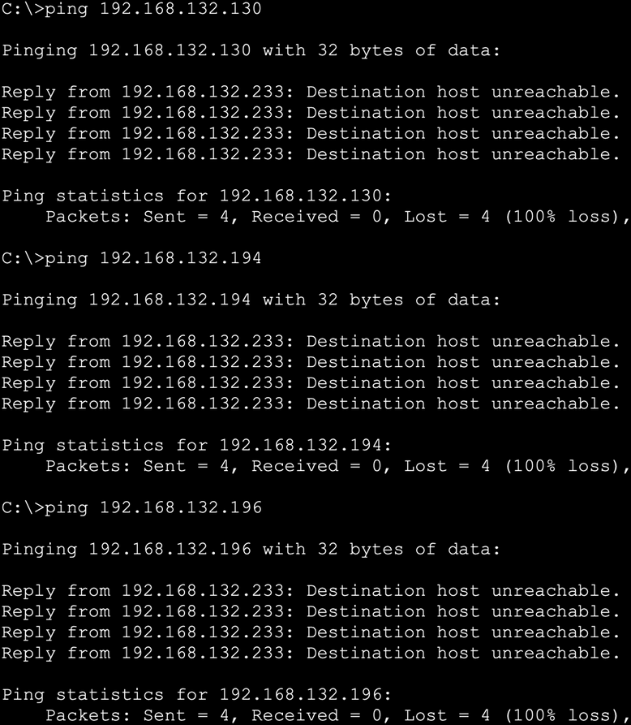

Test passed:

- [x] Yes
- [ ] No

---

## Test 18: DMZ to management VLAN

**Test procedure:**

- From DMZ (reverse proxy), run:

```
ping 192.168.132.225
ping 192.168.132.226
ping 192.168.132.227
```

Obtained result:

- All pings say: Destination host unreachable.

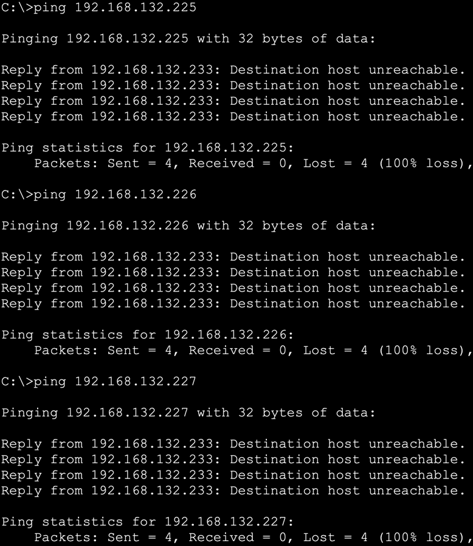

Test passed:

- [x] Yes
- [ ] No

---

## Test 19: ACL hit verification (VLAN 11)

**Test procedure:**

- On R1, run:

```
show access-lists ACL_VLAN11
```

Obtained result:

- All ACLs implemented successfully.

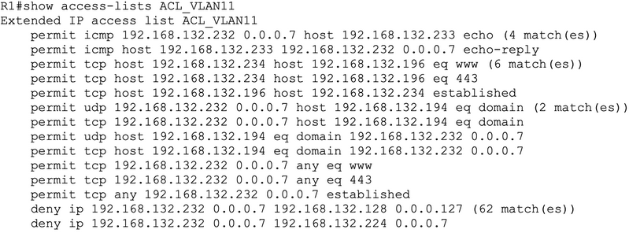

Test passed:

- [x] Yes
- [ ] No

---

## Test 20: Server to default gateway

**Test procedure:**

- From any server in VLAN 33, run:

```
ping 192.168.132.193
```

Obtained result:

- Ping successful.

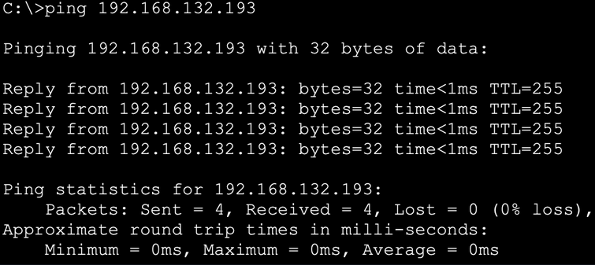

Test passed:

- [x] Yes
- [ ] No

---

## Test 21: Server to client VLAN

**Test procedure:**

- From any server in VLAN 33, run:

```
ping 192.168.132.130
```

Obtained result:

- Ping says: Destination host unreachable.

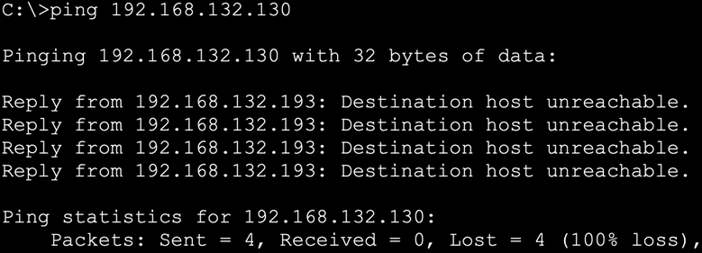

Test passed:

- [x] Yes
- [ ] No

---

## Test 22: Server to management VLAN

**Test procedure:**

- From any server in VLAN 33, run:

```
ping 192.168.132.225
```

Obtained result:

- Ping says: Destination host unreachable.

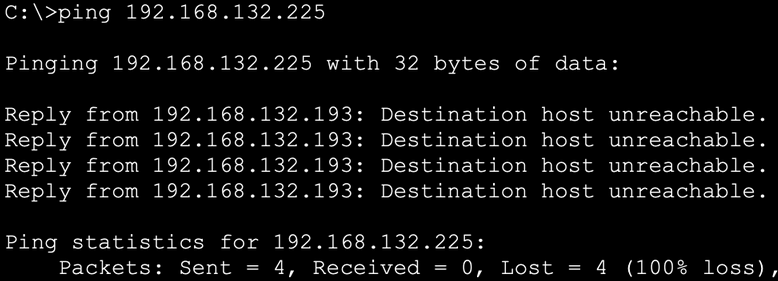

Test passed:

- [x] Yes
- [ ] No

---

## Test 23: Server DNS resolution (internal)

**Test procedure:**

- From any server, run:

```
nslookup t02-domain404.internal
```

Obtained result:

- Successfully resolved.

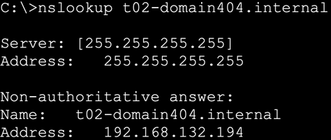

Test passed:

- [x] Yes
- [ ] No

---

## Test 24: ICMP restriction

**Test procedure:**

- From any server, run:

```
ping 192.168.132.130
```

Obtained result:

- Ping says: Destination host unreachable.

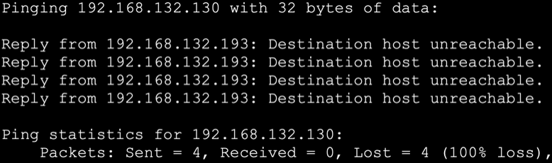

Test passed:

- [x] Yes
- [ ] No

---

## Test 25: ACL hit verification (VLAN 33)

**Test procedure:**

- On R1, run:

```
show access-lists ACL_VLAN33
```

Obtained result:

- Counters raised on permit and deny rules.

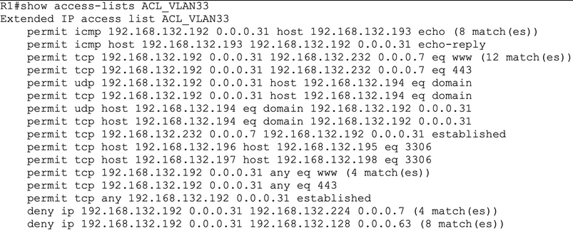

Test passed:

- [x] Yes
- [ ] No

---

## Test 26: Management ICMP (Allowed)

**Test procedure:**

- From TFTP server, run:

```
ping 192.168.132.225
ping 192.168.132.226
```

Obtained result:

- Both pings successful.

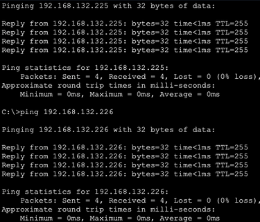

Test passed:

- [x] Yes
- [ ] No

---

## Test 27: Management ICMP (Blocked external)

**Test procedure:**

- From client, run:

```
ping 192.168.132.225
ping 192.168.132.226
ping 192.168.132.227
```

Obtained result:

- All pings say: Destination host unreachable.

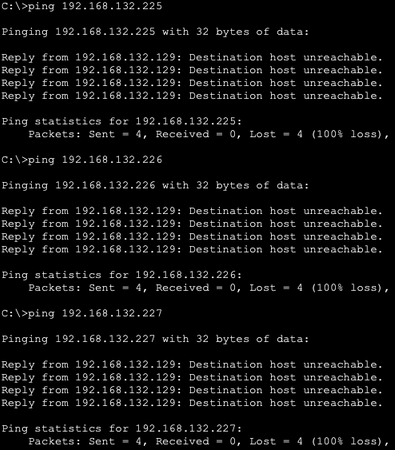

Test passed:

- [x] Yes
- [ ] No

---

## Test 28: Server VLAN to Management

**Test procedure:**

- From any server, run:

```
ping 192.168.132.225
```

Obtained result:

- Ping says: Destination host unreachable.

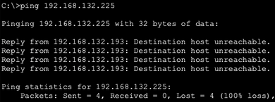

Test passed:

- [x] Yes
- [ ] No

---

## Test 29: DMZ to Management

**Test procedure:**

- From DMZ (reverse proxy), run:

```
ping 192.168.132.225
```

Obtained result:

- Ping says: Destination host unreachable.

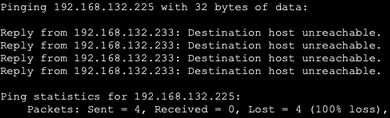

Test passed:

- [x] Yes
- [ ] No

---

## Test 30: TFTP functionality (router)

**Test procedure:**

- From R1, run `copy running-config tftp` and use `192.168.132.227` as server.

Obtained result:

- Running-config copied successfully (5554 bytes).
- File `R1-confg` visible on TFTP server.

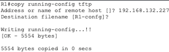

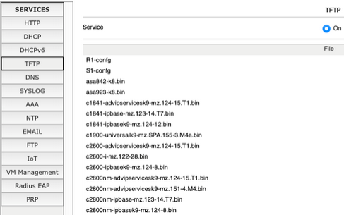

Test passed:

- [x] Yes
- [ ] No

---

## Test 31: TFTP functionality (switch)

**Test procedure:**

- From S1, run `copy running-config tftp` and use `192.168.132.227` as server.

Obtained result:

- Running-config copied successfully (3302 bytes).
- File `S1-confg` visible on TFTP server.

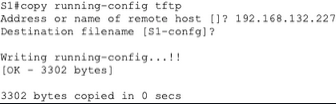

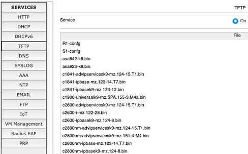

Test passed:

- [x] Yes
- [ ] No

---

## Test 32: Management to DNS

**Test procedure:**

- From R1, run:

```
ping 192.168.132.194
```

Obtained result:

- Ping failed (success rate 0%).

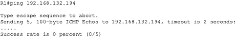

Test passed:

- [x] Yes
- [ ] No

---

## Test 33: ACL hit verification (VLAN 1)

**Test procedure:**

- On R1, run:

```
show access-lists ACL_VLAN1
```

Obtained result:

- Counters raised on permit and deny rules.

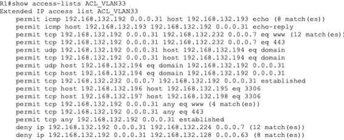

Test passed:

- [x] Yes
- [ ] No

---

## Test 34: Valid internet traffic

**Test procedure:**

- From ISP router / outside network, run:

```
ping 172.22.0.1
```

Obtained result:

- Ping successful (success rate 100%).

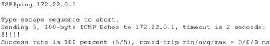

Test passed:

- [x] Yes
- [ ] No

---

## Test 35: Internet to internal scan attempt

**Test procedure:**

- From ISP router, run:

```
ping 192.168.132.129
ping 192.168.132.225
ping 192.168.132.194
```

Obtained result:

- All pings failed (success rate 0%).

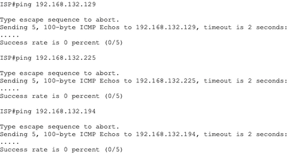

Test passed:

- [x] Yes
- [ ] No

---

## Test 36: NAT Table Validation

**Test procedure:**

- On R1, run:

```
show ip nat translations
```

Obtained result:

- Only inside networks appear in the NAT table.
- No invalid translations.

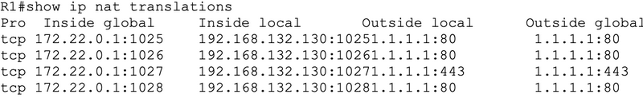

Test passed:

- [x] Yes
- [ ] No
