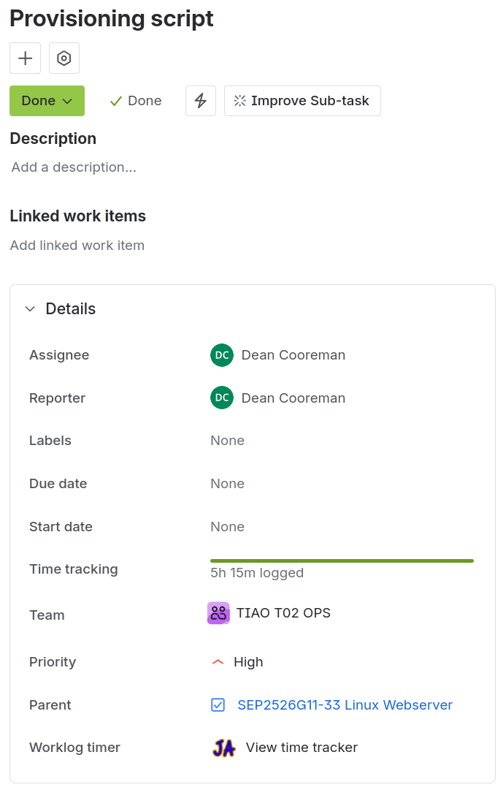
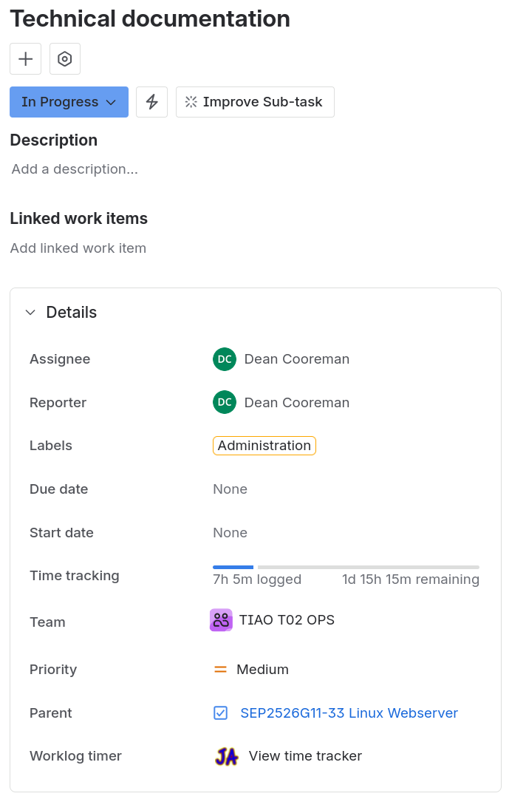
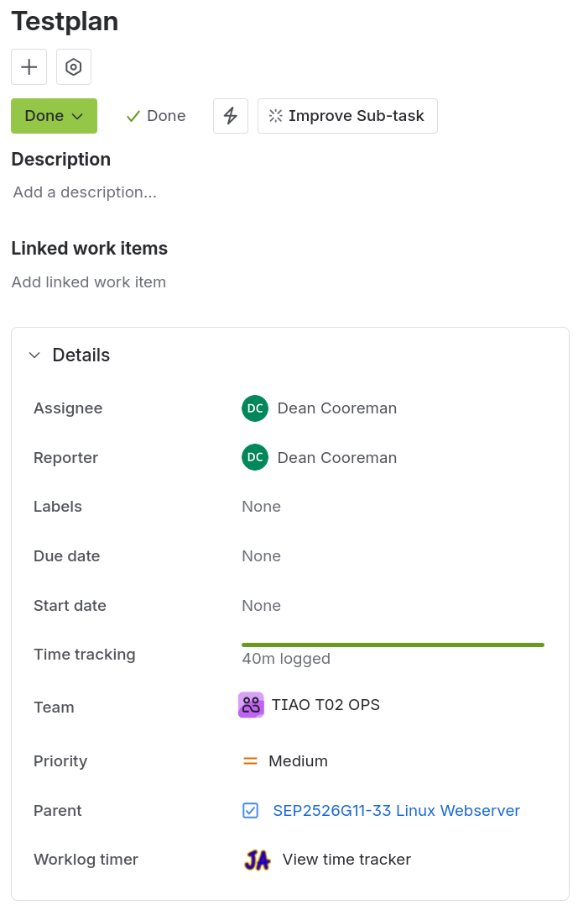

# Requirements

Author(s): D. Cooreman - `dean.cooreman@student.hogent.be`

This document specifies the requirements and technical procedures for the automated deployment of a web server hosting a WordPress Content Management System (CMS). The setup is designed to be reproducible using Vagrant and integrated bash provisioning scripts.

## Host Requirements

The software can run on a host using Microsoft Windows, any Linux distribution, or macOS.

| Software | Description |
| :--- | :--- |
| [Oracle Virtualbox](https://www.virtualbox.org/) | Virtualisation software used to run the virtual machines |
| [Vagrant](https://developer.hashicorp.com/vagrant) | Command line utility for managing the lifecycle of virtual machines, isolate dependencies and their configuration within a single disposable and consistent environment. |

## Deliverables

- **Disable password logins:** Authentication should only be possible with SSH-keys.
- **Web server installation:** Apache HTTP Server (`httpd`) must be installed, enabled, and running on the target system.
- **PHP installation:** Installation of PHP and the necessary MySQL extensions (`php-mysqlnd`) to support WordPress functionality.
- **WordPress deployment:** The latest version of WordPress must be downloaded, extracted, and deployed.
- **Automated Configuration** Dynamic configuration of `wp-config.php` using predefined variables for database credentials and host.
- **Security & Permissions:** Proper ownership and file permissions applied to the WordPress directory, along with SELinux boolean configuration
- **Network Access:** Firewall configuration to allow inbound traffic on standard web ports.

## Subtasks

1. Gather information and resources
  - Person in charge of implementation: D. Cooreman
  - Person in charge of testing: N/A
  - Dependancies: N/A

2. Disable password logins
  - Person in charge of implementation: D. Cooreman
  - Person in charge of testing: N/A
  - Dependancies: Subtask 1

3. Environment Setup & Dependencies
  - Person in charge of implementation: D. Cooreman
  - Person in charge of testing: N/A
  - Dependancies: Subtask 1

4. Apache & PHP Provisioning
  - Person in charge of implementation: D. Cooreman
  - Person in charge of testing: N/A
  - Dependancies: Subtask 3

5. WordPress Installation & Database Linking
  - Person in charge of implementation: D. Cooreman
  - Person in charge of testing: N/A
  - Dependancies: Subtask 3, 4

6. Security Hardening
  - Person in charge of implementation: D. Cooreman
  - Person in charge of testing: N/A
  - Dependancies: Subtaks 3, 4 and 5

7. Technical documentation
  - Person in charge of implementation: D. Cooreman
  - Person in charge of testing: N/A
  - Dependancies: 1, 2, 3, 4, 5 and 6

8. Test plan / functional validation
  - Person in charge of implementation: D. Cooreman
  - Person in charge of testing: N/A
  - Dependancies: All subtasks

## Technical Specifications

| Componenet | Requirement / Value |
| :--- | :--- |
| OS | Almalinux (latest version) |
| Webserver | Apache |
| CMS | WordPress |
| PHP | Standard repository version with `php-mysqlnd` |
| Web Root | `/var/www/html/wordpress` |
| Permissions | Directories: `755`, Files: `640` |
| SELinux Context | `httpd_can_network_connect_db` set to `on` |
| Firewall Services | `http`, `https` |

## Time Spent

| Student    | Estimated Effort | Actual effort | Variance remarks |
| :--- | :--- | :--- | :--- |
| D.Cooreman | 8h0m | 13h0m | First script and documentation that I made for this project. It took me longer then I expected |

