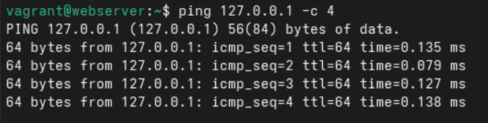
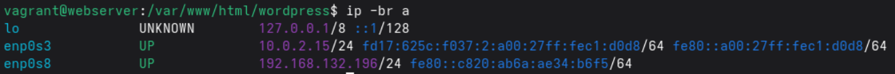
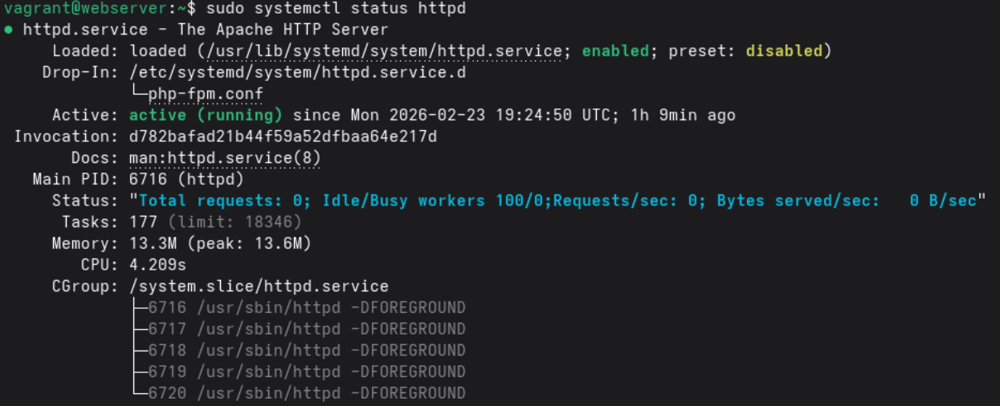
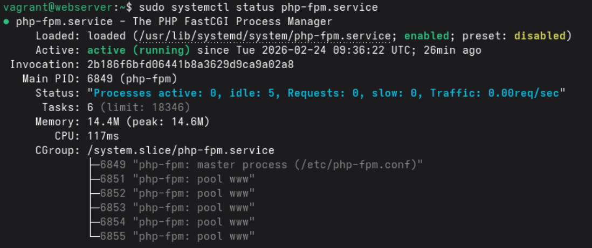
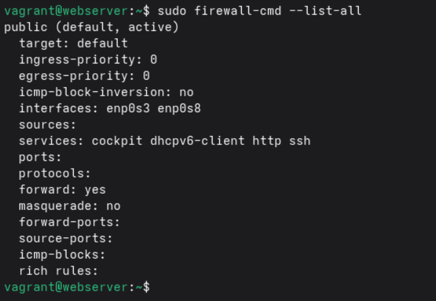
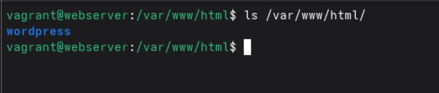
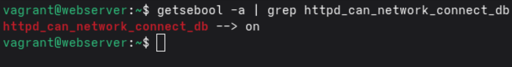
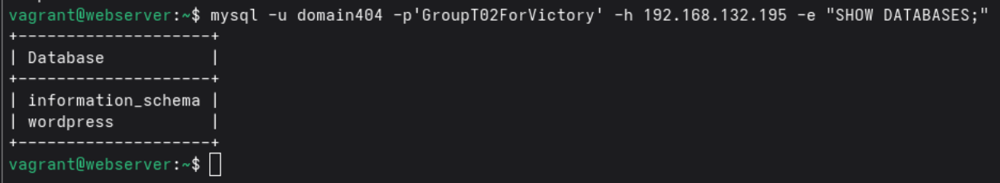
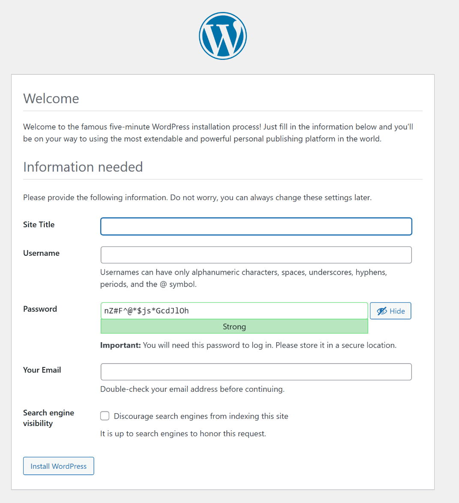
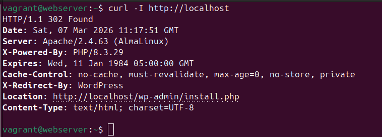

# Test plan

Author(s): D. Cooreman - `dean.cooreman@student.hogent.be`

## Before starting

- Open a terminal window and navigate to the /src folder of the project.
- Use the command `vagrant up` and control if all virtual machines are up and running.
- SSH into the webserver by using the `vagrant ssh webserver` command.
- Install mariadb on the webserver to be able to make a connection to the database with the command `sudo dnf install -y mariadb`
- Create a client with a GUI within the same internal network on Virtualbox.

## Test 1: Ping the local host

Test procedure:

- Run the command `ping 127.0.0.1 -c 4`

Expected result:

- All pings are succesful.
- The round trips are almost instant (less then 1ms).

## Test 2: Is the webserver configured with the correct IP-adress?

Test procedure:

- Run the command `ip -br a`

Expected result:

- The IP-address is `192.168.132.196`.

## Test 3: Is the Apache HTTP Server enabled and running?

Test procedure:

- Run the command `sudo systemctl status httpd`

Expected results:

- The output shows that the service is enabled and active.

## Test 4: Is the PHP service enabled and running?

Test procedure:

- Run the command `sudo systemctl status php-fpm`

Expected results:

- The output shows that the service is enabled and active.

## Test 5: Are the firewall rules correct for Apache?

Test procedure:

- Run the command `sudo firewall-cmd --list-all`

Expected results:

- The output shows that `http` is listed in the services section.

## Test 6: Is wordpress installed in the correct folder?

Test procedure:

- Run the command `ls /var/www/html/`

Expected result:

- The output shows the wordpress directory.

## Test 7: Is the SELinux boolean for the database connection configured correctly?

Test procedure:

- Run the command `getsebool -a | grep httpd_can_network_connect_db`

Expected result:

- The output shows that the boolean is set to on.

## Test 8: Is the database reachable?

Test procedure:

- Run the command `mysql -u domain404 -p'GroupT02ForVictory' -h 192.168.132.195 -e "SHOW DATABASES;"` 
- After testing remove mariadb with the command `sudo dnf remove mariadb -y`

Expected result:

- The output shows the database name.

## Test 9: Is the website reachable from a client?

Test procedure:

- Open a web browser and surf to `http://192.168.132.196`

Expected result: 

- The website is reachable.

## Test 10: Is the website reachable from the webserver via localhost?

Test procedure:

- On the webserver, run the command `curl -I http://localhost`  

Expected result:

- The command returns an HTTP status code in the 2xx or 3xx range (for example `HTTP/1.1 302 Found`).
- The `Server` header shows Apache.

## Test 11: Is it possible to login to wordpress and make a post?

Test procedure:

- Open a web browser and surf to `http://192.168.132.196`
- Install wordpress
- Make an account.
- Login to wordpress.
- Make a post.

Expected results:

- You are succesfully logged in.
- You succefully made a post.

