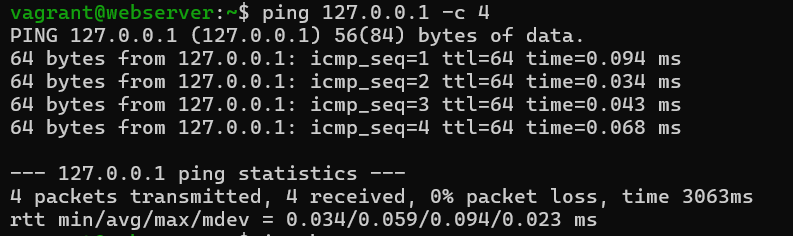
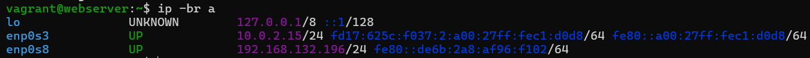
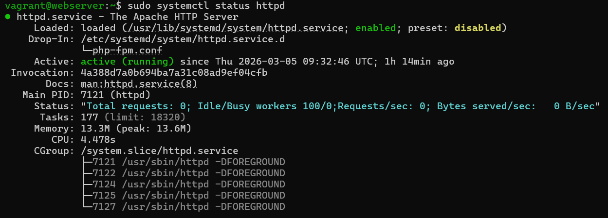
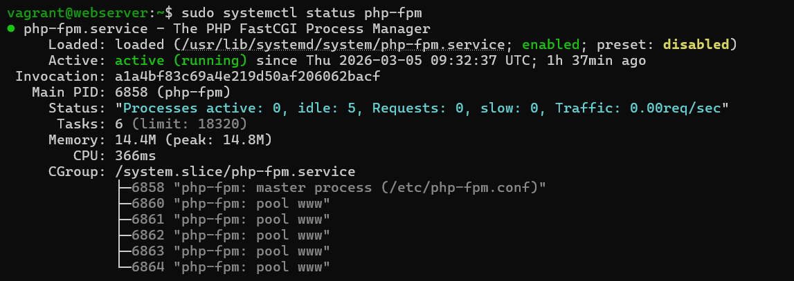
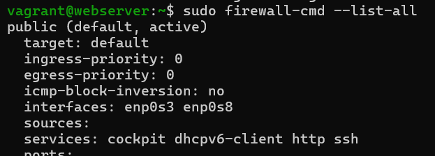
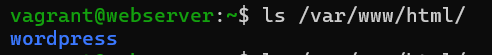
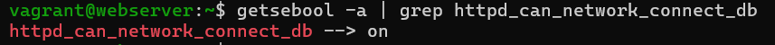
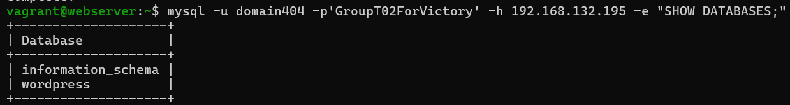

# Test report

- Test Executor(s): Johan Magerman - `johan.magerman@student.hogent.be`
- Executed on: 05/03/2026

## Test 1: Ping the local host

Test procedure:

- Run the command `ping 127.0.0.1 -c 4`

Obtained result:

- All pings are succesful.
- The round trips are almost instant (less then 1ms).

Test passed:

- [x] Yes
- [ ] No

## Test 2: Is the webserver configured with the correct IP-address?

Test procedure:

- Run the command `ip -br a`

Obtained result:

- enp0s8 adapter has IP 192.168.132.196

Test passed:

- [x] Yes
- [ ] No

## Test 3: Is the Apache HTTP Server enabled and running?

Test procedure:

- Run the command `sudo systemctl status httpd`

Expected results:

- The output shows that the service is enabled and active.

Obtained result:

- The httpd service is active and enabled

Test passed:

- [x] Yes
- [ ] No

## Test 4: Is the PHP service enabled and running?

Test procedure:

- Run the command `sudo systemctl status php-fpm`

Obtained result:

- The php-fpm service is active and enabled

Test passed:

- [x] Yes
- [ ] No

## Test 5: Are the firewall rules correct for Apache?

Test procedure:

- Run the command `sudo firewall-cmd --list-all`

Obtained result:

- http is listed in the allowed services

Test passed:

- [x] Yes
- [ ] No

## Test 6: Is wordpress installed in the correct folder?

Test procedure:

- Run the command `ls /var/www/html/`

Obtained result:

- wordpress directory exists

Test passed:

- [x] Yes
- [ ] No

## Test 7: Is the SELinux boolean for the database connection configured correctly?

Test procedure:

- Run the command `getsebool -a | grep httpd_can_network_connect_db`

Obtained result:

- boolean is set to on

Test passed:

- [x] Yes
- [ ] No

## Test 8: Is the database reachable?

Test procedure:

- Run the command `mysql -u domain404 -p'GroupT02ForVictory' -h 192.168.132.195 -e "SHOW DATABASES;"` 
- After testing remove mariadb with the command `sudo dnf remove mariadb -y`

Obtained result:

- Databases are shown correctly

Test passed:

- [x] Yes
- [ ] No

## Test 9: Is the website reachable from a client?

Test procedure:

- Open a web browser and surf to `http://192.168.132.196`

Expected result: 

- The website is reachable.

Obtained result:

- /

<!-- If desired, add a screenshot of the result obtained here. -->

Test passed:

- [ ] Yes
- [x] No

Comments:

- To test from which client? All linux VM's are CLI only.

## Test 10: Is it possible to login to wordpress and make a post?

Test procedure:

- Open a web browser and surf to `http://192.168.132.196`
- Install wordpress
- Make an account.
- Login to wordpress.
- Make a post.

Obtained result:

- /

<!-- If desired, add a screenshot of the result obtained here. -->

Test passed:

- [ ] Yes
- [x] No

Comments:

- To test from which client? All linux VM's are CLI only.