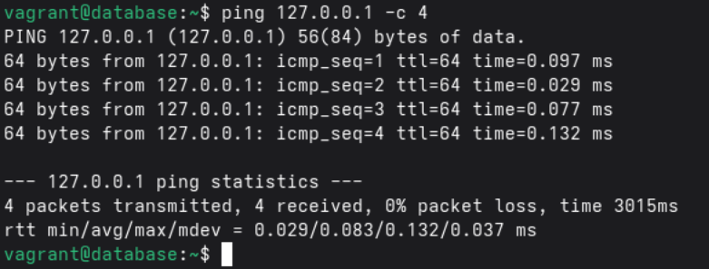
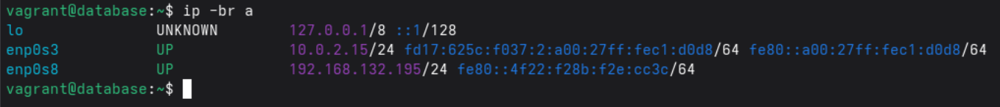
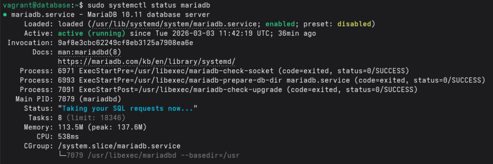
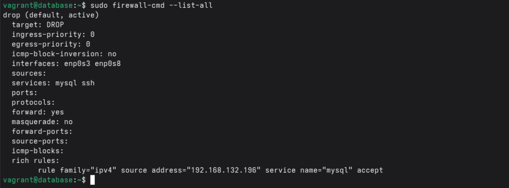
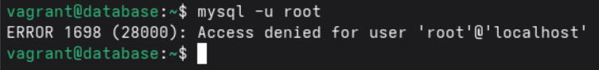
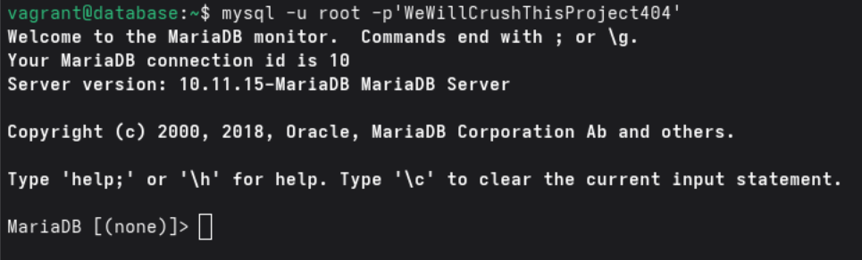
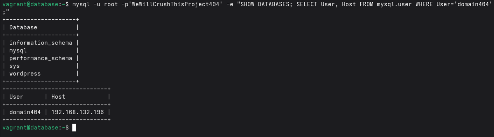
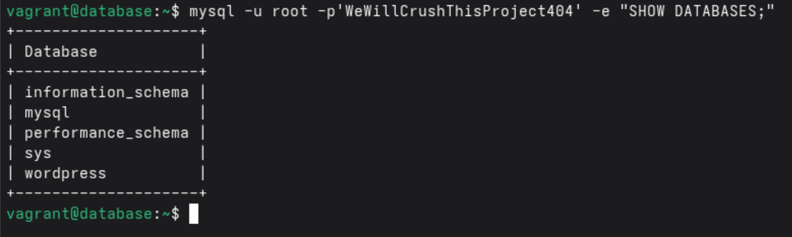
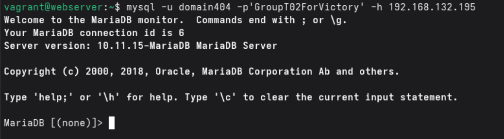
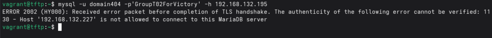

# Test plan

Author(s): D. Cooreman - `dean.cooreman@student.hogent.be`

## Before starting

- Open a terminal window and navigate to the /src folder of the project.
- Use the command `vagrant up` and control if all virtual machines are up and running.
- SSH into the database by using the `vagrant ssh database` command.

## Test 1: Ping the local host

Test procedure:

- Run the command `ping 127.0.0.1 -c 4`

Expected result:

- All pings are succesful.
- The round trips are almost instant (less then 1ms).

## Test 2: Is the database configured with the correct IP-address?

Test procedure:

- Run the command `ip -br a`

Expected result:

- The IP-address is `192.168.132.195`.

## Test 3: Is MariaDB enabled and running?

Test procedure:

- Run the command `sudo systemctl status mariadb`

Expected result:

- The output show that the service is `enabled` and `active`.

## Test 4: Are the firewall rules restricting acces correctly?

Test procedure:

- Run the command `sudo firewall-cmd --list-all` 

Expected result:

- The default zone is set to drop.
- The `mysql` and `ssh` services are listed in the allowed services.
- A rule exists specifically allowing the `webserver` IP `192.168.132.196`.

## Test 5: Is the root password set and secure?

Test procedure:

- Attempt to log in without a password: `mysql -u root`.
- Attempt to log in with the configured password: `mysql -u root -p'WeWillCrushThisProject404'`.

Expected results:

- The passwordless login is denied.

- The login with the password is successful.

## Test 6: Does the WordPress database and user exist?

Test procedure:

- Run the command: `mysql -u root -p'WeWillCrushThisProject404' -e "SHOW DATABASES; SELECT User, Host FROM mysql.user WHERE User='domain404';"`.

Expected results:

- The wordpress database is listed.
- The user `domain404` is listed with the host allowed from `192.168.132.196`.

## Test 7: Is the test database removed?

Test procedure:

- Run the command: `mysql -u root -p'WeWillCrushThisProject404' -e "SHOW DATABASES;"`.

Expected result:

- The test database does not appear in the list.

## Test 8: Is the database reachable from the webserver?

Test procedure:

- SSH into the webserver: `vagrant ssh webserver`
- Install MariaDB: `sudo dnf install -y mariadb`
- Make connection with the database: `mysql -u domain404 -p'GroupT02ForVictory' -h 192.168.132.195`

Expected result:

- The connection is established successfully.

## Test 9: Is the connection refused from the TFTP-server to the database?

Test procedure:

- SSH into the TFTP-server: `vagrant ssh tftp`
- Install MariaDB: `sudo dnf install -y mariadb`
- Try to make connection with the database: `mysql -u domain404 -p'GroupT02ForVictory' -h 192.168.132.195`

Expected result:

- The connection is refused or times out because the firewall rich rule only allows the webserver IP.

