# Test report

- Test Executor(s): Guillaume Lescur - `guillaume.lescur@student.hogent.be`
- Executed on: 15/03/2026

## 1. Software installation

### Test 1.1 - Verify Nginx and firewalld are installed

**Test procedure:**

1. Open a terminal on the host machine.

2. Connect to the reverse-proxy VM:

```shell
vagrant ssh reverse-proxy
```

3. Display information about the installed package:

```shell
rpm -q nginx firewalld
```

Obtained result:

- Both packages are installed:

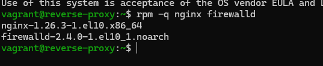

Test passed:

- [x] Yes
- [ ] No

## 2. Service status

### Test 2.1 - Verify Nginx is enabled and active

**Test procedure**

```shell
systemctl is-enabled nginx
systemctl is-active nginx
```

### Test 2.2 - Verify firewalld is enabled and active

**Test procedure**

```shell
systemctl is-enabled firewalld
systemctl is-active firewalld
```

Obtained result:

- All commands return `enabled` and `active`.

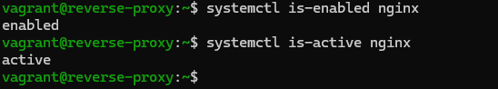
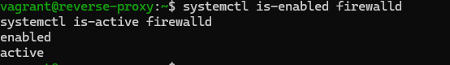

Test passed:

- [x] Yes
- [ ] No

## 3. Firewall configuration

### Test 3.1 - Verify HTTP and HTTPS are allowed

**Test procedure**

```shell
sudo firewall-cmd --list-services
```

> Do not rely on assumptions - explicitly check output!

### Test 3.2 - Verify ports 80 and 443 are listening

**Test procedure**

```shell
ss -tulpn | grep -E ':80|:443'
```

Obtained result:

- Output contains both `http` and `https`
- Port 80 (TCP) is listening.
- Port 443 (TCP) is listening.
- Process associated with Nginx.

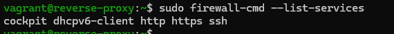
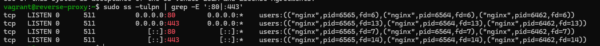

Test passed:

- [x] Yes
- [ ] No

## 4. SELinux configuration

### Test 4.1 - Verify SELinux is enforcing

**Test procedure**

```shell
getenforce
```

### Test 4.2 - Verify httpd_can_network_connect boolean

**Test procedure**

```shell
getsebool httpd_can_network_connect
```

Obtained result:

- SELinux is enforcing and http can connect to network is on

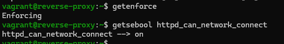

Test passed:

- [x] Yes
- [ ] No

## 5. SSL certificate validation

### Test 5.1 - Verify SSL directory exists

**Test procedure**

```shell
ls -ld /etc/nginx/ssl
```

### Test 5.2 - Verify certificate and key exist

**Test procedure**

```shell
ls -l /etc/nginx/ssl/
```

### Test 5.3 - Verify private key permissions

**Test procedure**

```shell
stat -c "%a" /etc/nginx/ssl/nginx_selfsigned.key
```

### Test 5.4 - Verify certificate subject

**Test procedure**

```shell
openssl x509 -in /etc/nginx/ssl/nginx_selfsigned.crt -noout -subject
```

Obtained result:

- Directory exists
- Files exist
-

```bash
600
```
- Subject contains:

```bash
CN=example.local
```

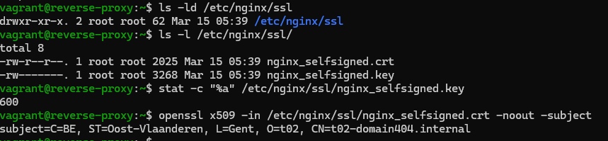

Test passed:

- [x] Yes
- [ ] No

## 6. Nginx configuration File

### Test 6.1 - Verify reverse proxy configuration file exists

**Test procedure**

```shell
ls -l /etc/nginx/conf.d/reverseproxy.conf
```

### Test 6.2 - Verify HTTP to HTTPS redirect configuration

**Test procedure**

```shell
grep "return 301" /etc/nginx/conf.d/reverseproxy.conf
```

### Test 6.3 - Verify proxy_pass configuration

**Test procedure**

```shell
grep proxy_pass /etc/nginx/conf.d/reverseproxy.conf
```

### Test 6.4 - Verify configuration syntax

**Test procedure**

```shell
sudo nginx -t
```

Obtained result:

- File exists
- Line contains:


- IP must match backend webserver IP exactly.

```bash
proxy_pass `192.168.132.196`;
```


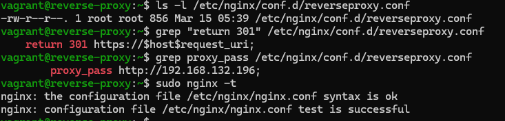

Test passed:

- [x] Yes
- [ ] No

## 7. Functional validation - HTTP redirect

### Test 7.1 - Verify HTTP redirects to HTTPS

**Test procedure**

From host machine:

```shell
curl -I http://192.168.132.234
```

> Do not use https here - test plain HTTP.

Obtained result:

Response contains:

```bash
HTTP/1.1 301
Location: https://...
```

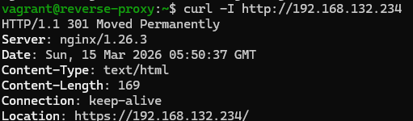

Test passed:

- [x] Yes
- [ ] No

## 8. Functional validation - HTTPS access

### Test 8.1 - Verify HTTPS responds

**Test procedure**

```shell
curl -k https://192.168.132.234
```

> Use -k because certificate is self-signed.

Obtained result:

- HTML content of backend webserver is returned.

- No connection refused.

- No timeout.

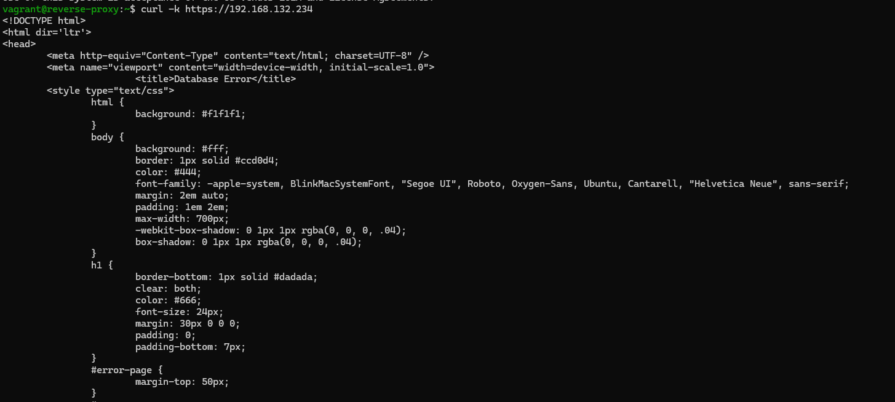

Test passed:

- [x] Yes
- [ ] No

## 9. Reverse proxy backend validation

### Test 9.1 - Confirm traffic reaches backend server

**Test procedure**

1. SSH into backend webserver (192.168.132.196).

```shell
vagrant ssh webserver
```

2. Check Apache logs:

```shell
sudo tail -f /var/log/httpd/access_log
```

3. From host machine:

```shell
curl -k https://192.168.132.234
```

Expected result: 

- New entry appears in backend access log.

- Source IP equals proxy server IP (192.168.132.234).

Obtained result:

- New entry appears in backend access log.

- Source IP equals proxy server IP (192.168.132.234).

- Configuration that proxy forwarding is active

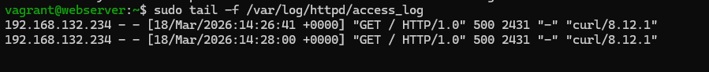

Test passed:

- [X] Yes
- [ ] No

## 10. Domain name validation

### Test 10.1 - Verify server_name configuration

**Test procedure**

```shell
grep server_name /etc/nginx/conf.d/reverseproxy.conf
```

Obtained result:

Contains:

```bash
example.local
www.example.local
```

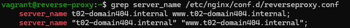

Test passed:

- [x] Yes
- [ ] No
