# Test Plan - TFTP server

_Author: J. Robyn - jelle.robyn@student.hogent.be_

This test plan validates that the provisioning script correctly installs and configures the TFTP server according to the defined specification.

All tests are executed on the **TFTP server VM**, unless explicitly stated otherwise.

## Acceptance criteria

The TFTP server is considered correctly configured when:

- All tests 1 through 11 succeed.
- No SELinux denials occur.
- Both download and upload operations function over the network.
- Configuration files are automatically placed during provisioning.
- No manual configuration is required after provisioning.

## Preconditions

The Vagrant environment is up:

```shell
vagrant up tftp
```

Provisioning has completed without errors.

## 1. Software installation

### Test 1.1 - Verify required packages are installed

**Test procedure:**

1. Open a terminal on your host machine:

2. Connect to the TFTP VM:

```bash
vagrant ssh tftp
```

> Note: **Do not skip this step** - all commands must run inside the VM!

3. Display information about the installed package:

```bash
rpm -q tftp-server tftp
```

**Expected result**

- Both packages are installed:


- No message stating "is not installed".

> If one of the packages is missing, provisioning failed!

## 2. Systemd configuration

### Test 2.1 - Verify drop-in directory exists

Confirm that the systemd override directory was created.

**Test procedure:**

1. Ensure you are logged into the TFTP VM.

2. Execute:

```bash
ls -ld /etc/systemd/system/tftp.service.d/
```

**Expected result**

- Directory exists.

- Output starts with `drwx`.


> If the directory does not exist, service override was not created.

### Test 2.2 - Verify override file exists

Confirm that the `ExecStart` directive, which specifies the command to launch the service, is correctly overridden.

**Test procedure:**

1. Execute:

```bash
ls -l /etc/systemd/system/tftp.service.d/override.conf
```

**Expected result**

- File exists.

- No "No such file or directory" error.

- No deviations are allowed.


### Test 2.3 - Verify ExecStart is correctly overridden

**Test procedure:**

1. Execute:

```shell
cat /etc/systemd/system/tftp.service.d/override.conf
```

**Expected result (exact content required)**

```bash
[Service]
ExecStart=
ExecStart=/usr/sbin/in.tftpd -c -p -s /var/lib/tftpboot
```

Important validation points:

- The first `ExecStart=` line must be empty.

- The second must include `-c` `-p` `-s`.

- The directory must be `/var/lib/tftpboot`.

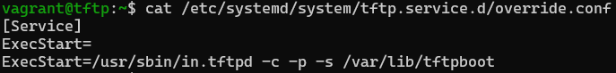

> If flags are missing, uploads may fail.

## 3. Directory structure

### Test 3.1 - Verify TFTP root directory exists

**Test Procedure:**

1. Execute:

```shell
ls -ld /var/lib/tftpboot
```

**Expected result**

- Directory exists.

- No error message.


### Test 3.2 - Verify backup directory exists

**Test procedure:**

1. Execute:

```shell
ls -ld /var/lib/tftpboot/upload
```

**Expected result**

- Directory exists.

- No error message.


If missing, upload backup structure is incorrect.

### Test 3.3 - Verify provisioning files were copied

**Test procedure**

1. Execute:

```shell
ls -l /var/lib/tftpboot
```

**Expected result**

- Files from `/vagrant/provisioning/files/tftp/` are present.

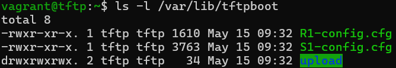

- If the source directory was empty, only the directory listing appears.

> Do **not** manually copy files before this test.

## 4. User and group validation

### Test 4.1 - Verify group tftp exists

**Test procedure**

1. Execute:

```shell
getent group tftp
```

**Expected Result**

- Entry for `tftp` group exists.
- It has a GID => 1000 - `tftp:x:<gid>:`).

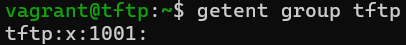

### Test 4.2 - Verify user tftp exists

**Test procedure**

1. Execute:

```shell
getent passwd tftp
```

**Expected result**

- Entry for `tftp` user exists.

- Home directory: `/var/lib/tftpboot`

- Shell: `/sbin/nologin`

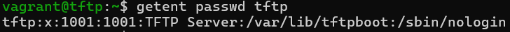

If shell is different, configuration deviates from specification.

## 5. Permissions and ownership

### Test 5.1 - Verify ownership of TFTP root

**Test procedure**

1. Execute:

```shell
ls -l /var/lib/tftpboot
```

**Expected result**

- Owner and group must both be `tftp` `tftp`


### Test 5.2 - Verify permissions of TFTP root

**Test procedure**

1. Execute:

```shell
stat -c "%a" /var/lib/tftpboot
```

> Do not use `ls -l` for numeric verification.

**Expected result**

```bash
777
```

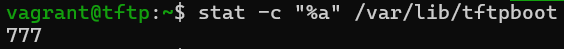

### Test 5.3 - Verify permissions of upload directory

**Test procedure**

1. Execute:

```shell
stat -c "%a" /var/lib/tftpboot/upload
```

**Expected result**

```bash
777
```

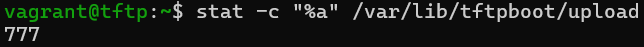

## 6. SELinux validation

### Test 6.1 - Verify SELinux is enforcing

**Test procedure**

1. Execute:

```shell
getenforce
```

**Expected result**

```bash
Enforcing
```

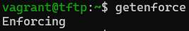

> If `Disabled`, security requirement is not validated.

### Test 6.2 - Verify SELinux boolean

**Test procedure**

1. Execute:

```shell
getsebool tftp_anon_write
```

**Expected Result**

```bash
tftp_anon_write --> on
```

- Must be on, not off.

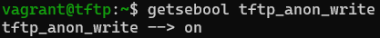

### Test 6.3 - Verify file context registration

**Test procedure**

1. Execute:

```shell
sudo semanage fcontext -l | grep /var/lib/tftpboot
```

> Make sure to execute this command with `sudo`, otherwise a `ValueError` will occur:


**Expected result**

Output contains:

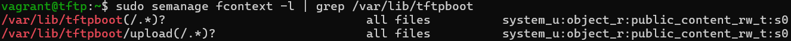

### Test 6.4 - Verify SELinux label applied

**Test procedure**

1. Execute:

```shell
ls -Zd /var/lib/tftpboot
```

**Expected result**

- The type is:

```bash
public_content_rw_t
```

- Any other type = failure.


## 7. Firewall configuration

### Test 7.1 - Verify firewalld is active

**Test procedure**

1. Execute:

```shell
systemctl is-active firewalld
```

**Expected result**

```bash
active
```

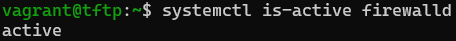

### Test 7.2 - Verify TFTP service is allowed

**Test procedure**

1. Execute:

```shell
sudo firewall-cmd --list-services
```

**Expected result**

Output contains:

```bash
tftp
```

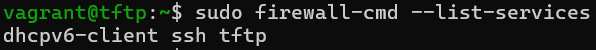

> Do not rely on visual inspection only - verify exact keyword!

## 8. Service activation

### Test 8.1 - Verify tftp.socket status

**Test procedure**

1. Execute:

```shell
systemctl is-enabled tftp.socket
systemctl is-active tftp.socket
```

**Expected result**

Both commands return:

```bash
enabled
active
```

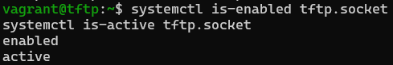

### Test 8.2 - Verify UDP port 69 is listening

**Test procedure**

1. Execute:

```shell
sudo ss -ulpn | grep :69
```

> Do not use `netstat` unless `ss` is unavailable.

**Expected result**

- UDP port 69 appears.

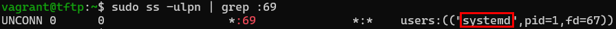

> Process `systemd` will only change to `in.tftpd` once an actual TFTP-request is recieved

## 9. Functional test - download

### Test 9.1 - Verify file download from client

> NOTE: TFTP has to be installed before testing:
>
> ```shell
> dnf install tftp-server
> ```

Performed from another VM in the same network.

**Test procedure**

On the server:

1. Execute:

```shell
echo "Test succeeded" | sudo tee /var/lib/tftpboot/test.txt
```

On the client (same network!):

1. Execute:

```shell
tftp 192.168.132.227
get test.txt
quit
```

> Do not use a different IP address.

**Expected result**

- Download succeeds.

- test.txt contains:

```bash
Test succeeded
```

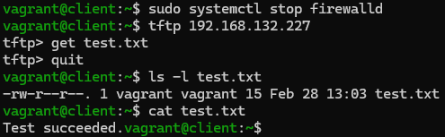

> NOTE: you might need to disable the firewall.<br>
> If not, a `Transfer timed out` error may occur:

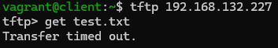

> NOTE: please check the test.txt file for the correct owner / group.<br>
> Files created manually will have root root and need to be changed to tftp

```shell
ls -l /var/lib/tftpboot/test.txt
-rw-r--r--. 1 root root ... test.txt

sudo chown tftp:tftp /var/lib/tftpboot/test.txt
-rwxr-xr-x. 1 tftp tftp  ... test.txt
```
