# Test report

- Test Executor(s): Johan Magerman - `johan.magerman@student.hogent.be`, Guillaume Lescur - `Guillaume.lescur@student.hogent.be`
- Executed on: 05/03/2026 and 15/05/2026

## 1. Software installation

### Test 1.1 - Verify required packages are installed

**Test procedure:**

1. Open a terminal on your host machine:

2. Connect to the TFTP VM:

```bash
vagrant ssh tftp
```

> Note: **Do not skip this step** - all commands must run inside the VM!

3. Display information about the installed package:

```bash
rpm -q tftp-server tftp
```

Obtained result:

- both packages are installed

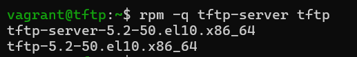 

Test passed:

- [x] Yes
- [ ] No

## 2. Systemd configuration

### Test 2.1 - Verify drop-in directory exists

Confirm that the systemd override directory was created.

**Test procedure:**

1. Ensure you are logged into the TFTP VM.

2. Execute:

```bash
ls -ld /etc/systemd/system/tftp.service.d/
```

Obtained result:

- directory exists and rights are set correctly

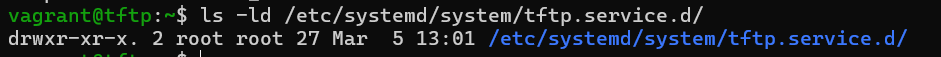

Test passed:

- [x] Yes
- [ ] No

### Test 2.2 - Verify override file exists

Confirm that the `ExecStart` directive, which specifies the command to launch the service, is correctly overridden.

**Test procedure:**

1. Execute:

```bash
ls -l /etc/systemd/system/tftp.service.d/override.conf
```

Obtained result:

- file exists and rights are set correctly

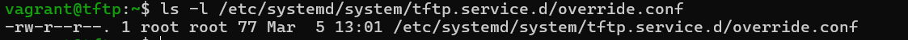

Test passed:

- [x] Yes
- [ ] No

### Test 2.3 - Verify ExecStart is correctly overridden

**Test procedure:**

1. Execute:

```shell
cat /etc/systemd/system/tftp.service.d/override.conf
```

Obtained result:

- File content is exactly as expected

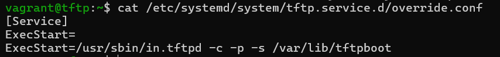

Test passed:

- [x] Yes
- [ ] No

## 3. Directory structure

### Test 3.1 - Verify TFTP root directory exists

**Test Procedure:**

1. Execute:

```shell
ls -ld /var/lib/tftpboot
```

Obtained result:

- directory exists and has correct rights

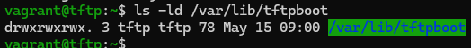

Test passed:

- [x] Yes
- [ ] No

### Test 3.2 - Verify backup directory exists

**Test procedure:**

1. Execute:

```shell
ls -ld /var/lib/tftpboot/upload
```

Obtained result:

- directory exists and has correct rights

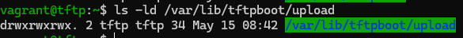

Test passed:

- [x] Yes
- [ ] No

### Test 3.3 - Verify provisioning files were copied

**Test procedure**

1. Execute:

```shell
ls -l /var/lib/tftpboot
```

Obtained result:

- source directory was empty so no files present

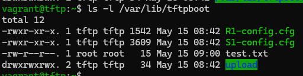

Test passed:

- [x] Yes
- [ ] No

## 4. User and group validation

### Test 4.1 - Verify group tftp exists

**Test procedure**

1. Execute:

```shell
getent group tftp
```

Obtained result:

- group tftp exists with system GID

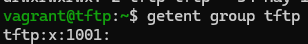

Test passed:

- [x] Yes
- [ ] No

### Test 4.2 - Verify user tftp exists

**Test procedure**

1. Execute:

```shell
getent passwd tftp
```

Obtained result:

- tftp user exists with correct home directory and shell configured

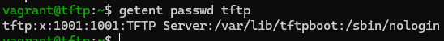

Test passed:

- [x] Yes
- [ ] No

## 5. Permissions and ownership

### Test 5.1 - Verify ownership of TFTP root

**Test procedure**

1. Execute:

```shell
ls -ld /var/lib/tftpboot
```

Obtained result:

- directory owner and group set to tftp

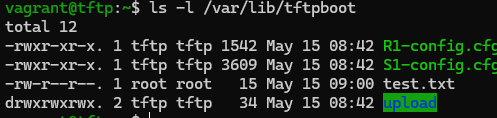

Test passed:

- [x] Yes
- [ ] No

### Test 5.2 - Verify permissions of TFTP root

**Test procedure**

1. Execute:

```shell
stat -c "%a" /var/lib/tftpboot
```

> Do not use `ls -l` for numeric verification.

Obtained result:

- Permissions are set correctly

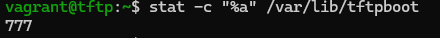

Test passed:

- [x] Yes
- [ ] No

### Test 5.3 - Verify permissions of upload directory

**Test procedure**

1. Execute:

```shell
stat -c "%a" /var/lib/tftpboot/upload
```

Obtained result:

- Permissions are set correctly

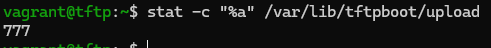

Test passed:

- [x] Yes
- [ ] No

## 6. SELinux validation

### Test 6.1 - Verify SELinux is enforcing

**Test procedure**

1. Execute:

```shell
getenforce
```

Obtained result:

- SELinux is enforcing

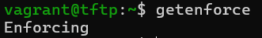

Test passed:

- [x] Yes
- [ ] No

### Test 6.2 - Verify SELinux boolean

**Test procedure**

1. Execute:

```shell
getsebool tftp_anon_write
```

Obtained result:

- TFTP anon write Boolean is set to on

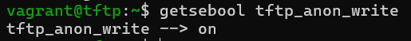

Test passed:

- [x] Yes
- [ ] No

### Test 6.3 - Verify file context registration

**Test procedure**

1. Execute:

```shell
sudo semanage fcontext -l | grep /var/lib/tftpboot
```

> Make sure to execute this command with `sudo`, otherwise a `ValueError` will occur:

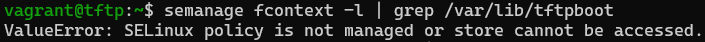

Obtained result:

- Output contains `/var/lib/tftpboot(/.*)?    all files    system_u:object_r:tftpdir_t:s0`

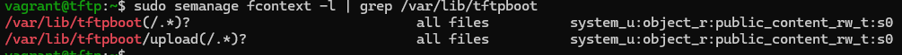

Test passed:

- [x] Yes
- [ ] No

### Test 6.4 - Verify SELinux label applied

**Test procedure**

1. Execute:

```shell
ls -Zd /var/lib/tftpboot
```

Obtained result:

- Output contains `tftpdir_t`


Test passed:

- [x] Yes
- [ ] No

## 7. Firewall configuration

### Test 7.1 - Verify firewalld is active

**Test procedure**

1. Execute:

```shell
systemctl is-active firewalld
```

Obtained result:

- Firewall is active

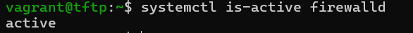

Test passed:

- [x] Yes
- [ ] No

### Test 7.2 - Verify TFTP service is allowed

**Test procedure**

1. Execute:

```shell
sudo firewall-cmd --list-services
```

Obtained result: tftp service is allowed in firewall 

- 

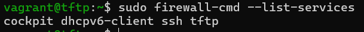

Test passed:

- [x] Yes
- [ ] No

## 8. Service activation

### Test 8.1 - Verify tftp.socket status

**Test procedure**

1. Execute:

```shell
systemctl is-enabled tftp.socket
systemctl is-active tftp.socket
```

Obtained result: socket is enabled and active

- 

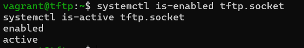

Test passed:

- [x] Yes
- [ ] No

### Test 8.2 - Verify UDP port 69 is listening

**Test procedure**

1. Execute:

```shell
sudo ss -ulpn | grep :69
```

> Do not use `netstat` unless `ss` is unavailable.

Obtained result:

- System is listening on udp port 69

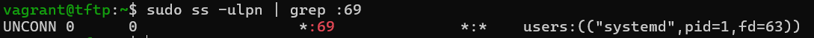

Test passed:

- [x] Yes
- [ ] No

## 9. Functional test - download

### Test 9.1 - Verify file download from client

Performed from another VM in the same network.

**Test procedure**

On the server:

1. Execute:

```shell
echo "Test succeeded" | sudo tee /var/lib/tftpboot/test.txt
```

On the client (same network!):

1. Execute:

```shell
tftp 192.168.132.227
get test.txt
quit
```

> Do not use a different IP address.

Obtained result:

- testvm does not have tftp installed, does not recognize the command

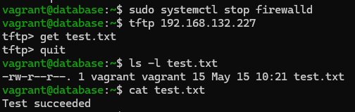

Test passed:

- [ ] Yes
- [x] No
