# Test report

- Test Executor(s): Guillaume Lescur - `guillaume.lescur@student.hogent.be`
- Executed on: 22/03/2026

## Test 1: Is the DC reachable via ping?

**Test procedure:**

```
ping 192.168.132.194
```

Obtained result:

- All replies are received with no packet loss.
- Round-trip times are in the single-digit milliseconds range.

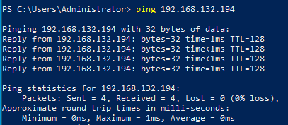

Test passed:

- [x] Yes
- [ ] No

## Test 2: Is the hostname and IP address configured correctly?

**Test procedure**

```powershell
$cs = Get-CimInstance Win32_ComputerSystem
Write-Host $cs.Name
ipconfig
```

Obtained result:

- Hostname is `windowsdc`.
- The active network adapter shows IPv4 address `192.168.132.194` with subnet mask `255.255.255.224`.

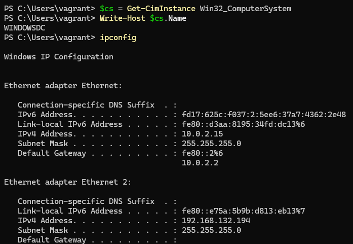

Test passed:

- [x] Yes
- [ ] No

## Test 3: Is the server successfully promoted to a Domain Controller?

**Test procedure**

```powershell
$cs = Get-CimInstance Win32_ComputerSystem
Write-Host "DomainRole: $($cs.DomainRole)  Domain: $($cs.Domain)"
```

Obtained result:

- `DomainRole` is `5` (Primary Domain Controller).
- `Domain` is `ad.t02-domain404.internal`.

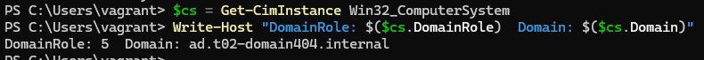

Test passed:

- [x] Yes
- [ ] No

## Test 4: Are the required Windows features installed?

**Test procedure**

```powershell
Get-WindowsFeature DNS, AD-Domain-Services, RSAT-ADDS, RSAT-AD-PowerShell |
    Select-Object Name, Installed, InstallState
```

Obtained result:

- All four features (`DNS`, `AD-Domain-Services`, `RSAT-ADDS`, `RSAT-AD-PowerShell`) show `Installed = True`.

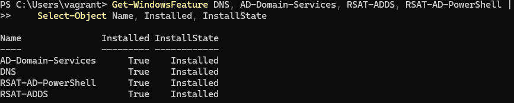

Test passed:

- [x] Yes
- [ ] No

## Test 5: Are the AD-related Windows services running?

**Test procedure**

```powershell
Get-Service ADWS, DNS, KDC, Netlogon, NTDS, W32Time |
    Select-Object Name, Status, StartType
```

Obtained result:

- All services (`ADWS`, `DNS`, `KDC`, `Netlogon`, `NTDS`, `W32Time`) have `Status = Running` and `StartType = Automatic`.

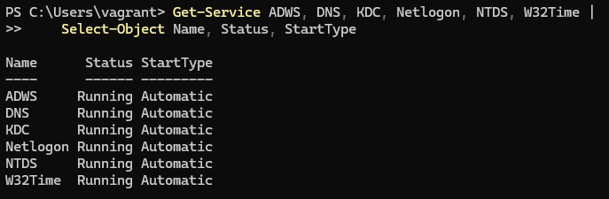

Test passed:

- [x] Yes
- [ ] No

## Test 6: Is the Active Directory domain configured correctly?

**Test procedure**

```powershell
Get-ADDomain | Select-Object DNSRoot, NetBIOSName, DomainMode, PDCEmulator
Get-ADForest | Select-Object Name, ForestMode
```

Obtained result:

- `DNSRoot` is `ad.t02-domain404.local`.
- `NetBIOSName` is `DOMAIN404`.
- `DomainMode` and `ForestMode` are both `Windows2016...`.
- `PDCEmulator` points to `windowsdc.ad.t02-domain404.local`.

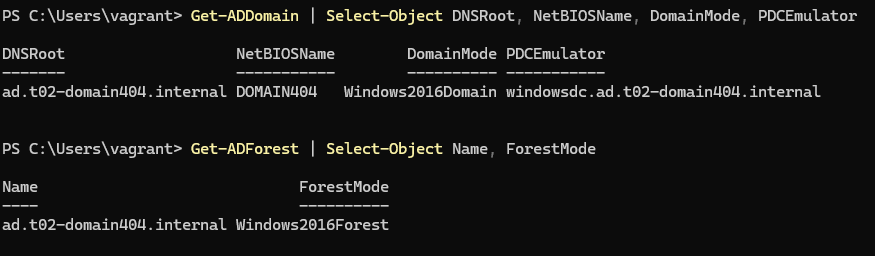

Test passed:

- [x] Yes
- [ ] No

## Test 7: Is the DC registered as a Domain Controller?

**Test procedure**

```powershell
Get-ADDomainController -Filter * | Select-Object Name, IPv4Address, IsGlobalCatalog, OperationMasterRoles
```

Obtained result:

- `windowsdc` appears with IP `192.168.132.194`.
- `IsGlobalCatalog` is `True`.
- All five FSMO roles (`PDCEmulator`, `RIDMaster`, `InfrastructureMaster`, `SchemaMaster`, `DomainNamingMaster`) are held by `windowsdc`.

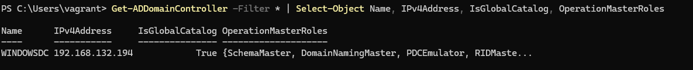

Test passed:

- [x] Yes
- [ ] No

## Test 8: Is the DNS Server service running and configured correctly?

**Test procedure:**

```powershell
Get-Service DNS | Select-Object Name, Status, StartType
Get-DnsServerForwarder | Select-Object -ExpandProperty IPAddress
```

Obtained result:

- DNS service is `Running` with `StartType = Automatic`.
- Forwarders include `1.1.1.1`, `1.0.0.1`, `8.8.8.8`, and `8.8.4.4` (Cloudflare and Google).

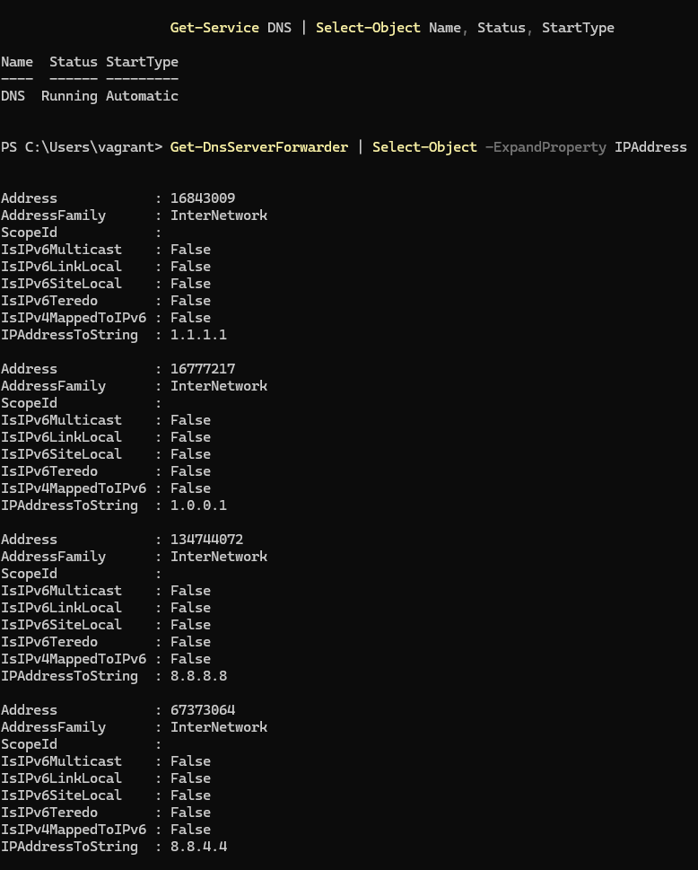

Test passed:

- [x] Yes
- [ ] No

## Test 9: Are the DNS zones created correctly?

**Test procedure**

```powershell
Get-DnsServerZone | Select-Object ZoneName, ZoneType, IsDsIntegrated, DynamicUpdate
```

Obtained result:

- Forward lookup zone `ad.t02-domain404.internal` exists, is AD-integrated, and allows secure dynamic updates.
- Reverse lookup zone `132.168.192.in-addr.arpa` exists, is AD-integrated, and allows secure dynamic updates.

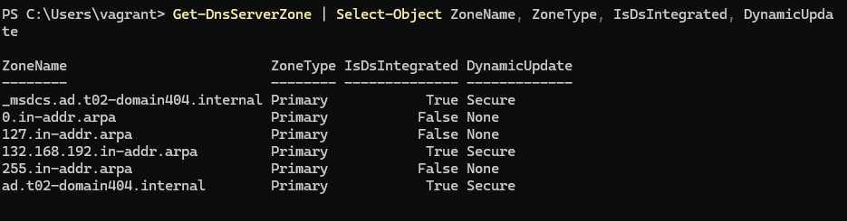

Test passed:

- [x] Yes
- [ ] No

## Test 10: Are the DNS A and PTR records for the DC present?

**Test procedure**

```powershell
# A record
Resolve-DnsName -Name "windowsdc.ad.t02-domain404.internal" -Type A

# PTR record
Resolve-DnsName -Name "194.132.168.192.in-addr.arpa" -Type PTR
```

Obtained result:

- The A record resolves to `192.168.132.194`.
- The PTR record resolves to `windowsdc.ad.t02-domain404.internal`.

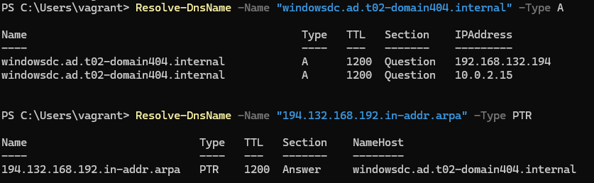

Test passed:

- [x] Yes
- [ ] No

## Test 11: Does the DC use itself as its DNS server?

**Test procedure**

```powershell
Get-DnsClientServerAddress -AddressFamily IPv4 |
    Where-Object { $_.ServerAddresses -ne '' } |
    Select-Object InterfaceAlias, ServerAddresses
```

Obtained result:

- The active network adapter has `127.0.0.1` (or `192.168.132.194`) as its primary DNS server.

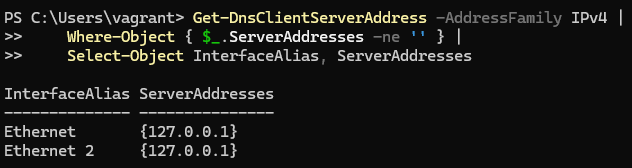

Test passed:

- [x] Yes
- [ ] No

## Test 12: Can the DC resolve external DNS names (forwarders working)?

**Test procedure**

```powershell
Resolve-DnsName -Name "google.com" -Type A
```

Obtained result:

- One or more A records are returned for `google.com`, confirming that DNS forwarding to Cloudflare/Google is operational.

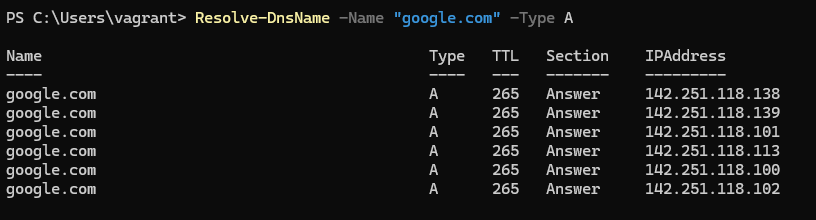

Test passed:

- [x] Yes
- [ ] No

## Test 13: Can DNS queries reach the DC from another machine?

**Test procedure**

```
nslookup windowsdc.ad.t02-domain404.internal 192.168.132.194
```

Obtained result:

- The query returns `192.168.132.194` without errors, confirming the DC's DNS service is reachable from the network.

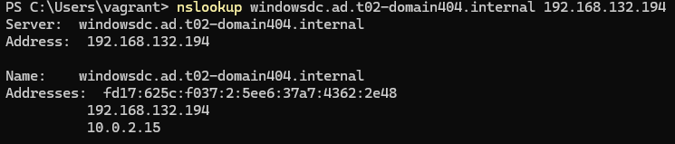

Test passed:

- [x] Yes
- [ ] No

## Test 14: Are the default Active Directory Organisational Units present?

**Test procedure**

```powershell
Get-ADOrganizationalUnit -Filter * |
    Select-Object Name, DistinguishedName
```

Obtained result:

- The default built-in OUs (`Domain Controllers`, etc.) are present.
- Any custom OUs defined in `$OUs` within `windowsdc-config.ps1` are also listed. *(Currently the `$OUs` array is empty.)*

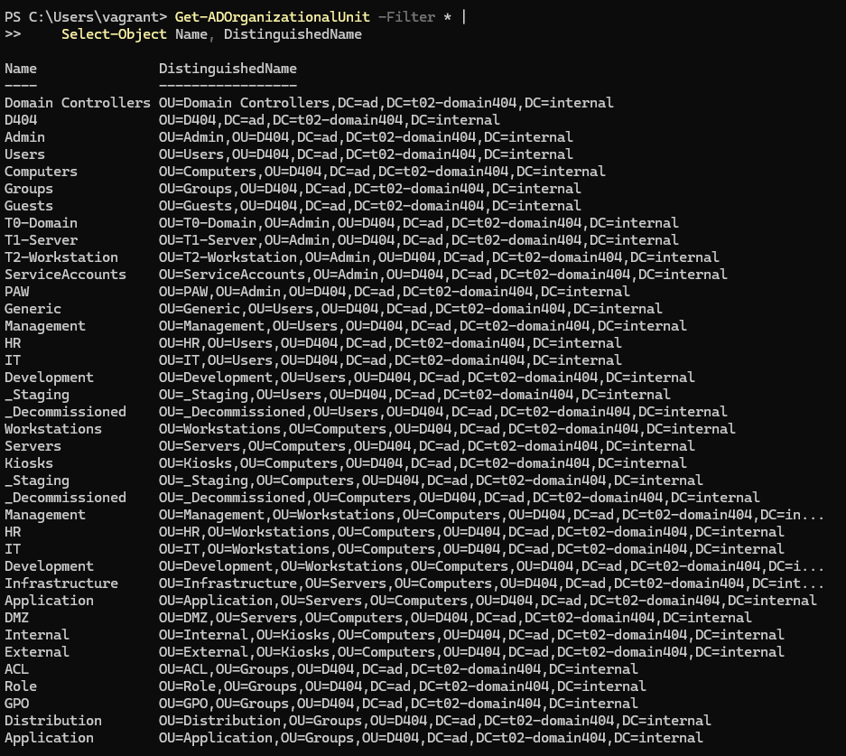

Test passed:

- [x] Yes
- [ ] No

## Test 15: Are the expected AD user accounts present?

**Test procedure**

```powershell
Get-ADUser -Filter * | Select-Object SamAccountName, Name, Enabled
```

Obtained result:

- The built-in `Administrator` account is present.
- The users accounts are present.
- Any additional domain users created during provisioning are listed and `Enabled = True`. *(Update this test once user creation is implemented in stage2.)*

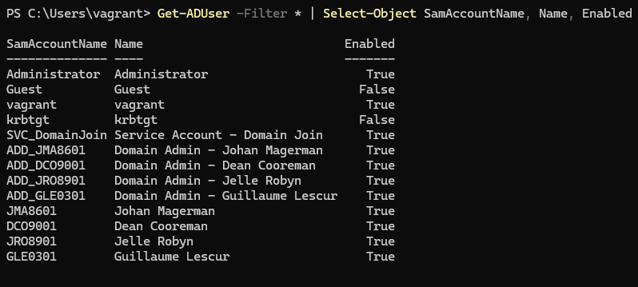

Test passed:

- [x] Yes
- [ ] No
