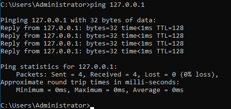
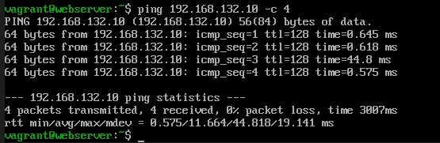
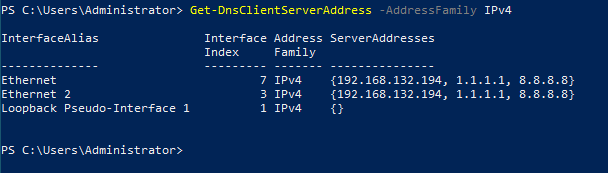
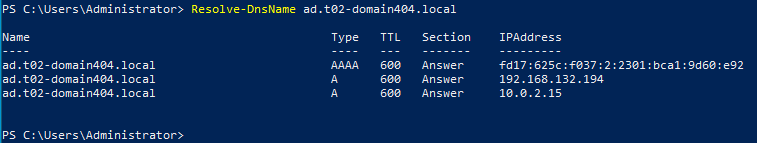
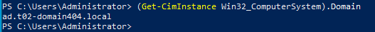
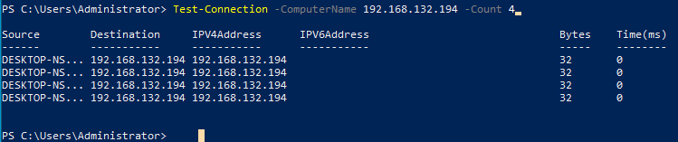
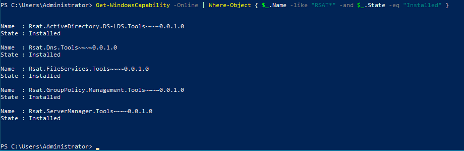

# Test Plan

Author(s): D. Cooreman - `dean.cooreman@student.hogent.be`

## Before Starting

- Open a terminal window and navigate to the `/src` folder of the project.
- Ensure `windowsdc` is fully provisioned and running before testing the client.
- Use the command `vagrant up winclient` and wait for provisioning to complete.
- Connect to the client via VirtualBox GUI.
- Log in with: username `DOMAIN404\Administrator` and password `vagrant`.

## Test 1: Ping the local host

Test procedure:

- Run the command `ping 127.0.0.1`

Expected result:

- All pings are successful.
- The round trips are almost instant (less then 1ms).

## Test 2: Is the client reachable on the network?

Test procedure:

- On the client push `windows key + r`, then type `wf.msc` and press enter.
- Click inbound rules in the left panel.
- Right click and enable `File and Printer Sharing (Echo Request - ICMPv4-In)`
- Open another VM that is connected to the same internal network.
- Run the command: `ping 192.168.132.130 -c 4`

Expected result:

- All pings are successful.

## Test 3: Is the client configured with the correct DNS servers?

Test procedure:

- On the client open Powershell and run: `Get-DnsClientServerAddress -AddressFamily IPv4`

Expected result:

- The primary DNS server is `192.168.132.193`. This is the IP address of the domain controller.
- The fallback servers `1.1.1.1` and `8.8.8.8` are also listed.

## Test 4: Can the client resolve the domain name?

Test procedure:

- On the client open Powershell and run: `Resolve-DnsName ad.t02-domain404.internal`

Expected result:

- The domain resolves successfully and returns the IP address of the domain controller `192.168.132.194`.

## Test 5: Is the client joined to the correct domain?

Test procedure:

- On the client open Powershell and run: `(Get-CimInstance Win32_ComputerSystem).Domain`

Expected result:

- The output shows `ad.t02-domain404.internal`.

## Test 6: Can the client reach the domain controller?

Test procedure:

- On the client open Powershell and run: `Test-Connection -ComputerName 192.168.132.194 -Count 4`

Expected result:

- All pings are successful.

## Test 7: Are the RSAT tools installed?

Test procedure:

- On the client open Powershell and run: `Get-WindowsCapability -Online | Where-Object { $_.Name -like "Rsat*" -and $_.State -eq "Installed" }`

Expected results:

- The following tools are installed:
  - `Rsat.ActiveDirectory.DS-LDS.Tools~~~~0.0.1.0`
  - `Rsat.GroupPolicy.Management.Tools~~~~0.0.1.0`
  - `Rsat.Dns.Tools~~~~0.0.1.0`
  - `Rsat.FileServices.Tools~~~~0.0.1.0`
  - `Rsat.ServerManager.Tools~~~~0.0.1.0`

