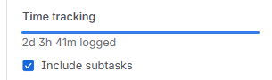

# Requirements

Author(s): D. Cooreman - `dean.cooreman@student.hogent.be`

This document specifies the requirements and technical procedures for the automated deployment of a Nextcloud server. The setup is designed to be reproducible using Vagrant and integrated bash provisioning scripts.

## Host Requirements

The software can run on a host using Microsoft Windows, any Linux distribution, or macOS.

| Software | Description |
| :--- | :--- |
| [Oracle Virtualbox](https://www.virtualbox.org/) | Virtualisation software used to run the virtual machines |
| [Vagrant](https://developer.hashicorp.com/vagrant) | Command line utility for managing the lifecycle of virtual machines, isolate dependencies and their configuration within a single disposable and consistent environment. |

## Deliverables

- **Disable password logins:** Authentication should only be possible with SSH-keys.
- **Apache & PHP-FPM installation:** Apache HTTP Server (`httpd`) must be installed, enabled, and running on the target system. PHP 8.2 (from Remi) must be installed with all required and recommended modules for Nextcloud.
- **Valkey caching:** A Valkey (Redis-compatible) instance must be installed, bound to `127.0.0.1`, password-protected, and wired into Nextcloud for distributed caching and locking.
- **Nextcloud deployment:** The configured version of Nextcloud must be downloaded from the official source, verified against its SHA-256 checksum, extracted, and deployed under `/var/www/html/nextcloud`.
- **Automated Configuration:** Headless installation via the `occ` CLI using predefined variables for database credentials, admin account, trusted domains, and reverse-proxy settings.
- **Security & Permissions:** Proper ownership and SELinux file contexts applied to the Nextcloud directories, with SELinux booleans set to allow Apache to reach the remote database and send mail.
- **Network Access:** Firewall configuration to allow inbound traffic on standard web ports, with the reverse proxy added as a trusted proxy.
- **User provisioning:** An administrator account and a regular Nextcloud user account must be created automatically.
- **LDAP / Active Directory integration:** The `user_ldap` app must be enabled and configured against the domain controller so that AD users can authenticate against Nextcloud.
- **Default apps & content:** A default calendar must be created for the regular user, and the Nextcloud Forms app must be installed and enabled.

## Subtasks

1. Gather information and resources
   - Person in charge of implementation: D. Cooreman
   - Person in charge of testing: N/A
   - Dependencies: N/A

2. Disable password logins
   - Person in charge of implementation: D. Cooreman
   - Person in charge of testing: N/A
   - Dependencies: Subtask 1

3. Environment Setup & Dependencies
   - Person in charge of implementation: D. Cooreman
   - Person in charge of testing: N/A
   - Dependencies: Subtask 1

4. Apache & PHP 8.2 Provisioning
   - Person in charge of implementation: D. Cooreman
   - Person in charge of testing: N/A
   - Dependencies: Subtask 3

5. Valkey caching setup
   - Person in charge of implementation: D. Cooreman
   - Person in charge of testing: N/A
   - Dependencies: Subtask 3

6. Nextcloud download, checksum verification and installation
   - Person in charge of implementation: D. Cooreman
   - Person in charge of testing: N/A
   - Dependencies: Subtask 3, 4

7. Firewall and SELinux hardening
   - Person in charge of implementation: D. Cooreman
   - Person in charge of testing: N/A
   - Dependencies: Subtask 3, 4, 6

8. Nextcloud initial configuration and database linking
   - Person in charge of implementation: D. Cooreman
   - Person in charge of testing: N/A
   - Dependencies: Subtask 4, 5, 6

9. User account creation
   - Person in charge of implementation: D. Cooreman
   - Person in charge of testing: N/A
   - Dependencies: Subtask 8

10. LDAP / Active Directory integration
    - Person in charge of implementation: D. Cooreman
    - Person in charge of testing: N/A
    - Dependencies: Subtask 8

11. Calendar and Forms app deployment
    - Person in charge of implementation: D. Cooreman
    - Person in charge of testing: N/A
    - Dependencies: Subtask 8, 9

12. Technical documentation
    - Person in charge of implementation: D. Cooreman
    - Person in charge of testing: N/A
    - Dependencies: Subtasks 1 through 11

13. Test plan / functional validation
    - Person in charge of implementation: D. Cooreman
    - Person in charge of testing: N/A
    - Dependencies: All subtasks

## Technical Specifications

| Component | Requirement / Value |
| :--- | :--- |
| OS | Almalinux (latest version) |
| Hostname | `nextcloud-server` |
| IP Address | `192.168.132.197` |
| Webserver | Apache (`httpd`) with PHP-FPM |
| Application | Nextcloud `31.0.4` |
| PHP | `8.2` from the Remi repository (required + recommended modules for Nextcloud) |
| PHP limits | `memory_limit=512M`, `max_execution_time=360`, `upload_max_filesize=512M`, `post_max_size=512M` |
| Cache | Valkey, bound to `127.0.0.1`, password `domain404` |
| Web Root | `/var/www/html/nextcloud` |
| Data directory | `/var/www/html/nextcloud/data` |
| Database backend | MariaDB on `192.168.132.198`, database `nextcloud`, user `nextcloud` |
| Admin account | `admin` / `admin404` |
| Regular user | `linustorvalds` (display name: Linus Torvalds) |
| Trusted proxy | `192.168.132.234` (reverse-proxy VM) |
| Public domain | `nextcloud.t02-domain404.internal` |
| Trusted domains | `192.168.132.197`, `nextcloud.t02-domain404.internal` |
| LDAP source | `192.168.132.194` (windowsdc) on port `389` |
| LDAP bind account | `SVC_DomainJoin@ad.t02-domain404.internal` |
| LDAP base DN | `DC=ad,DC=t02-domain404,DC=internal` |
| SELinux booleans | `httpd_can_network_connect`, `httpd_can_network_connect_db`, `httpd_can_sendmail` set to `on` |
| SELinux context | `httpd_sys_rw_content_t` applied to `data`, `config`, `apps`, `.htaccess`, `.user.ini`, AWS log dir |
| Firewall Services | `http`, `https` |
| Default apps | Calendar (`Domain404 Calendar` for `linustorvalds`), Forms |

## Time Spent

| Student | Estimated Effort | Actual effort | Variance remarks |
| :--- | :--- | :--- | :--- |
| D. Cooreman | 30h0m | 51h41m | No guides available for Almalinux. I needed to find a Redis alternative. Creation of an extra client `rockyclient`. |

