# Test Report - Extension: Hardened Nginx reverse-proxy server

- Test Executor(s): Guillaume Lescur - `guillaume.lescur@student.hogent.be`
- Executed on: 15/05/2026

## 1. Software installation

### Test 1.1 - Verify Nginx is installed (custom build)

**Test procedure:**

```shell
/opt/nginx/sbin/nginx -v
```

Obtained result:

Nginx version is displayed
Binary exists under `/opt/nginx/sbin/nginx`

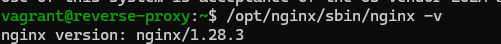

Test passed:

- [x] Yes
- [ ] No

### Test 1.2 - Verify headers-more module is included

**Test procedure:**

```shell
/opt/nginx/sbin/nginx -V 2>&1 | grep headers-more
```

Obtained result:

Output contains:

```shell
--add-module=...headers-more-nginx-module
```

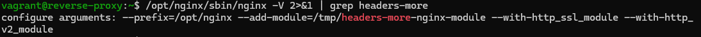

Test passed:

- [x] Yes
- [ ] No

## 2. Systemd configuration

### Test 2.1 - Verify Nginx service is enabled and active

**Test procedure:**

```shell
systemctl is-enabled nginx
systemctl is-active nginx
```

Obtained result:

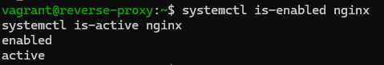

Test passed:

- [x] Yes
- [ ] No

### Test 2.2 - Verify custom systemd unit file

**Test procedure:**

```shell
cat /lib/systemd/system/nginx.service
```

Obtained result:

- File exists
- Contains references to `/opt/nginx/sbin/nginx`

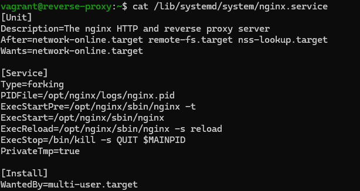

Test passed:

- [x] Yes
- [ ] No

## 3. Configuration validation

### 3.1 Verify Nginx configuration syntax

**Test procedure:**

```shell
sudo /opt/nginx/sbin/nginx -t
```

Obtained result:

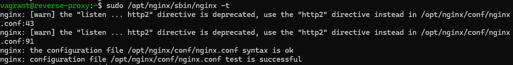

Test passed:

- [x] Yes
- [ ] No

### Test 3.2 - Verify configuration file location

**Test procedure:**

```shell
ls -l /opt/nginx/conf/nginx.conf
```

Obtained result:

- File exists
- Owned by root

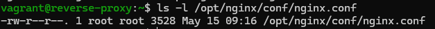

Test passed:

- [x] Yes
- [ ] No

## 4. Firewall configuration

### Test 4.1 - Verify firewalld is active

**Test procedure:**

```shell
systemctl is-active firewalld
```

Obtained result:

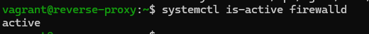

Test passed:

- [x] Yes
- [ ] No

### Test 4.2 - Verify allowed services

**Test procedure:**

```shell
sudo firewall-cmd --list-services
```

Obtained result:

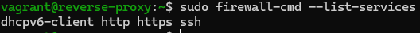

Test passed:

- [x] Yes
- [ ] No

## 5. SELinux validation

### Test 5.1 - Verify SELinux is enforcing

**Test procedure:**

```shell
getenforce
```

Obtained result:

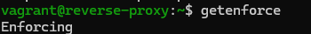

Test passed:

- [x] Yes
- [ ] No

### Test 5.2 - Verify required boolean

**Test procedure:**

```shell
getsebool httpd_can_network_connect
```

Obtained result:

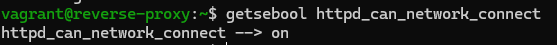

Test passed:

- [x] Yes
- [ ] No

## 6. Network validation

### Test 6.1 - Verify listening ports

**Test procedure:**

```shell
sudo ss -tulnp | grep nginx
```

Obtained result:

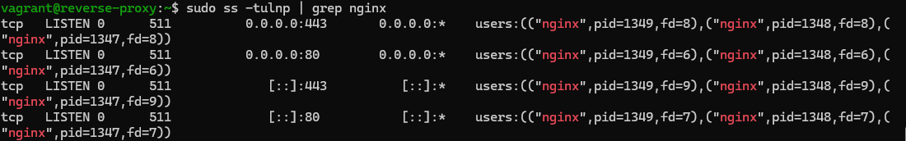

Test passed:

- [x] Yes
- [ ] No

## 7. Reverse proxy behaviour

### Test 7.1 - Test HTTP -> HTTPS redirect

**Test procedure:**

```shell
curl -I -H "Host: t02-domain404.internal" http://127.0.0.1
```

Obtained result:

```shell
HTTP/1.1 301 Moved Permanently
Location: https://t02-domain404.internal/
```

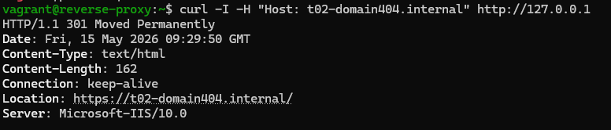

Test passed:

- [x] Yes
- [ ] No

### Test 7.2 - Test HTTPS reverse proxy

**Test procedure:**

```shell
curl -I --insecure -H "Host: t02-domain404.internal" https://127.0.0.1
```

Obtained result:

- Backend response is returned
- TLS is active
- No connection errors

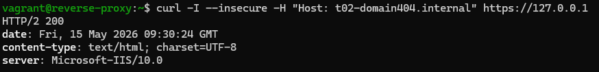

Test passed:

- [x] Yes
- [ ] No

## 8. Security behaviour

### Test 8.1 - Verify default-deny behaviour

**Test procedure:**

```shell
curl -I http://192.168.132.234 -H "Host: unknown.test"
```

Obtained result:

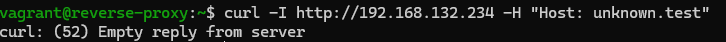

Test passed:

- [x] Yes
- [ ] No

### Test 8.2 - Verify server header spoofing

**Test procedure:**

```shell
curl -I --insecure -H "Host: t02-domain404.internal" https://127.0.0.1
```

Obtained result:

- The following headers are **NOT** present:
  - X-Powered-By
  - X-Pingback
  - Link
- No Nginx version string is visible

```shell
Server: Microsoft-IIS/10.0
```


Test passed:

- [x] Yes
- [ ] No

## 9. Error handling

### Test 9.1 - Verify custom error pages

**Test procedure:**

```shell
curl -k --resolve t02-domain404.internal:443:127.0.0.1 https://t02-domain404.internal/nonexistent
```

Obtained result:

- Custom error page is returned
- No reference to Nginx
- Content originates from `/var/ErrorPages/`

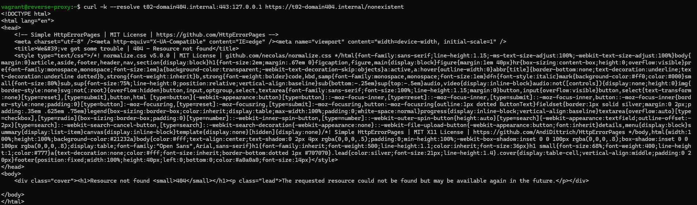

Test passed:

- [x] Yes
- [ ] No

### Test 9.2 - Verify backend error interception

**Test procedure:**

```shell
curl -I --insecure -H "Host: t02-domain404.internal" https://127.0.0.1
```

Obtained result:

- Custom 200 page is returned

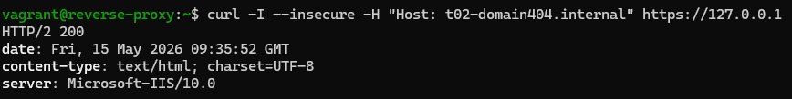

Test passed:

- [ ] Yes
- [x] No

## 10. TLS validation

### Test 10.1 - Verify TLS connection

**Test procedure:**

```shell
curl -I --resolve t02-domain404.internal:443:127.0.0.1 https://t02-domain404.internal
```

Obtained result:

- Curl failed to verify the legitimacy of the server and could not establish a secure connection to it

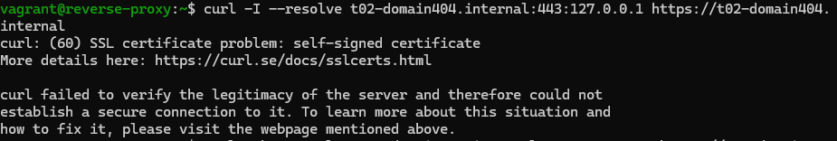

Test passed:

- [ ] Yes
- [X] No

### Test 10.2 - Verify HTTP/2 support

**Test procedure:**

```shell
curl -Ik --resolve t02-domain404.internal:443:127.0.0.1 https://t02-domain404.internal
```

Obtained result:

- HTTP/2 is negotiated

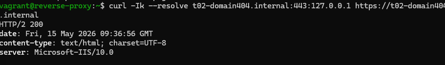

Test passed:

- [x] Yes
- [ ] No
