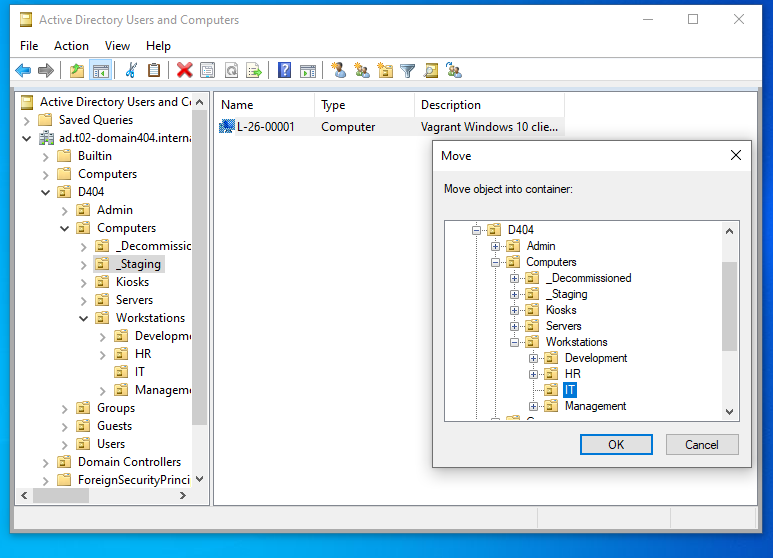
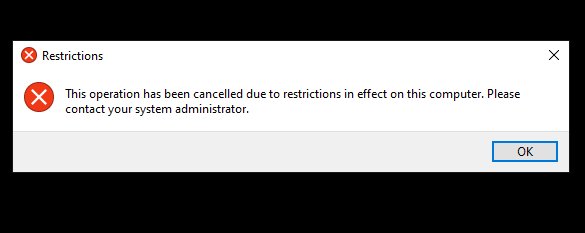
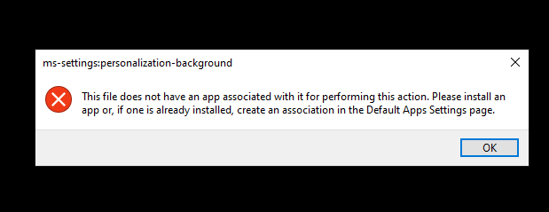
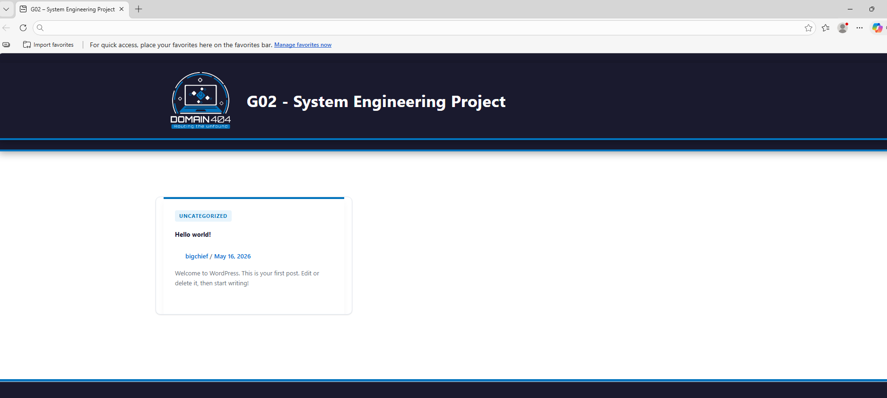
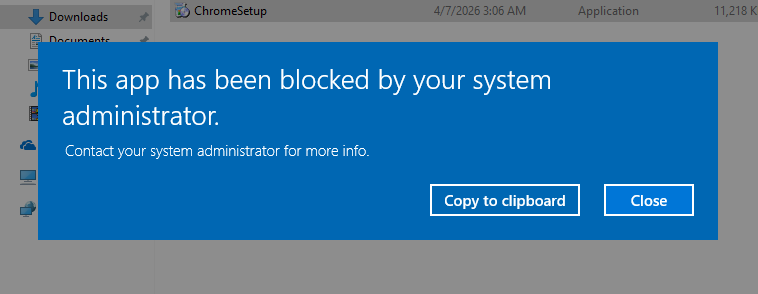

# Test Plan

Author(s): G. Lescur - `guillaume.lescur@student.hogent.be`

## Before Starting

- Open a terminal window and navigate to the `/src` folder of the project.
- Ensure `windowsdc` and `winclient` are fully provisioned and running before testing.

## Pre-requirements

### Make user available on the client

Test procedure:

- Log in on the client with username `DOMAIN404\Administrator` and password `vagrant`.
- Open the active directory and move the computerobject L-26-0001 from Computers > _Staging to Computers > Workstations > IT
- Restart the computer

Expected result:

- The computer restarts and you can log in with another user

### Log in with the newly available user

Test procedure:

- log in with username `GLE0301` and password `vagrant

Expected result:

- The user is logged on

## Test 1: Check the new control panel restrictions

Test procedure:

- Type `control panel` in the search bar and click on it

Expected result:

- A notification is given that this is not allowed

## Test 2: Check the new background restrictions

Test procedure:

- Right click on background and choose `personalize`

Expected result:

- The background should be black, and pressing personalize gives an error too

## Test 3: Check the new taskbar restrictions

Test procedure:

- Right click on taskbar
- Try to pin/unpin an app

Expected result:

- The menu you usually get to change settings does not appear
- The apps can't be pinned or unpinned

## Test 4: Check the new edge changes

Test procedure:

- Open edge, the default page should be `https://t02-domain404.internal/`
- Note: The very first time you open edge you have to personalize your experience. This might give a problem. Finish it, open a new tab, close edge and start it again.

Expected result:

- The starting page of edge should be `https://t02-domain404.internal/`

## Test 5: Check the new .exe restrictions

Test procedure:

- Open edge and look up the download for google. Install this.
- Once this is downloaded, go to your downloads and try to run it.

Expected result:

- You should get a notification saying that this type of files can not be run.

