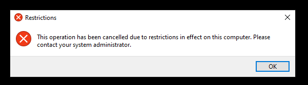
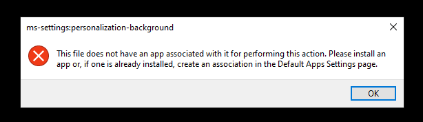
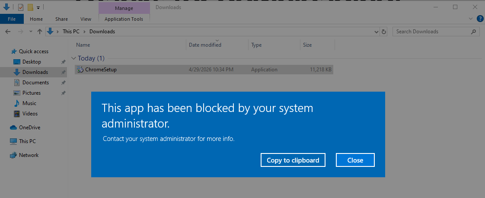

# Test Report – Extension: Extended GPOs

- Test Executor: D. Cooreman - `dean.cooreman@student.hogent.be`
- Executed on: 30/04/2026

## Test 1: Make user available on the client

**Test procedure:**

- Log in on the client with username `DOMAIN404\Administrator` and password `vagrant`.
- Open Active Directory Users and Computers and move the computer object `L-26-0001` from `Computers > _Staging` to `Computers > Workstations > IT`.
- Restart the computer.

Obtained result:

Comments: This is not really a test. It's more a pre-requirement to do the following tests.

## Test 2: Log in with the newly available user

**Test procedure:**

- Log in with username `GLE0301` and password `vagrant`.

Obtained result:

- I could successfully login with the user `GELE0301`.

Test passed:

- [x] Yes
- [ ] No

## Test 3: Check the new control panel restrictions

**Test procedure:**

- Type `control panel` in the search bar and click on it.

Obtained result:

- Warning shows and says: This operation has been canceled due to restrictions in effect on this computer.

Test passed:

- [x] Yes
- [ ] No

## Test 4: Check the new background restrictions

**Test procedure:**

- Right-click on the desktop and choose `Personalize`.

Obtained result:

- I was not able to click Personalize. A warning showed up that says: This file does not have an app associated with it for performing this action.

Test passed:

- [x] Yes
- [ ] No

- Suggestion: Set a nicer background then just black. Maybe we can use something good that represents our team? There is already a custom logo available.

## Test 5: Check the new taskbar restrictions

**Test procedure:**

- Right-click on the taskbar.
- Try to pin/unpin an app.

Obtained result:

- When I right-click an icon in the taskbar it doesn't give an option to unpin.

Test passed:

- [x] Yes
- [ ] No

## Test 6: Check the new Edge changes

**Test procedure:**

- Open Edge. The default page should be `https://t02-domain404.internal/`.
- Note: the very first time you open Edge you may be prompted to personalize your experience — complete it, open a new tab, close Edge, and reopen it.

Obtained result:

- Edge loads https://t02-domain404.internal/ as default page.

Test passed:

- [x] Yes
- [ ] No

## Test 7: Check the new .exe restrictions

**Test procedure:**

- Open Edge and download the Google Chrome installer.
- Once downloaded, navigate to the Downloads folder and attempt to run the installer.

Obtained result:

- I downloaded the Chrome installer and when I clicked it a warning shows up: This app has been blocked by your system administrator.

Test passed:

- [x] Yes
- [ ] No
