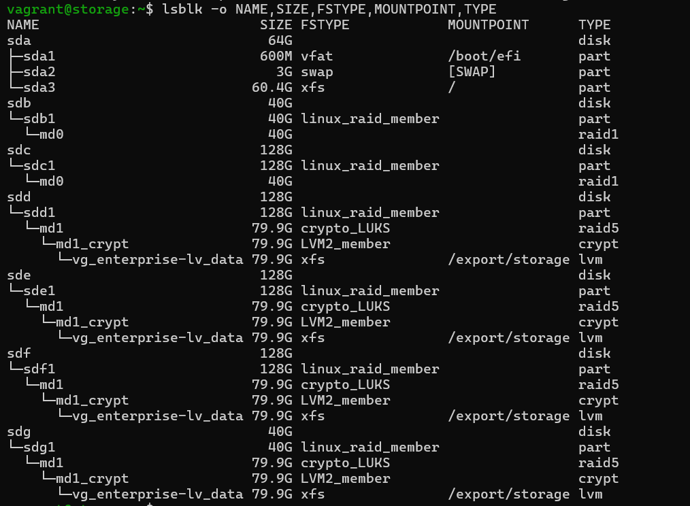
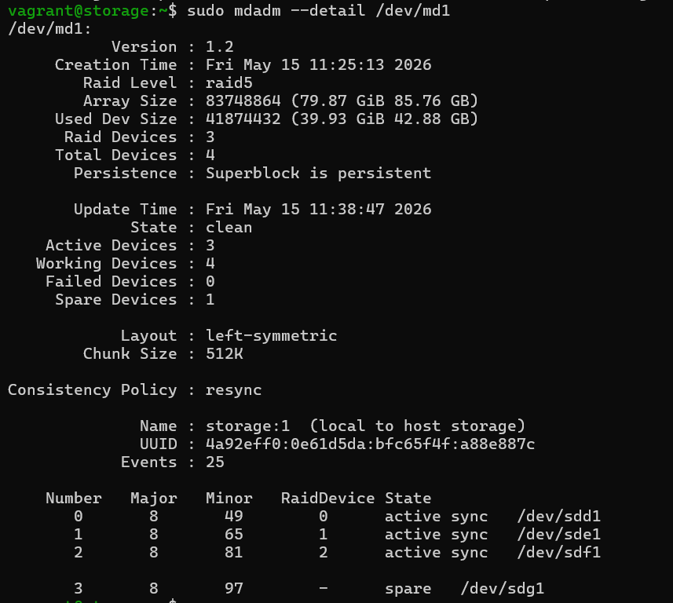
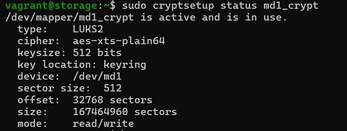
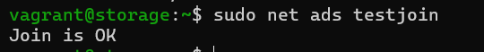
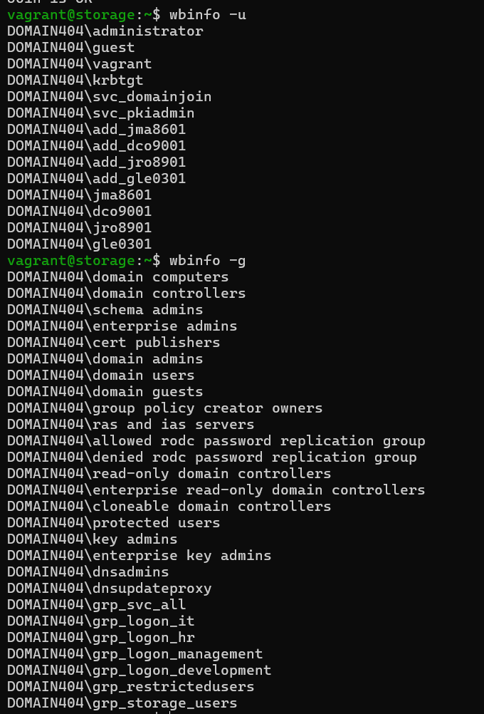
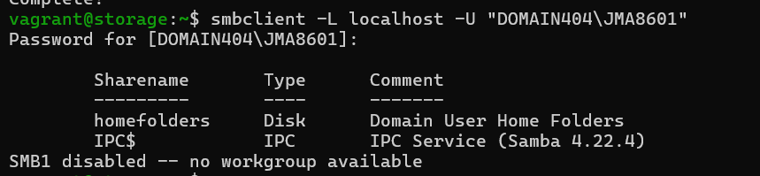
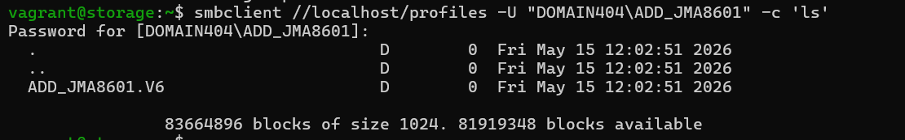
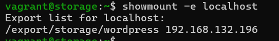
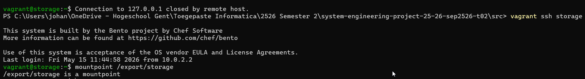
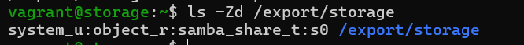

# Test plan: Enterprise Storage Server

Author(s): J. Magerman - `johan.magerman@student.hogent.be`

This document specifies the testing procedures required to validate the complex storage stack and Active Directory integration of the Enterprise Storage Server.

## Before starting

* Ensure the Domain Controller (`192.168.132.194`) is online and functional.
* Ensure the Storage Server (`192.168.132.199`) has been provisioned.
* Log in to the Storage Server via SSH: `vagrant ssh storage`.
* Have a Windows Client and the Webserver ready to test network mounts.

---

## Phase 1: Physical & Logical Storage Validation

### Test 1: Disk Hierarchy Verification
**Test procedure:**
* Run the command: `lsblk -o NAME,SIZE,FSTYPE,MOUNTPOINT,TYPE`.

**Expected result:**
* `/dev/sdb` and `/dev/sdc` show `md0` (RAID-1).
* `/dev/sdd`, `/dev/sde`, `/dev/sdf`, and `/dev/sdg` show `md1` (RAID-5).
* `md1` contains a `crypt` layer named `md1_crypt`.
* `md1_crypt` contains the LVM volume `vg_enterprise-lv_data` mounted at `/export/storage`.

### Test 2: RAID Health and Spare Status
**Test procedure:**
* Run the command: `sudo mdadm --detail /dev/md1`.

**Expected result:**
* State is `clean` or `active`.
* Number of Active Devices is 3.
* Number of Spare Devices is 1.

### Test 3: Encryption Integrity
**Test procedure:**
* Run the command: `sudo cryptsetup status md1_crypt`.

**Expected result:**
* The device is active and uses `aes-xts-plain64` cipher.
* The key location points to the device `md1`.

---

## Phase 2: Active Directory & Identity Validation

### Test 4: Domain Membership
**Test procedure:**
* Run the command: `sudo net ads testjoin`.

**Expected result:**
* Output returns: `Join is OK`.

### Test 5: Winbind Identity Resolution
**Test procedure:**
* Run the command: `wbinfo -u` and `wbinfo -g`.

**Expected result:**
* A list of Active Directory users and groups is displayed.
* Specifically, `GRP_Storage_Users` should be visible.

### Test 6: Linux UID Mapping
**Test procedure:**
* Run the command: `getent passwd "DOMAIN404\JMA8601"`.

**Expected result:**
* The system returns the user info with a UID in the `10000-999999` range.

---

## Phase 3: Network Service & Sharing Validation

### Test 7: Samba Share Availability homefolders
**Test procedure:**
* Install smbclient: `sudo dnf install -y samba-client`.
* Run the command: `smbclient -L localhost -U "DOMAIN404\JMA8601"` and enter the password for user JMA8601 (default: vagrant).

**Expected result:**
* `homefolders` is visible in the share list

### Test 8: Samba Share Availability profiles
**Test procedure:**
* Log on to the windows client as ADD_JMA8601 (default password: vagrant), change the password and let the client create the profile
* Connect directly to the hidden profiles share: `smbclient //localhost/profiles -U "DOMAIN404\ADD_JMA8601" -c 'ls'` and provide the password you just set.

**Expected result:**
* The command successfully connects to the share and lists its contents, proving the share is active despite being hidden.

### Test 9: NFS Export for Webserver
**Test procedure:**
* Run the command: `showmount -e localhost`.

**Expected result:**
* `/export/storage/wordpress` is exported to `192.168.132.196`.

---

## Phase 4: Persistence & Security

### Test 10: Automatic Unlock on Reboot
**Test procedure:**
* Run the command: `sudo reboot`.
* Wait for the system to start and log back in using `vagrant ssh storage`.
* Run: `mountpoint /export/storage`.

**Expected result:**
* The command returns: `/export/storage is a mountpoint`, confirming the LUKS array unlocked automatically via `crypttab` and the keyfile.

### Test 11: SELinux Contexts
**Test procedure:**
* Run the command: `ls -Zd /export/storage`.

**Expected result:**
* The directory has the `samba_share_t` security context applied.

