# Test report

- Test Executor(s): Guillaume Lescur - `guillaume.lescur@student.hogent.be`
- Executed on: 16/05/2026

## Test 1: Disk Hierarchy Verification

**Test procedure:**
* Run the command: `lsblk -o NAME,SIZE,FSTYPE,MOUNTPOINT,TYPE`.

Obtained result:
* `/dev/sdb` and `/dev/sdc` show `md0` (RAID-1).
* `/dev/sdd`, `/dev/sde`, `/dev/sdf`, and `/dev/sdg` show `md1` (RAID-5).
* `md1` contains a `crypt` layer named `md1_crypt`.
* `md1_crypt` contains the LVM volume `vg_enterprise-lv_data` mounted at `/export/storage`.

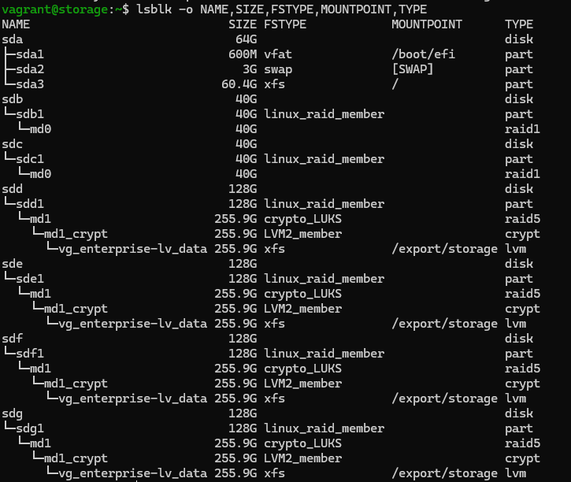

Test passed:

- [x] Yes
- [ ] No

## Test 2: RAID Health and Spare Status

**Test procedure:**
* Run the command: `sudo mdadm --detail /dev/md1`.

Obtained result:
* State is `clean` or `active`.
* Number of Active Devices is 3.
* Number of Spare Devices is 1.

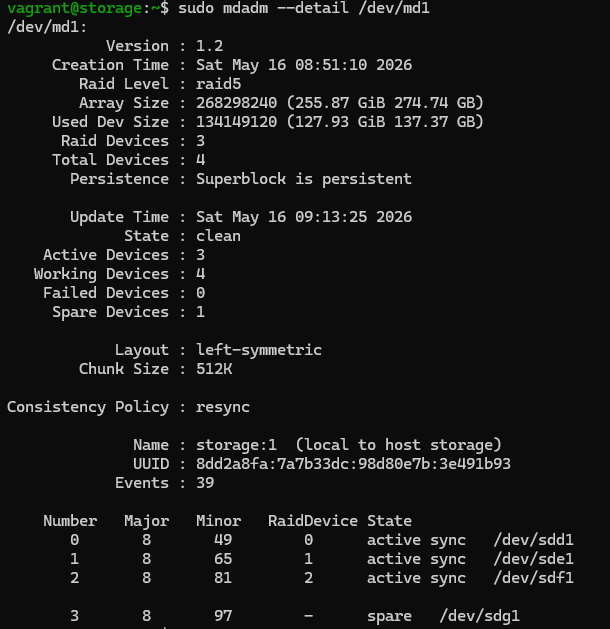

Test passed:

- [x] Yes
- [ ] No

## Test 3: Encryption Integrity

**Test procedure:**
* Run the command: `sudo cryptsetup status md1_crypt`.

Obtained result:
* The device is active and uses `aes-xts-plain64` cipher.
* The key location points to the device `md1`.

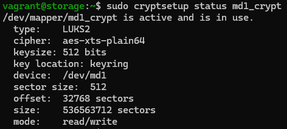

Test passed:

- [x] Yes
- [ ] No

## Test 4: Domain Membership

**Test procedure:**
* Run the command: `sudo net ads testjoin`.

Obtained result:
* Output returns: `Join is OK`.

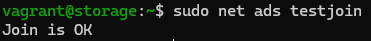

Test passed:

- [x] Yes
- [ ] No

## Test 5: Winbind Identity Resolution

**Test procedure:**
* Run the command: `wbinfo -u` and `wbinfo -g`.

Obtained result:
* A list of Active Directory users and groups is displayed.
* Specifically, `GRP_Storage_Users` should be visible.

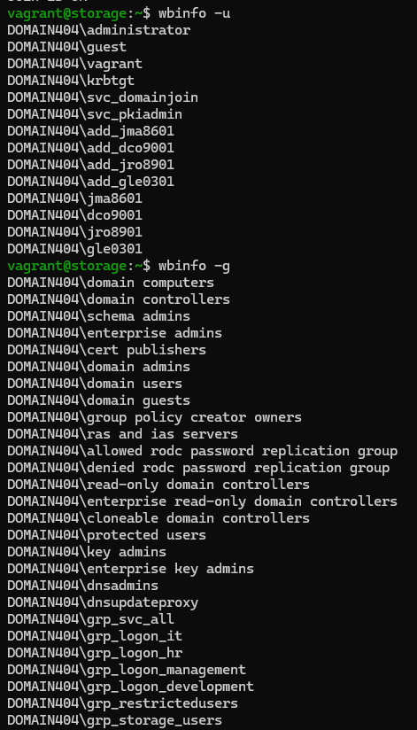

Test passed:

- [x] Yes
- [ ] No

## Test 6: Linux UID Mapping

**Test procedure:**
* Run the command: `getent passwd "DOMAIN404\JMA8601"`.

Obtained result:
* The system returns the user info with a UID in the `10000-999999` range.

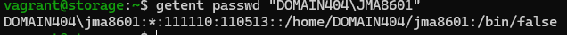

Test passed:

- [x] Yes
- [ ] No

## Test 7: Samba Share Availability homefolders

**Test procedure:**
* Install smbclient: `sudo dnf install -y samba-client`.
* Run the command: `smbclient -L localhost -U "DOMAIN404\JMA8601"` and enter the password for user JMA8601 (default: vagrant).

Obtained result:
* `homefolders` is visible in the share list

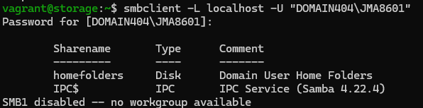

Test passed:

- [x] Yes
- [ ] No

## Test 8: Samba Share Availability profiles

**Test procedure:**
* Log on to the windows client as ADD_JMA8601 (default password: vagrant), change the password and let the client create the profile
* Connect directly to the hidden profiles share: `smbclient //localhost/profiles -U "DOMAIN404\ADD_JMA8601" -c 'ls'` and provide the password you just set.

Obtained result:
* The command successfully connects to the share and lists its contents, proving the share is active despite being hidden.

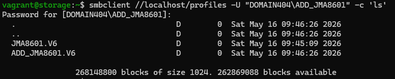

Test passed:

- [x] Yes
- [ ] No

## Test 9: NFS Export for Webserver

**Test procedure:**
* Run the command: `showmount -e localhost`.

Obtained result:
* `/export/storage/wordpress` is exported to `192.168.132.196`.

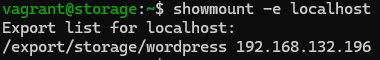

Test passed:

- [x] Yes
- [ ] No

## Test 10: Automatic Unlock on Reboot

**Test procedure:**
* Run the command: `sudo reboot`.
* Wait for the system to start and log back in using `vagrant ssh storage`.
* Run: `mountpoint /export/storage`.

Obtained result:
* The command returns: `/export/storage is a mountpoint`, confirming the LUKS array unlocked automatically via `crypttab` and the keyfile.

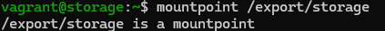

Test passed:

- [x] Yes
- [ ] No

## Test 11: SELinux Contexts

**Test procedure:**
* Run the command: `ls -Zd /export/storage`.

Obtained result:
* The directory has the `samba_share_t` security context applied.

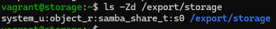

Test passed:

- [x] Yes
- [ ] No
