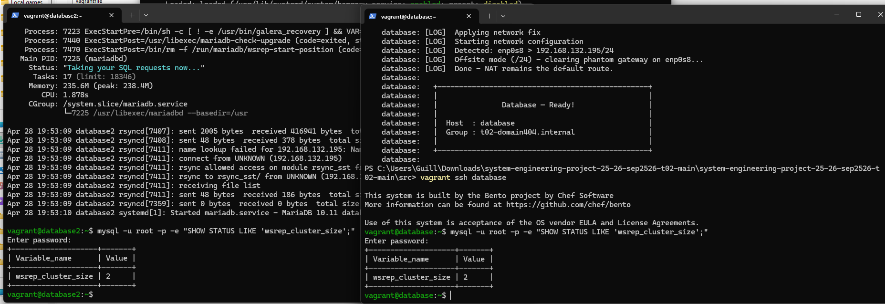
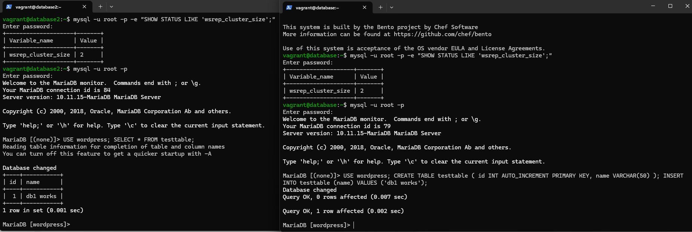
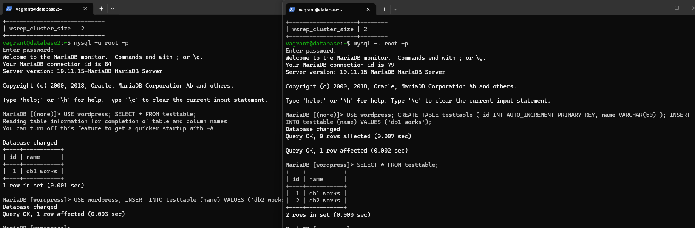
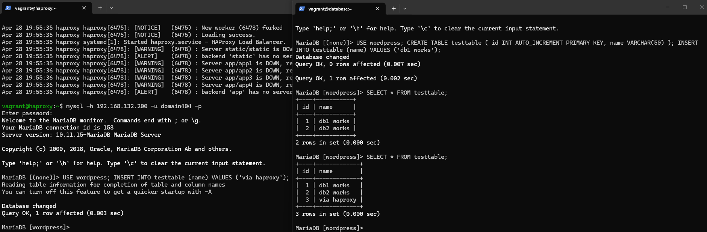
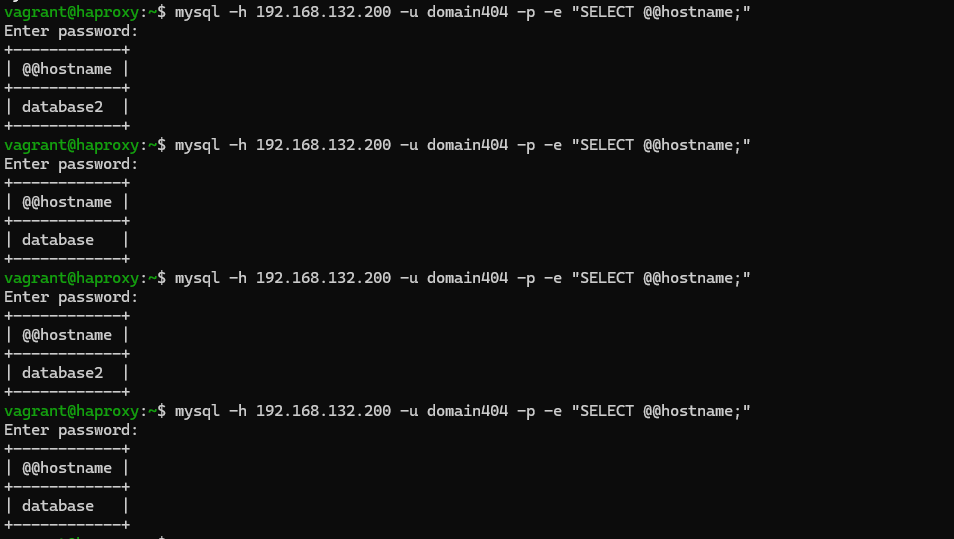
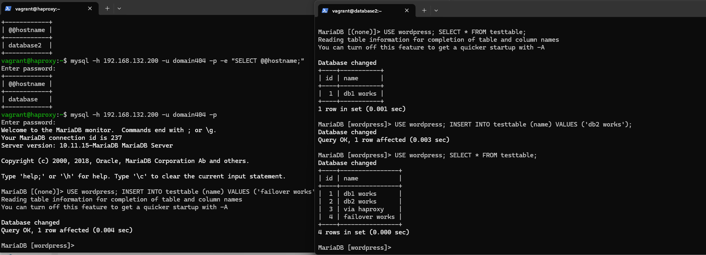
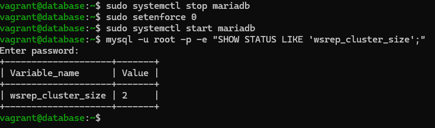

# Test Plan

Author(s): G. Lescur - `guillaume.lescur@student.hogent.be`

## Before Starting

- Open a terminal window and navigate to the `/src` folder of the project.
- Ensure `database` `ddatabase2` and `haproxy` is fully provisioned and running before testing.

## Test 1: Check the cluster

Test procedure:

- Open the database with `vagrant ssh database`
- Type `mysql -u root -p'WeWillCrushThisProject404' -e "SHOW STATUS LIKE 'wsrep_cluster_size';"`
- Do the same for database2

Expected result:

- You should get the result `wsrep_cluster_size = 2`

## Test 2: Test replication from db1 to db2

Test procedure:

- On the first database type `mysql -u root -p'WeWillCrushThisProject404'`
- Type `USE wordpress; CREATE TABLE testtable (
  id INT AUTO_INCREMENT PRIMARY KEY,
  name VARCHAR(50)
); INSERT INTO testtable (name) VALUES ('db1 works'); `
- On the second database type `mysql -u root -p'WeWillCrushThisProject404'`
- Type `USE wordpress;
SELECT * FROM testtable; `

Expected result:

- You see `db1 works`

## Test 3: Test replication from db2 to db1

Test procedure:

- On database2 type `USE wordpress; INSERT INTO testtable (name) VALUES ('db2 works');`
- On the first database type `SELECT * FROM testtable;`

Expected result:

- You see `db2 works`

## Test 4: Test via HaProxy

Test procedure:

- Use `mysql -h 192.168.132.201 -u domain404 -p'GroupT02ForVictory'`
- Type `USE wordpress;
INSERT INTO testtable (name) VALUES ('via haproxy');`
Go to database or database too and type `SELECT * FROM testtable;`

Expected result:

- You see `via haproxy`

## Test 5: Load balancing check

Test procedure:

- Use `mysql -h 192.168.132.201 -u domain404 -p'GroupT02ForVictory' -e "SELECT @@hostname;"`. Repeat this 10 times

Expected result:

- You should see that the output switches between `database` and `database2`

## Test 6: Failover test

Test procedure:

- Go to database and type `sudo systemctl stop mariadb`
- Go to the haproxy server and type `mysql -h 192.168.132.201 -u domain404 -p'GroupT02ForVictory'`.
- Type `USE wordpress;
INSERT INTO testtable (name) VALUES ('failover works');`
- Go to database 2 and type `USE wordpress; SELECT * FROM testtable;`

Expected result:

- You see `failover works`

## Test 7: Restart node

Test procedure:

- Go to database and type `sudo systemctl start mariadb`
- Type `mysql -u root -p'WeWillCrushThisProject404' -e "SHOW STATUS LIKE 'wsrep_cluster_size';"`

Expected result:

- You should get the result `wsrep_cluster_size = 2`

