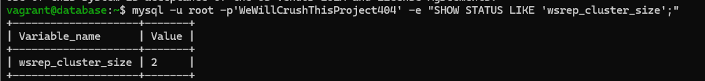
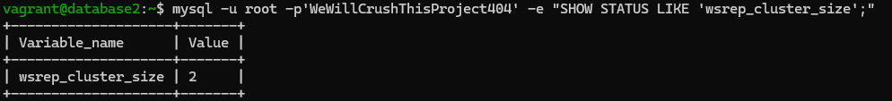
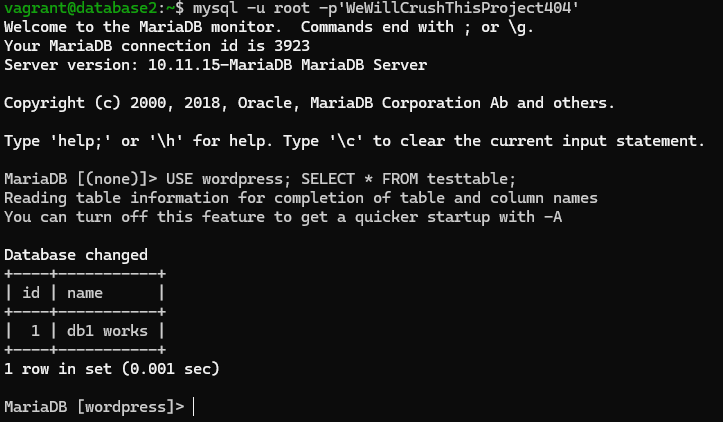
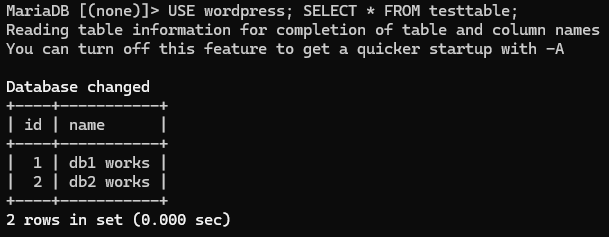
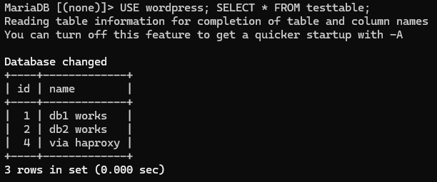
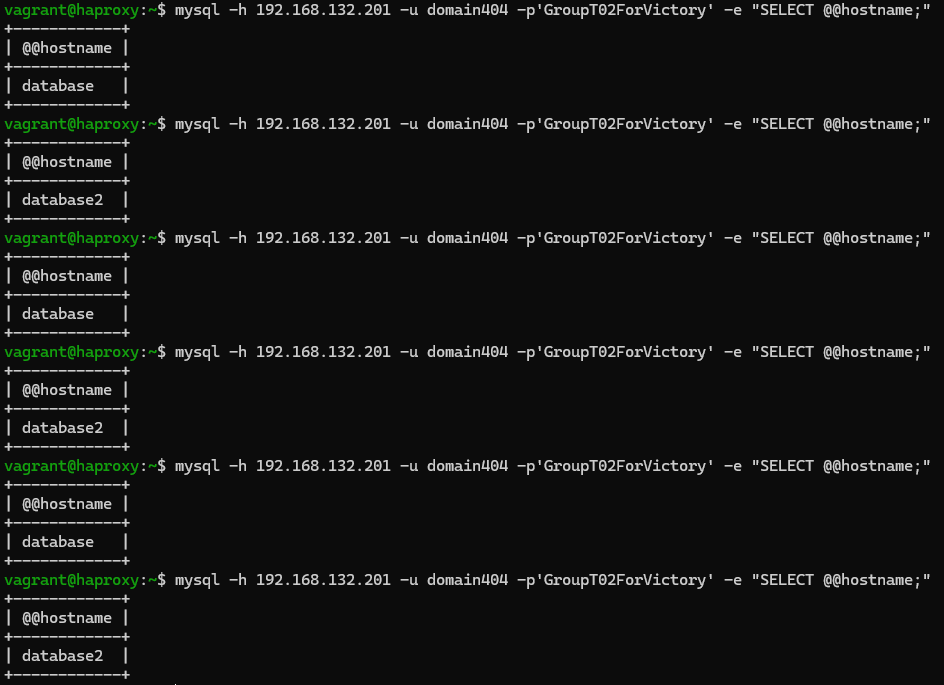
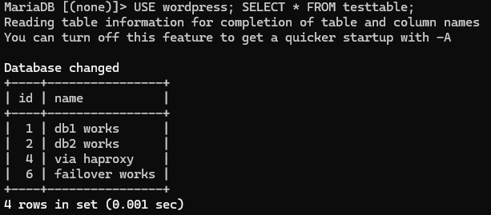
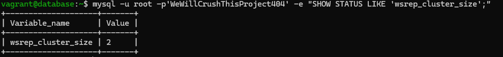

# Test report

- Test Executor(s): D. Cooreman - `dean.cooreman@student.hogent.be`
- Executed on: 

## Test 1: Check the cluster

Test procedure:

- Open the database with `vagrant ssh database`
- Type `mysql -u root -p'WeWillCrushThisProject404' -e "SHOW STATUS LIKE 'wsrep_cluster_size';"`
- Do the same for database2

Expected result:

- You should get the result `wsrep_cluster_size = 2`.

Obtained result:

- The output contains wsrep_cluster_size with value 2 on both databases.

Test passed:

- [x] Yes
- [ ] No

## Test 2: Test replication from db1 to db2

Test procedure:

- On the first database type `mysql -u root -p'WeWillCrushThisProject404'`
- Type `USE wordpress; CREATE TABLE testtable (id INT AUTO_INCREMENT PRIMARY KEY, name VARCHAR(50)); INSERT INTO testtable (name) VALUES ('db1 works');`
- On the second database type `mysql -u root -p'WeWillCrushThisProject404'`
- Type `USE wordpress; SELECT * FROM testtable;`

Expected result:

- You see `db1 works`

Obtained result:

- The output says `db1 works`
 

Test passed:

- [x] Yes
- [ ] No

## Test 3: Test replication from db2 to db1

Test procedure:

- On database2 type `USE wordpress; INSERT INTO testtable (name) VALUES ('db2 works');`
- On the first database type `SELECT * FROM testtable;`

Expected result:

- You see `db2 works`.

Obtained result:

- The output says `db2 works`.

Test passed:

- [x] Yes
- [ ] No

## Test 4: Test via HaProxy

Test procedure:

- Use `mysql -h 192.168.132.201 -u domain404 -p'GroupT02ForVictory'`
- Type `USE wordpress; INSERT INTO testtable (name) VALUES ('via haproxy');`
- Go to database or database2 and type `SELECT * FROM testtable;`

Expected result:

- You see `via haproxy`.

Obtained result:

- The output says `via haproxy`.

Test passed:

- [x] Yes
- [ ] No

## Test 5: Load balancing check

Test procedure:

- Use `mysql -h 192.168.132.201 -u domain404 -p'GroupT02ForVictory' -e "SELECT @@hostname;"`. Repeat this 10 times.

Expected result:

- You should see that the output switches between `database` and `database2`.

Obtained result:

- The output switches between database and database2.

Test passed:

- [x] Yes
- [ ] No

## Test 6: Failover test

Test procedure:

- Go to database and type `sudo systemctl stop mariadb`
- Go to the haproxy server and type `mysql -h 192.168.132.201 -u domain404 -p'GroupT02ForVictory'`
- Type `USE wordpress; INSERT INTO testtable (name) VALUES ('failover works');`
- Go to database2 and type `USE wordpress; SELECT * FROM testtable;`

Expected result:

- You see `failover works`.

Obtained result:

- The output shows `failover works`.

Test passed:

- [x] Yes
- [ ] No

## Test 7: Restart node

Test procedure:

- Go to database and type `sudo systemctl start mariadb`
- Type `mysql -u root -p'WeWillCrushThisProject404' -e "SHOW STATUS LIKE 'wsrep_cluster_size';"`

Expected result:

- You should get the result `wsrep_cluster_size = 2`.

Obtained result:

- The output show wsrep_cluster_size with value 2.

Test passed:

- [x] Yes
- [ ] No
