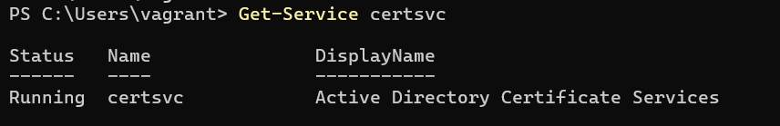
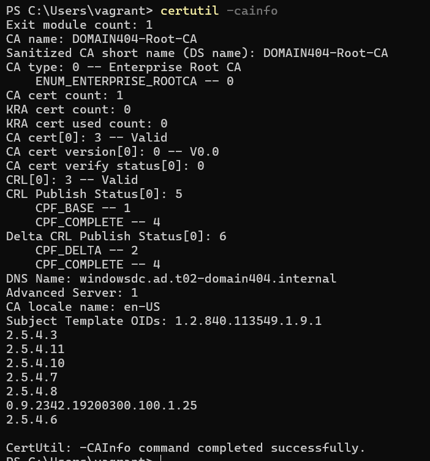
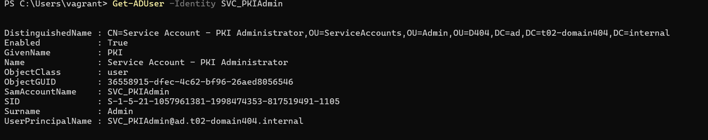
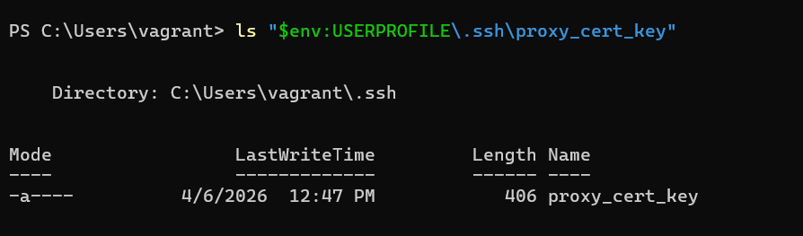
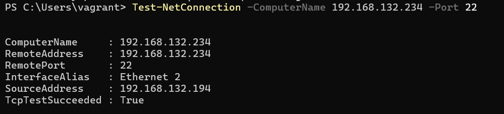
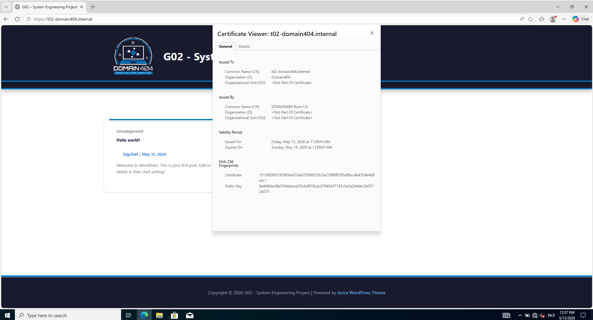
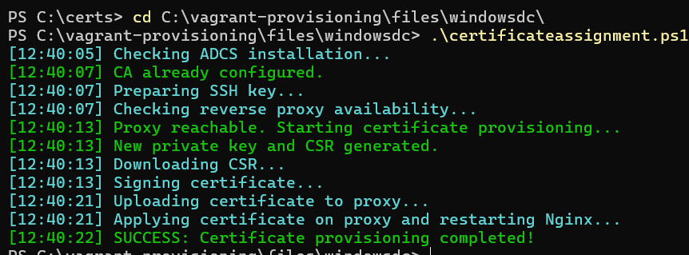
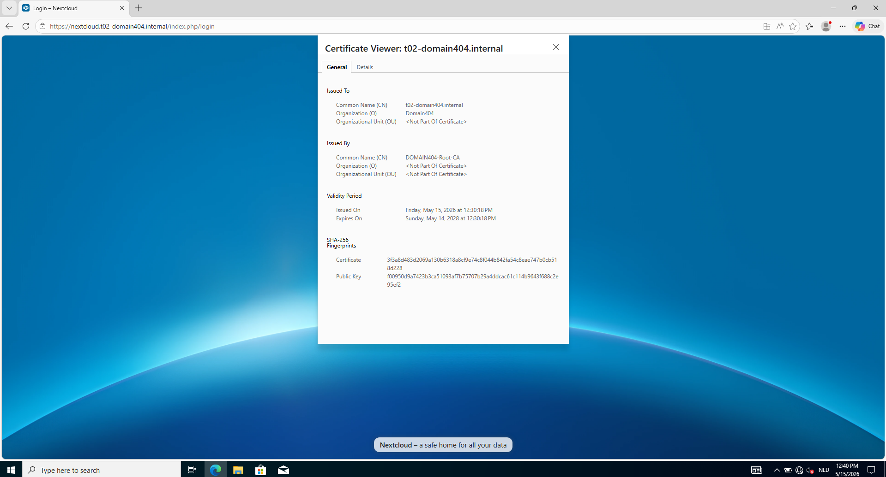

# Test plan: Certificate Authority (CA) Extension

Author(s): J. Magerman - `johan.magerman@student.hogent.be`

This document specifies the testing procedures to validate the installation of the Enterprise Root CA and the automated certificate bridge between the Windows Domain Controller and the Linux Reverse Proxy.

## Before starting

* Ensure the Reverse Proxy (`reverse-proxy`) and the Domain Controller (`windowsdc`) are up and running.
* Ensure the database servers (`database1 - database2`), haproxy (`haproxy`) and webserver (`webserver`) are up and running.
* Ensure the Nextcloud server (`nextcloud-server`) and database (`nextcloud-database`) are up and running.
* Log in to the Domain Controller as an Administrator.
* Open a PowerShell terminal.
* Ensure a Windows Client (e.g., `L-26-00001`) is joined to the domain and running.

---

## Test 1: Is the CA service running?

**Test procedure:**
* Run the command: `Get-Service certsvc`.

**Expected result:**
* The output shows that the `certsvc` (Active Directory Certificate Services) is `Running`.

---

## Test 2: Is the Enterprise Root CA correctly named?

**Test procedure:**
* Run the command: `certutil -cainfo`.

**Expected result:**
* The output displays the configuration of the local CA.
* The `CA name` (or "Sanitized Name") is listed as `DOMAIN404-Root-CA`.

---

## Test 3: Does the PKI Service Account exist?

**Test procedure:**
* Run the command: `Get-ADUser -Identity SVC_PKIAdmin`.

**Expected result:**
* The user account is found and its Distinguished Name (DN) points to the `ServiceAccounts` OU.

---

## Test 4: Is the SSH bridge secure?

**Test procedure:**
* Navigate to the SSH key location: `ls "$env:USERPROFILE\.ssh\proxy_cert_key"`.

**Expected result:**
* The file exists.

---

## Test 5: Can the DC reach the Proxy for certificate tasks?

**Test procedure:**
* Run the command: `Test-NetConnection -ComputerName 192.168.132.234 -Port 22`.

**Expected result:**
* `TcpTestSucceeded` is `True`.

---

## Test 6: Is the certificate trusted by a client?

**Test procedure:**
* Log in to the Windows Client (`L-26-00001`).
* Open a browser or terminal and surf to `https://t02-domain404.internal`.

**Expected result:**
* The connection is successful.
* No certificate warnings are shown.
* The certificate issuer is verified as `DOMAIN404-Root-CA`.

---

## Test 7: Validation of manual certificate assignment script

**Test procedure:**
* Navigate to `C:\vagrant-provisioning\files\windowsdc\`.
* Run the script: `.\certificateassignment.ps1`.

**Expected result:**
* The script pulls the CSR from the proxy.
* The script signs the certificate using the `WebServer` template.
* The script pushes the signed `.cer` file to the proxy and restarts Nginx.
* The terminal displays: "Reverse Proxy Certificate Provisioning Complete!".

---

## Test 8: Is the manual certificate trusted by a client for the nextcloud site?

**Test procedure:**
* Log in to the Windows Client (`L-26-00001`).
* Open a browser or terminal and surf to `https://nextcloud.t02-domain404.internal`.

**Expected result:**
* The connection is successful.
* No certificate warnings are shown.
* The certificate issuer is verified as `DOMAIN404-Root-CA`.

