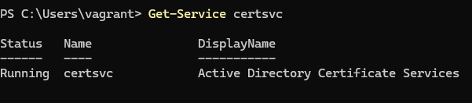
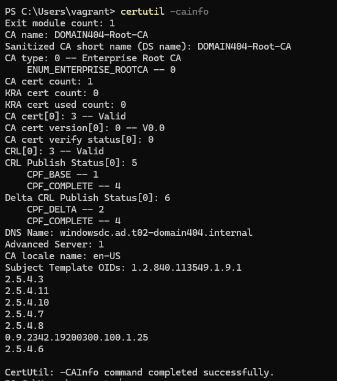
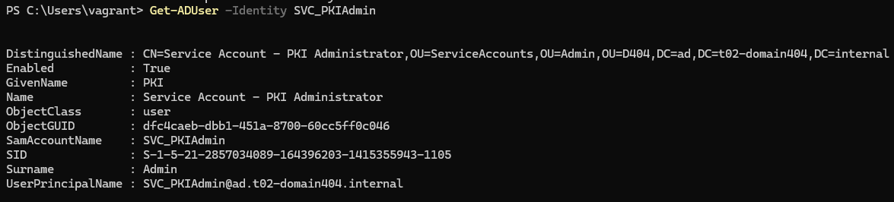
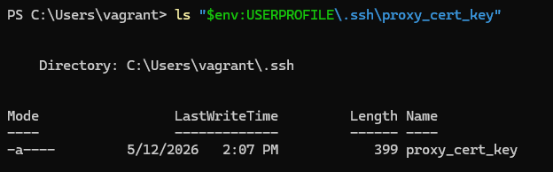
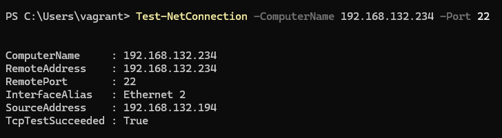
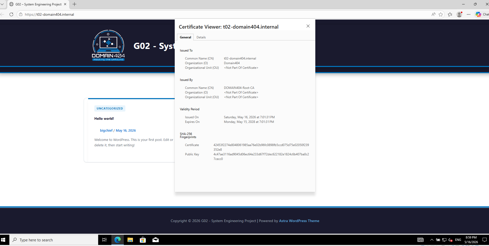
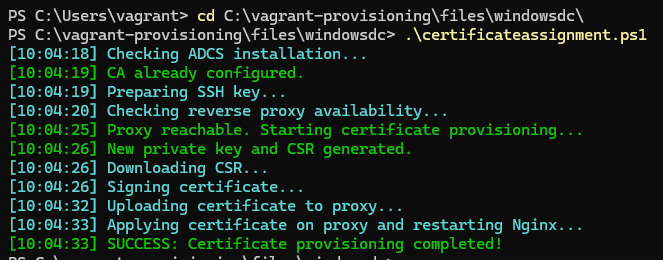
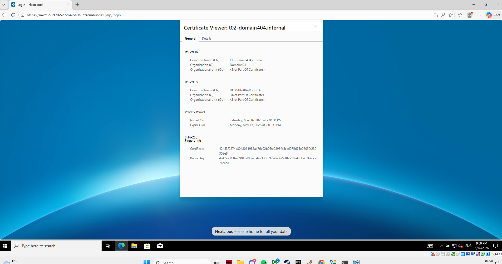

# Test report

- Test Executor(s): Guillaume Lescur - `guillaume.lescur@student.hogent.be`
- Executed on: 16/05/2026

## Test 1: Is the CA service running?

**Test procedure:**
* Run the command: `Get-Service certsvc`.

Obtained result:

* The output shows that the `certsvc` (Active Directory Certificate Services) is `Running`.

Test passed:

- [x] Yes
- [ ] No

## Test 2: Is the Enterprise Root CA correctly named?

**Test procedure:**
* Run the command: `certutil -cainfo`.

Obtained result:
* The output displays the configuration of the local CA.
* The `CA name` (or "Sanitized Name") is listed as `DOMAIN404-Root-CA`.

Test passed:

- [x] Yes
- [ ] No

## Test 3: Does the PKI Service Account exist?

**Test procedure:**
* Run the command: `Get-ADUser -Identity SVC_PKIAdmin`.

Obtained result:
* The user account is found and its Distinguished Name (DN) points to the `ServiceAccounts` OU.

Test passed:

- [x] Yes
- [ ] No

## Test 4: Is the SSH bridge secure?

**Test procedure:**
* Navigate to the SSH key location: `ls "$env:USERPROFILE\.ssh\proxy_cert_key"`.

Obtained result:
* The file exists.

Test passed:

- [x] Yes
- [ ] No

## Test 5: Can the DC reach the Proxy for certificate tasks?

**Test procedure:**
* Run the command: `Test-NetConnection -ComputerName 192.168.132.234 -Port 22`.

Obtained result:
* `TcpTestSucceeded` is `True`.

Test passed:

- [x] Yes
- [ ] No

## Test 6: Is the certificate trusted by a client?

**Test procedure:**
* Log in to the Windows Client (`L-26-00001`).
* Open a browser or terminal and surf to `https://t02-domain404.internal`.

Obtained result:
* The connection is successful.
* No certificate warnings are shown.
* The certificate issuer is verified as `DOMAIN404-Root-CA`.

Test passed:

- [x] Yes
- [ ] No

## Test 7: Validation of manual certificate assignment script

**Test procedure:**
* Navigate to `C:\vagrant-provisioning\files\windowsdc\`.
* Run the script: `.\certificateassignment.ps1`.

Obtained result:
* The script pulls the CSR from the proxy.
* The script signs the certificate using the `WebServer` template.
* The script pushes the signed `.cer` file to the proxy and restarts Nginx.
* The terminal displays: "Reverse Proxy Certificate Provisioning Complete!".
 

Test passed:

- [x] Yes
- [ ] No

## Test 8: Is the manual certificate trusted by a client for the nextcloud site?

**Test procedure:**
* Log in to the Windows Client (`L-26-00001`).
* Open a browser or terminal and surf to `https://nextcloud.t02-domain404.internal`.

Obtained result:
* The connection is successful.
* No certificate warnings are shown.
* The certificate issuer is verified as `DOMAIN404-Root-CA`.
 

Test passed:

- [x] Yes
- [ ] No
